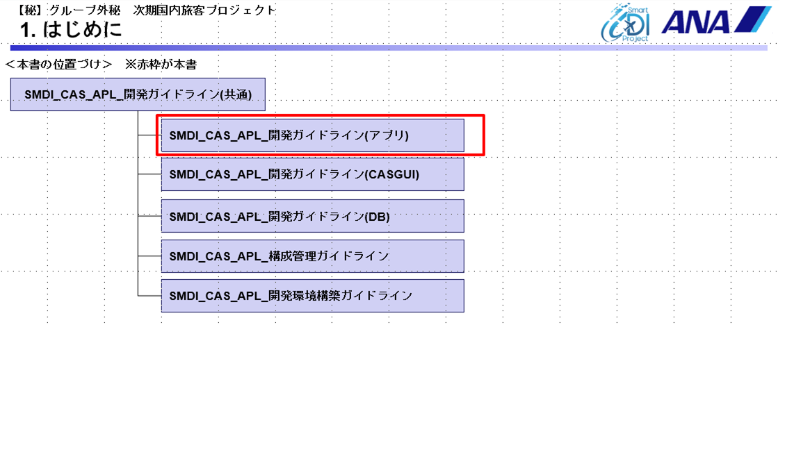
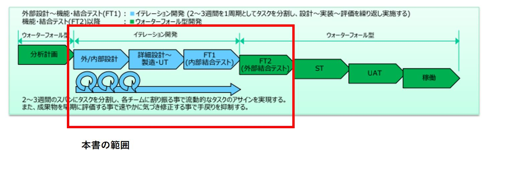
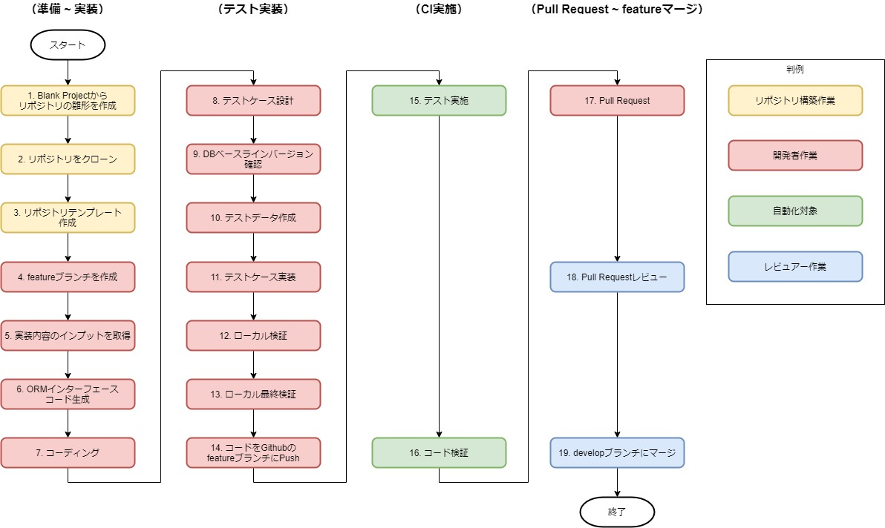
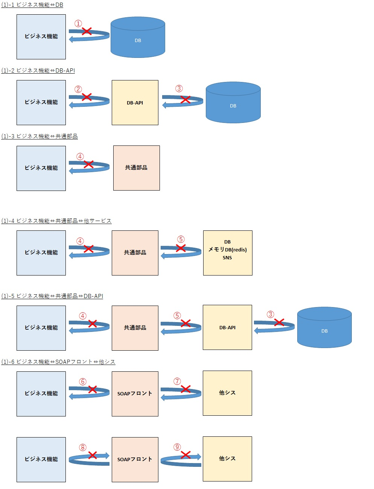
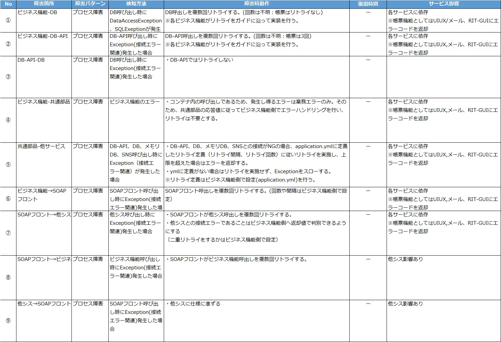
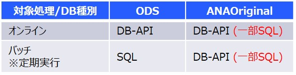

# DevGuideline(APL)　共通編

# 目次

<!-- @import "[TOC]" {cmd="toc" depthFrom=1 depthTo=6 orderedList=false} -->

<!-- code_chunk_output -->

- [DevGuideline(APL) ドラフト版](#DevGuideline(APL)-font-colorredドラフト版font)
- [目次](#目次)
- [1. はじめに](#1-はじめに)
  - [1.1 本書の目的](#11-本書の目的)
  - [1.2 本書の位置付け](#12-本書の位置付け)
  - [1.3 参照ドキュメント一覧](#13-参照ドキュメント一覧)
  - [1.4 本書の記載範囲と利用者](#14-本書の記載範囲と利用者)
    - [1.4.1 本書の記載範囲](#141-本書の記載範囲)
    - [1.4.2 本書の利用者](#142-本書の利用者)
  - [1.5 開発体制](#15-開発体制)
  - [1.6 コミュニケーション計画](#16-コミュニケーション計画)
  - [1.7 利用言語/プロダクト](#17-利用言語プロダクト)
- [2. 各チーム成果物一覧](#2-各チーム成果物一覧)
  - [2.1 各チーム分計成果物一覧](#21-各チーム分計成果物一覧)
  - [2.2 各チーム開発工程成果物一覧](#22-各チーム開発工程成果物一覧)
- [3 開発作業方針](#3-開発作業方針)
  - [3.1 開発の流れ](#31-開発の流れ)
    - [3.1.1 開発作業フロー](#311-開発作業フロー)
      - [準備 ~ 実装](#準備--実装)
      - [テスト実装](#テスト実装)
      - [CI実施](#ci実施)
      - [Pull Request ~ featureマージ](#pull-request--featureマージ)
- [4 規則/規約](#4-規則規約)
  - [4.1 採番規則](#41-採番規則)
    - [4.1.1 ビジネスコンポーネント識別子](#411-ビジネスコンポーネント識別子)
    - [4.1.2 採番・命名ルール](#412-採番命名ルール)
    - [4.1.3 Webサービス（REST）のURI](#413-webサービスrestのuri)
  - [4.2 ネーミング規約](#42-ネーミング規約)
    - [4.2.1 ネーミング規約　オンライン](#421-ネーミング規約-オンライン)
      - [4.2 1.1 基本原則](#4211-基本原則)
        - [4.2.1.1.1 一般的ではない略称は使用しないこと](#42111-一般的ではない略称は使用しないこと)
        - [4.2.1.1.2 基本的に名称にはローマ字表記を使用しないこと](#42112-基本的に名称にはローマ字表記を使用しないこと)
      - [4.2.1.2 GitHub上のリポジトリ名、プロジェクト名](#4212-github上のリポジトリ名プロジェクト名)
      - [4.2.1.3 パッケージ名、クラス名](#4213-パッケージ名クラス名)
        - [4.2.1.3.1 パッケージ名](#42131-パッケージ名)
          - [4.2.1.3.1.1 マイクロサービスを構成するクラスのパッケージ](#421311-マイクロサービスを構成するクラスのパッケージ)
          - [4.2.1.3.1.2 共通ライブラリを構成するクラスのパッケージ](#421312-共通ライブラリを構成するクラスのパッケージ)
        - [4.2.1.3.2 クラス名](#42132-クラス名)
      - [4.2.1.4 定数、フィールド名](#4214-定数フィールド名)
        - [4.2.1.4.1 定数](#42141-定数)
          - [4.2.1.4.1.1 定数定義](#421411-定数定義)
          - [4.2.1.4.1.2 定数クラス](#421412-定数クラス)
          - [4.2.1.4.1.3 定数の命名](#421413-定数の命名)
        - [4.2.1.4.2 フィールド名](#42142-フィールド名)
      - [4.2.1.5 外部変数名](#4215-外部変数名)
        - [4.2.1.5.1 プロパティ値](#42151-プロパティ値)
        - [4.2.1.5.2 環境変数](#42152-環境変数)
      - [4.2.1.6 メソッド名](#4216-メソッド名)
      - [4.2.1.7 ローカル変数名](#4217-ローカル変数名)
      - [4.2.1.8 テストケース](#4218-テストケース)
      - [4.2.1.9 テストクラス](#4219-テストクラス)
      - [4.2.1.10 テストメソッド](#42110-テストメソッド)
    - [4.2.2 ネーミング規約 バッチ](#422-ネーミング規約)
      - [4.2.2.1 スクリプトファイル名](#4221-スクリプトファイル名)
      - [4.2.2.2 メインシェル](#4222-メインシェル)
      - [4.2.2.3 サブシェル](#4223-サブシェル)
      - [4.2.2.4 インクルードされるシェル部品](#4224-インクルードされるシェル部品)
      - [4.2.2.5 シェル関数名](#4225-シェル関数名)
      - [4.2.2.6 シェル変数名](#4226-シェル変数名)
      - [4.2.2.7 環境変数名](#4227-環境変数名)
- [5. アプリケーション設計方針](#5-アプリケーション設計方針)
  - [5.1 アプリケーション設計記載方針](#51-アプリケーション設計記載方針)
  - [5.2 アプリケーション設計方針](#52-アプリケーション設計方針)
  - [5.3 共通機能設計方針](#53-共通機能設計方針)
  - [5.4 リトライ設計方針](#54-リトライ設計方針)
  - [5.5 例外処理設計方針](#55-例外処理設計方針)
  - [5.6 DB-API利用方針](#56-DB-API利用方針)
  - [5.7 内部連携機能の利用方針](#57-内部連携機能の利用方針)
- [6. 業務機能実装方針](#6-業務機能実装方針)
- [7. アプリケーションテスト方針](#7-アプリケーションテスト方針)

# 1. はじめに

## 1.1 本書の目的

本書は、BUDDYシステム開発におけるガイドラインとして、
BUDDYシステムのアプリケーション開発の手順を理解するための資料である。

## 1.2 本書の位置付け

本書は、以下位置付けのドキュメントである。

>表1.1




## 1.3 参照ドキュメント一覧
ここでは、本資料における出典、参照資料の参照先について記述する。</BR>
********************************************
**※以下参照先は、2021年9月時点の暫定保存先。将来的にはSVN、GitHubに格納される予定のため、格納次第修正予定**</BR>
**※参照先ドキュメントは最新版でないものが含まれているため、最新版確認次第、修正予定**
********************************************

| 名称 | 章| 参照先  |
| - | - | - | 
| プロジェクト管理計画書 |3.5章 | https://drive.google.com/drive/folders/1awv7nnguwTdxmL-TsJMQhUUakxG5V55X?usp=sharing |
| 開発環境構築ガイドライン「4.4 MyBatis Generator」 |4.4章 | https://github.com/CAS-ASY/local-dev-env |
| 開発環境構築ガイドライン「4.3 OpenAPI generator」 |4.3章 | https://github.com/CAS-ASY/local-dev-env |
| 処理パターン別コンテキスト |xxxxxxx</br>（格納次第記載） | https://drive.google.com/drive/u/0/folders/1a-nHB-kfI7TfA5gXFQ-BSMT3xrnSjfTK|
| ログ出力実装方針と実装例 |xxxxxxx</br>（格納次第記載） | https://docs.google.com/spreadsheets/d/1MhterePU3krkt2-43MIM7rGFPXyxwCmb/edit#gid=473181419 |
| BlankProject |- | https://github.com/CAS-ASY/BlankProject |


## 1.4 本書の記載範囲と利用者
本書の記載範囲、利用者、サービス×各章別参照手引を記載する。
## 1.4.1 本書の記載範囲
**＜アプリにおける対象＞**</BR>
本書では、**PLUSバックエンド機能**について記載する。
</BR>

|区分|サービス  |概要|
| ---- | ---- | ---- |
|PLUSバックエンド機能 |各ビジネス機能 | ビジネス機能ID単位で分割された各アプリ機能
|共通 |GW | 外部システムとの通信におけるフロント機能
|共通 |DB-API | DBアクセスに利用する機能
|共通 |共通ライブラリ | PLUSで定義された業務・システムの共通機能
|PLUSフロントエンド機能 | PLUSGUI | PLUSにおけるUI機能（PLUSGUI）


**＜対象工程＞**</BR>
本書では、設計～FT2について記載する。
	
>表1.2




​	
### 1.4.2 本書の利用者


利用者はプロダクトオーナー、統括スクラムマスター、スクラムマスター、副スクラムマスター、開発担当者とする。</br>
※各役割の定義は、1.5章参照


## 1.5 開発体制

アプリケーションチーム内の開発体制について記載する。記載範囲/工程内の体制は、DevSecOps体制に基づいた体制とする
<!--指摘No.63 mod
DEV SEC OPS方針に基づいた体制において、アプリチーム開発者から見た役割は下記となる。
-->
|  チーム/個人 |  設計における役割  
| :----: | :---- | 
|プロダクトオーナー  |  イテレーションごとに開発成果物をレビューする。  
|統括スクラムマスター(チーム)|   プロダクトオーナー作業を分担する。　  
|アプリチーム / スクラムマスター| 開発者の設計課題、仕様課題を一緒に解決する。<BR>スクラムマスターは複数チームを兼務しながら調整を主導する。   
|  アプリチーム / 副スクラムマスター  |  スクラムマスター作業を分担する。  <BR>副スクラムマスターは各チーム1名とする。   
| アプリチーム / **開発者**  |  インプットドキュメントから設計/開発を実施し、<BR>プロダクトオーナーが定めた各イテレーションの完了基準を満たす。<BR>仕様調整や課題についてはスクラムマスターと共に解決を図る。<BR> 開発中のレビュー作業はお互いにペアレビューを行う。

<BR>

## 1.6 コミュニケーション計画

コミュニケーション計画について記載する。</br>
アプリケーション内のコミュニケーション計画は、プロジェクト管理計画書参照。</br>
※チーム内にて必要に応じてプロジェクト管理計画書規定以外の会議体を調整しても良い

> 参照: [1.3 参照ドキュメント一覧](#13-参照ドキュメント一覧) 「プロジェクト管理計画書
」</br>

## 1.7 利用言語/プロダクト

ここでは、PLUSバックエンド機能開発における利用する利用言語/プロダクトを記載する。

- Amazon Linux 2
- Ubuntu
- kubernetes
- IBM MQ
- ActiveMQ
- PostgreSQL
- Java(OpenJDK)
- Nginx
- S3
- WebSAM SVF Connect SUITE Standard Linux版
- WebSAM SVF for PDF Linux版
- WebSAM SVF for Excel Linux版
- SVF Global Font Pack
- fluentd
- Datadog Agent
- Dynatrace Agent
- JP1/base
- JP1/AJS3


# 2. 各チーム成果物一覧
<!--TODO:引き継ぎ-->
********************************************
**※以下参照先は、2021年9月時点の暫定保存先。将来的にはSVN、GitHubに格納される予定のため、格納次第修正予定**</BR>
**※参照先ドキュメントは最新版でないものが含まれているため、最新版確認次第、修正予定**
********************************************

<!--2021.09.30.add　③DevSecOpsの考え方の取り込み-->
## 2.1 各チーム分計成果物一覧

開発ガイドライン(共通)より、アプリチームの**設計に必要となる**分計工程のドキュメントを記載する。
<!--指摘No.68
ここでは、分計工程にて作成された**設計インプット**となるドキュメント一覧を記載する
-->
| No | 作成チーム |ドキュメント</br>名称 | 説明 | 配置場所</br>(作成済はURL) |備考 |
| - | :-: | :-: | - | - |- |
| 1 |  APL | 要件確認書 | ユーザと調整した業務要件を記載した資料。</br>各機能群毎に作成 | [GoogleDrive](https://drive.google.com/drive/folders/1jOK8me45I3Sfz3lDWtn8ZtIGUVgpDwp_?usp=sharing/)  |
| 2 | APL | システム機能要件書 | 要件確認書を元に、システム化方針を記載した資料。</br>各ビジネス機能毎に作成 | [GoogleDrive](https://drive.google.com/drive/folders/1V1-LNFLp_z0G6X3UiWzWV_GPAB5-g4Yg?usp=sharing/)  |
| 3 |  APL | 各種一覧※1 | システム機能要件書を元に定義した、各種一覧 | ※１参照 |
| 4 |  APL | 概要設計書 | 開発工程で作成するアプリケーション概要を記載した資料 | [GoogleDrive](https://drive.google.com/drive/folders/10dUL9GTmqNM-o_0kpSr7Qyvo-pojUhW_?usp=sharing/) |
| 5 |  DB| テーブル定義書 | システム機能要件、並びに外部インターフェース定義を元にした</br>ODSのテーブル定義を記載した資料 | [GoogleDrive](https://drive.google.com/drive/folders/1fLRormW-a6KoHkyhoXteAye93_iIjwXQ?usp=sharing/) |
| 6 |  DB| DB-API概要書 | DB-APIを利用する対象を記載した資料。</br>開発工程以降はAPLチーム管轄のため、</br>開発工程での修正は×としている。 | [GoogleDrive](https://drive.google.com/drive/folders/1QuEr3UhoUgVwivM-ma6e9eN1VFH60XrP?usp=sharing/)  ||

<BR>
※１各種一覧の詳細</br>

| No | 作成チーム |ドキュメント名称 | 説明 | 配置場所 |備考 |
| - | :-: | :-: | - | - |- |
| 1 |  APL | 機能間連携台帳 | システム機能要件書を元に定義した、</br>各種一覧 | [GoogleDrive](https://drive.google.com/drive/folders/1IW06NsHxNEHEd1XHIz154AMXsn_o3c3T?usp=sharing/)  |
| 2 |  APL | ビジネス機能一覧 | システム機能要件書を元に定義した、</br>各種一覧 | [GoogleDrive](https://drive.google.com/drive/folders/1BzV24RpCEHBlX1RZs3uDgSZqY6_ffi_6?usp=sharing/)  |
| 3 |  APL | 外部インターフェース一覧 | システム機能要件書を元に定義した、</br>各種一覧 | [GoogleDrive](https://drive.google.com/drive/folders/1IqBut3laqzNOk-v-DOqbJBvbKl0buLvw?usp=sharing/)  |
| 4 |  APL | コンテナ×コンポーネント一覧 | システム機能要件書を元に定義した、</br>各種一覧 | [GoogleDrive](https://drive.google.com/drive/folders/1OZr0yy_MyaMbMn9fg5wV8Pk23ZJ2Lhd4?usp=sharing/)  |
| 5 |  APL | 帳票一覧 | システム機能要件書を元に定義した、</br>各種一覧 | [GoogleDrive](https://drive.google.com/drive/folders/1YEjCokWuf_q9l5fMsLMp8SRYb0RM0ZJT?usp=sharing/)  |
| 6 |  APL | 画面一覧 | システム機能要件書を元に定義した、</br>各種一覧 | [GoogleDrive](https://drive.google.com/drive/folders/1HufeSGudxNrAKbWcXj3tQoxWQm80krr0?usp=sharing/)  |


## 2.2 各チーム開発工程成果物一覧

ここでは、DEV SEC OPS方針に基づいたイテレーション開発において、
「分計成果物に対して深化」「開発工程にて新規作成」する成果物を記載する。  

成果物に対するテーラリング、ならびにスケジュールの組み方は*スクラムマスター*が判断する。


| No | 分類|ドキュメント名称 | 説明 | 配置場所 | 各ビジネス機能(A01) | 各ビジネス機能(B01) | 各ビジネス機能(C01) | システム機能共通  | 共通機能 | DB-API |備考 |
| - | - | - | - | - |:-:| :-: | :-: | :-: | :-: | :-: |- 
| 1 |doc |システム機能要件書 | 要件確認書を元に、システム化方針を記載した資料。各ビジネス機能毎に作成 | [GoogleDrive](https://drive.google.com/drive/folders/19vpOdIXvGxPpDRG7P8i7y16Ei8bB-jhx) |〇 |〇 |〇 |〇 |〇 |- |
| 2 |doc |DB-API概要書 | DB-APIを利用する対象を記載した資料。開発工程以降はAPLチーム管轄のため、開発工程での修正は×としている。 | [GoogleDrive](https://drive.google.com/drive/folders/1IiC4oktX91c049Wzoo1u8pVBiJY_GI1I) |- |- |- |- |- |〇 |
| 3 |doc |OPENAPI仕様 | PLUS内の機能間連携で使用するAPI仕様 | [GoogleDrive](https://drive.google.com/drive/folders/187xR5_ZZO641NBwEbM11X1HqRG5MyeZK)  | 〇 | - | - |- |- |〇|開発工程で新規作成、PLUSGUI機能のみ
| 4 |xls |CRUD_コンポーネント機能一覧×API×テーブル | PLUS内の機能ごとに使用するテーブルをマッピングした資料 | [GoogleDrive](https://drive.google.com/drive/folders/1ZKoAYhgM5cfuuWhI-MhjY8g9fKGVsnu2) |〇 |〇 |〇 |〇 |〇 |〇 |


# 3 開発作業方針
<!--#5807 構成管理に関する内容を構成管理ガイドラインに集約-->
## 3.1 開発の流れ
### 3.1.1 開発作業フロー
各開発者の標準的な開発作業の流れ（開発準備 ~ developブランチマージ）を以下に示す。

また、作業開始の前提として開発者の端末に開発に必要なツール環境が構築されている必要がある。
各工程の作業については、基本的にアプリチームが行うものとする。
<!--2021.09.30.add指摘事項No.19-->
開発に必要なツール環境構築手順は以下を参照する  
> 参照: [1.3 参照ドキュメント一覧](#13-参照ドキュメント一覧) 「開発環境構築ガイドライン」
<!--2021.09.30.addend指摘事項No.19-->

<!--2021.09.30.add指摘事項No.21-->
> 表6.1
<!--2021.09.30.modend-->


#### 準備 ~ 実装
1. BlankProjectからリポジトリの雛形を作成<BR>
新規にリポジトリを作成する場合は、BlankProjectから新規リポジトリの雛形を作成する。
手順は以下のGithubリポジトリを参照する。<!--2021.09.30 mod ③DevSecOpsの考え方の取り込み-->**スクラムマスター**が実施する。<!--2021.09.30 mod ③DevSecOpsの考え方の取り込み-->
>  [1.3 参照ドキュメント一覧](#13-参照ドキュメント一覧) 「BlankProject」
<!--2021.09.30 mod 指摘No.6-->
<!--
https://github.com/CAS-prototype/BlankProject
-->
<!--2021.09.30 modend 指摘No.6-->

2. リポジトリをクローン<BR>
全手順で作成したリポジトリを、任意のGitクライアントでCloneして取得する。

3. リポジトリテンプレート作成<BR>
APIテンプレートコードを`OpenAPI Generator`を用いて生成する。
手順は以下の「OpenAPI Generator利用手順」を参照する。
>  [1.3 参照ドキュメント一覧](#13-参照ドキュメント一覧) 開発環境構築ガイドライン「OpenAPI Generator利用手順」

<!--2021.09.30 mod 指摘No.6-->
<!--
> 利用手順書:格納場所が決定次第反映
-->
<!--2021.09.30 modend 指摘No.6-->

4. featureブランチを作成<BR>
featureブランチを作成する。
以降の、リポジトリの変更はfeatureブランチに対して行う。

5. 実装内容のインプットを取得<BR>
実装のインプットとなる設計書などを取得する。
必要なドキュメントは、各チーム分計成果物一覧を参照する。

<!--2021.09.30 mod 指摘No.18-->
<!--
必要な設計書は、設計ガイドラインを参照する。
-->
<!--2021.09.30 modend 指摘No.18-->

6. ORMインターフェースコード生成<BR>
新規にリポジトリを作成した場合や設計書に変更が合った場合、`MyBatisGenerator`を用いて、ORMのテンプレートコード（DAO / EntityDTO / SQL Mapper）を生成する。
手順は以下PLUS開発構築手順を参照する。
> 手順: [1.3 参照ドキュメント一覧](#13-参照ドキュメント一覧) 開発環境構築ガイドライン「MyBatisGenerator利用手順」
<!--2021.09.30.mod指摘事項No.19-->
<!--
> 利用手順書:格納場所が決定次第反映
-->
<!--2021.09.30.modend指摘事項No.19-->

7. コーディング<BR>
手作業で実装が必要な部分に対するコーディングを実施する。

#### テスト実装
8. テストケース設計<BR>
実装に対して必要なテストケースを設計する。
設計要素には、DBの状態、インプット、想定アウトプットなどがある。
テストデータ、テストケース実装はこの設計をもとに作成され、Pull Requestレビューでのレビュー対象となる。

<!--2021.09.30 mod 指摘No.25
9. DB適用バージョン確認
テスト用DBのテーブル作成のためのFlywayの適用バージョンを確認する。
DBチームにより作成されるFlywayのマイグレーションファイルを、適応上限バージョンを指定することでテスト用DBのマイグレーションを行うイメージ。（上限指定ができるかは未検証）

    例）
    DBを使用する各リポジトリで、Githubで管理されているFlywayリポジトリをsubmoduleとして取り込み、テスト時にFlyway submoduleを利用してテスト用DBを初期化する。
-->
9. DB適用バージョン確認<BR>
   テスト用DBのテーブル作成のためのliquibaseの適用バージョンを確認する。<!-- 2021.09.30 mod ③DevSecOpsの考え方の取り込み --> **DBチーム** により作成されるliquibaseのマイグレーションファイルを、適応上限バージョンを指定することでテスト用DBのマイグレーションを行うイメージ。（上限指定ができるかは未検証）

    例）
    DBを使用する各リポジトリで、Githubで管理されているliquibaseリポジトリをsubmoduleとして取り込み、テスト時にliquibase submoduleを利用してテスト用DBを初期化する。
10. テストデータ作成<BR>
単体テスト用にテスト用DBに投入するテストデータを作成する。
また、単体テスト用に想定されるI/Oのテストデータを作成する。

11. テストケース実装<BR>
Mockito, JUnit, DBUnit, Pactを用いたテストケース（単体テスト・CDC Testing）を実装する。
テストに必要なコンテナ（DB, AWS Localstackなど）はTestContainerを用いてテストケースのコードから起動する。
ただし、テストに必要なコンテナイメージなどは、アーキインフラチームで用意する。

12. ローカル検証<BR>
実装したプロダクションコード、テストケースをローカルで検証する。
`gradle test`での検証を想定しており、実装したテストケースが正しく動作するかを検証する。

13. ローカル最終検証<BR>
実装したプロダクションコード、テストケースをローカルで検証する。
`gradle check`での検証を想定しており、実装したテストケースが正しく動作するか、コードの品質が一定水準を満たしているかなど、CI相当の検証を行う。

14. コードをGithubのfeatureブランチにPush<BR>
コードの変更をリモートリポジトリにPushする。
Pushをトリガーに、CIが自動的に実行されるため、「13. ローカル最終検証」にて、パスすることを確認してからPushを行う。

#### CI実施
15, 16については、自動で実行されるため個別の記載は省略する。
このステージでは、Pushされたfeatureブランチに対してローカル最終検証で実施した検証と同等の検証が実施される。

#### Pull Request ~ featureマージ
17. Pull Request<BR>
CIをパスしたら、Githubからレビュアー(<!--2021.09.30 mod ③DevSecOpsの考え方の取り込み-->**スクラムマスター**もしくは**開発者**<!--2021.09.30 mod ③DevSecOpsの考え方の取り込み-->)を指定してdevelopブランチにPull Requestを送信する。

18. Pull Requestレビュー<BR>
レビュアーは、Pull Requestに対してなどのレビューを実施し開発者にフィードバックを行い、修正依頼を行う。
主なレビュー対象は以下。

| レビュー対象 | 確認事項 |
| - | - |
| テストケース設計 | 実装に対するテストケース設計（テストデータを含む）の妥当性を判断する |
| プロダクションコード | 潜在的なバグ、性能問題や設計との齟齬がないかを確認する |
| テスト結果(CI結果) | 単体テストをパスしていることを確認する |
| 静的解析結果(CI結果) | SpotBugs, CheckStyle, OWASP DependencyCheckの静的解析、QuarityGateをパスしていることを確認する。<br>QuarityGateで失敗している場合、SonarQubeの画面で解析結果を確認して修正箇所に関する指摘に対応する。QuarityGateをパスしている場合も解析結果を確認し、修正箇所に関する指摘があればスクラムマスターと相談して対応方針を決定する。 参照: [7.1.3.1 SonarQubeの利用](#5131-SonarQubeの利用) |

19. developブランチにマージ<BR>
レビュアーは、コードレビューで問題がなければ、Githubからfeatureブランチを、developブランチにマージする。
マージ後は以下の事項を確認し、解析結果に問題があれば対応する。  

| 確認対象 | 確認事項 |
| - | - |
| コンテナ診断結果(CI結果) | Trivy, Dockleのコンテナ診断をパスしていることを確認する。 ※push_packageジョブのARTIFACTS内でTrivy解析結果に「CRITICAL」「HIGH」の指摘が0件、Dockle解析結果に「FATAL」の指摘が0件であることを確認する。<br>アプリケーションレベルの指摘は原則として各アプリチームで対応し、コンテナOSレベルの指摘はアーキチームに相談・対応依頼する。対応方針の判断がつかない場合や重大度が高くない指摘に関しては、スクラムマスターとも相談して対応方針を決定する。<br>参照: [Trivyの解析除外設定](https://github.com/ANA-CASG/cicd-guideline/blob/main/com/Appendix/trivyexclusions.md) / [Dockleの解析除外設定](https://github.com/ANA-CASG/cicd-guideline/blob/main/com/Appendix/dockleexclusions.md) |
<!--
TODO: ↓要確認（手順書に移動？）

### 2.2.2 使用する開発ツール
アプリケーション開発で使用を予定しているツールは以下参照
> 利用ツール: [1.3 参照ドキュメント一覧](#13-参照ドキュメント一覧) 「PLUS開発構築手順」
-->

<!--
アプリケーション開発で使用を予定しているツールは以下である。
開発用PCは、以下のツールを十分に使用できるスペックを推奨する。

| 工程 | ツール | 概要 |
| - | - | - |
| 製造 | Visual Studio Code | 軽量テキストエディタ |
| ^ | Eclipse | Java用統合開発環境 |
| ビルド | Gradle | Groovyで記述可能なJava用ビルドツール
| コード検証 / 脆弱性診断 | SpotBugs | Java用の静的解析ツール |
| ^ | CheckStyle | Java用のコーディングスタイルに特化した静的解析ツール |
| 単体テスト | JUnit | Java用の標準テストツール |
| ^  | DBUnit | Java用のテストツール</br>テストに用いるDBの操作を容易にする |
| ^ | Mockito | Java用のモックフレームワーク |
| ^ | JaCoCo | Java用のテストカバレッジ測定、およびレポート作成を行うライブラリ |
| ^ | Docker | コンテナ仮想化ツール</br>単体テストでDBやAWSサービスを再現するため使用する |
| SCM | Github | Gitによるソースコード管理サービス |
| チケット管理 | JIRA | 課題管理、バグトラッキングなどを担うチケット管理ツール |
| CI/CD | Github Actions | Githubのリポジトリと強力に連携するCI(CD)サービス |
| ^ | Exastro | システム運用業務の自動化ツール |
-->


# 4 規則/規約
<!--2021.09.30 add 指摘No.18-->

##  <u> ［各ビジネス機能向け規則規約］</u>

ここでは採番・ネーミング規約について記載する。
各種言語に関するコーディング規約は以下を参照すること。


>参照[SQLコーディング規約](./appendix/sql-coding.md) <br>
>参照[Javaコーディング規約](./appendix/java-coding.md) <br>
>参照[Shellコーディング規約](./appendix/shell-coding.md) <br>


## 4.1. 採番規則

- 本章の参照者<br>

|各ビジネス機能</br>(A01)|各ビジネス機能</br>(B01)|各ビジネス機能</br>(C01)|システム機能共通|共通機能|DB-API|
| :----:| :----: | :----: | :----: | :----: | :----: |
|○  |○ |○ |× |× |○ |
<BR>


### 4.1.1 ビジネスコンポーネント識別子

ビジネスコンポーネントを示す識別子を以下の通りとする。 


| 大機能 | 中機能 | ビジネスコンポーネント | 識別子 | 備考 |
| - | - | - | - | - |
|APaSS/ODS関連機能 |APaSS関連機能 | インベントリ更新</br> PNR更新</br> TKT更新 | ODSRIT
| | | DCS更新 | ODSDCS
| | | ODS取込み（LSY） | ODSSSIM |
| | | ODS取込み（SIRAX） | ODSSIRAX
| | | ODS取込み（OAG） | ODSOAG
| | | ODS取込み（APF提携キャリア） | ODSAPF
| | | ODS取込み（INFINI） | ODSINFINI
| | | ODS取込み（Brain BO） | ODSBO
|ANAオリジナル機能 |AD/優待機能 | 株主優待 | SHAREHOLDER |
| |ラウンジ/保安検査関連 | 保安検査 | SECURITY
| | | WIFI | WIFI | 
| | | Gate | GATE | 
| | | イレギュラー | IRREGULAR| 
| |運航関連機能 | 運航状態管理 | FLIGHTSTATUS | 
| | | Flight Information Trigger | FIT| 
| | | アウトコール | OUTCALL| 
| | | 搭乗旅客リスト画面 | PLS| 
| |入出金管理 | 入出金管理 |SETTLEMENT | 
| |スタンバイ | 空席待ち通知 | WAITLIST | 
| |スケジュール | SSIM連携 | SSIM
| |メール | メール全般 | MAIL | 
| | | Alteaキュー監視 | 同上 | 
| | | NDCマスタメンテナンス | 同上 | 
| |帳票 | 帳票 | FORM
| | | CKIバックアップ | CKIBACKUP
| | | 業務サポート | BUSINESSSUPPORT
| |運賃 | 運賃取得 | FARE | 
| |他システムIF | MFL連携 | MFL
| | | CES連携 | CX
| | | Argus連携 | ARGUS | 廃止予定の機能
| | | FIS連携 | FIS
| | | FIS/AIOS(ASCOT)連携 | 同上
| | | BRAIN連携 | BRAIN | 
| | | mana連携 | MANA | 
| | | adam連携 | ADAM | 
| | | PROS連携RM/E連携 | PROS | 
| | | SPOOK連携 | SPOOK | 
| | | JTBメール連携 | JTB
| | | 代理店連携 | AGENCY
| | | Canary連携 | CANARY | 
| | | FIS/CATS連携 | CATS
| | | Minds連携 | MINDS |
| | | LCS連携 | LCS
| | | TIME連携 | TIME | 
| | | 提携連携 | AFILIATED
| | | 発売枠アップロード | CASUP| 
| | | BidPrice更新 | BIDPRICE | 
| | | Sirax連携 | SIRAX | 
| | | ANAアプリ連携 |ANAAPL| 
| | | ABD連携 | ABD
| | | Alteaセッション管理 | ALTEASESSION| 
| | | iCE連携 | ICE | 
| | | ATLAS-I連携 | ATLASI| 
| | | SES連携 | SES| 
| |ユーザーIF | PLUSGUIバックエンド | GUIBK |
| | | PLUSGUIフロントエンド | GUIFT|
| |Marvel | Marvel関連 | MARVEL | 
| |データパージ | データパージ | PARGED
|DB-API |DB-API | DB-API | DBAPI

<!--
TODO:NEW、MODのものはこれでいいか要レビュー
-->

<!--2021.09.30.modend-->
<!--
> 表7.1
 <image src="./images/conp.JPG" width="90%">  

 <image src="./images/conp02.JPG" width="90%">  

 <image src="./images/conp03.JPG" width="90%">  
-->

### 4.1.2 採番・命名ルール

設計で必要となる各種ID等の採番・命名ルールを以下の通りとする。

<!--2021.09.30.add指摘事項No.21--
> 表7.1
 
-->
<!--2021.09.30.modend-->

| 項目 | 採番・命名ルール | 例 | 備考 |
| - | - | - | - |
帳票ID | FSP<通番5桁>R |FSP20001R 
ファイルID | FL-<ビジネスコンポーネント識別子><通番3桁> |FL-CNR001
ジョブネットID | JN-<ビジネスコンポーネント識別子><通番3桁> |JN-MFL001
ジョブID | <ジョブネットID><通番3桁> |JN-MFL001001 
Webサービス（REST）のURI | 以下章「Webサービス（REST）のURI」を参照 |

<!--
TODO: 要確認以下はPLUSGUI扱いでOKか。インターフェースID、ファイル項目IDってどこで使うのか？

**（要確認）画面ID、画面メッセージIDは、PLUSGUIへ？**
| 項目 | 採番・命名ルール | 例 | 備考 |
| - | - | - | - |
画面ID | GI-<ビジネスコンポーネント識別子><通番3桁> |GI-GUI001 
画面メッセージID | GM-<ビジネスコンポーネント識別子><通番3桁> |GM-GUI001 
インタフェースID | IF-<ビジネスコンポーネント識別子><通番3桁> |IF-DCS001 

**（要確認）コンテナIDのこと？**
| 項目 | 採番・命名ルール | 例 | 備考 |
| - | - | - | - |
マイクロサービスID | MS-<ビジネスコンポーネント識別子><通番3桁> |MS-RIT001
※コンテナ一覧を見ればわかるため、命名ルールは記載しない（左記方針でOKか要相談）。
ファイル項目ID | 開発ガイドライン命名規約編xx.xx</br>クラス変数を参照 | - | 実装時に</br>javaのクラス変数とすることを</br>想定しているため、</br>クラス変数の命名ルールに則る
-->

### 4.1.3 Webサービス（REST）のURI
Webサービス（REST）のURIの命名について以下の通りとする。

https://<ホスト>/<バージョン> /<ビジネスコンポーネント識別子（小文字）>/<任意のURI>

この内、ホスト、バージョンについてはアーキ・インフラ管轄で設計されるため、  
アプリケーション設計ではビジネスコンポーネント識別子以降のURIを設計して設計書へ記述する。  
<任意のURI>については、一般的なURI設計の指針に従い以下の指針で設計する。
- 英数小文字とする
- 単語を複数つなげる場合は-（ハイフン）でつなげる
- ハイフン以外の記号を使用しない
- 複数形の名詞を使用し、動詞を使用しない （操作はhttpメソッドで示し、URIで操作対象リソースを示す）

例を以下に示す。

> 表4.1

 <image src="./images/7.1_webexample.JPG" width="90%">  


<!-- /code_chunk_output -->

## 4.2 ネーミング規約
<!-- /code_chunk_output -->

|各ビジネス機能</br>(A01)|各ビジネス機能</br>(B01)|各ビジネス機能</br>(C01)|システム機能共通|共通機能|DB-API|
| :----:| :----: | :----: | :----: | :----: | :----: |
|○  |○ |○ |○ |○ |○ |
<BR>
<!--2021.09.30.mod　 ⑤開発ガイドラインに不足している要素の取込(ableから) 
#### 1.1.1 変更点 
- なし
-->

開発対象となるシステム部品、すなわちビジネスコンポーネントより小さな粒度のネーミングの範囲で、PLUSプロジェクトとして統一する要素について述べる。

### 4.2.1 ネーミング規約　オンライン
#### 4.2.1.1 基本原則
#### 4.2.1.1.1 一般的ではない略称は使用しないこと

一般的ではない略称は使用しないこと。一般的ではない略称を使用する場合、用語集などで用語の定義を行い、プロジェクト内で用語について統一を図ってから使用すること。

#### 4.2.1.1.2 基本的に名称にはローマ字表記を使用しないこと

ローマ字表記を行うことで「英語＋ローマ字」といった名称になり可読性が低下するので基本的に使用しないこと。ただし、英語で表現するのが難しい用語や、英語に変換すると本来の意味がわからなくなる可能性がある業務用語については使用可とする。


### 4.2.1.2 GitHub上のリポジトリ名、プロジェクト名  

マイクロサービス1個につき1つのリポジトリを作り、1リポジトリにつき1プロジェクトとなるので、詳細設計フェーズで定義したコンテナIDをそのまま利用する。  
コンテナIDの採番規則については「採番規則」を参照のこと。

例）CASP-A101002_01

業務共通処理のレポジトリは以下の通りルールにて作成する。<BR>
[ビジネス機能間で横断で利用するもの]<BR>
業務共通管理のライブラリ名に則り<BR>
「COMMON_XX」の名前とする。（※XXの部分は連番であり業務共通ライブラリ一覧を参照すること。）<BR>

[ビジネス機能内で共通的に利用するもの]<BR>
上記の共通部品側の命名ルールには則らず、『COMMON』とビジネス機能のコンテナIDの共通的なID部分を合わせた命名とする。

例）
COMMON_CASP-A101002_01


### 4.2.1.3 パッケージ名、クラス名

#### 4.2.1.3.1 パッケージ名

ルートパッケージは「jp.co.ana.cas」とする。  

##### 4.2.1.3.1.1 マイクロサービスを構成するクラスのパッケージ  
<!--#4402 パッケージ階層の命名ルールについて変更-->
ルートパッケージに続けて、コンポーネントIDから“CASC-”を除き、全て小文字/ハイフンをアンダーバーとした文字列の階層を作る。
その後、論理クラスにあわせて階層を追加する。

例）コンテナID　 CASP-A101002_01　の場合
jp.co.ana.cas.a101002_01.xxxx（ファイル連携）
jp.co.ana.cas.a101002_02.xxxx（ODS取り込み）
と各パッケージ内の処理をコンポーネント単位にする。


ANAAPIの場合に関しては以下のルールとする。
ルートパッケージに続けて、パッケージ名はコンテナIDを用いた命名とする。全て小文字/ハイフンをアンダーバーとした文字列の階層を作る。

例）ANAAPI-SSIM-016（コンテナID）
コンテナIDをもとにパッケージ名は以下の通り
jp.co.ana.cas.anaapi_ssim_016.xxxx

ODSAPIの場合に関しては以下のルールとする。
ルートパッケージに続けて、パッケージ名はAPIIDを用いた命名とする。全て小文字/ハイフンをアンダーバーとした文字列の階層を作る。

例）ODSAPI-PNR-R-001（APIID）
jp.co.ana.cas.odsapi_pnr_r_001.xxxx


論理クラスとパッケージの対応関係は次の通り。DTOはレイヤを跨ぐため、controller/service/repositoryとは別パッケージとする。

|論理クラス|パッケージ|
|---|---|
|Controller|controller|
|Service|service|
|Logic|service|
|DAO|repository|
|ServiceClient|repository|
|RequestDTO, ResponseDTO|dto|
|EntityDTO|dto|

- SpringBootのJavaConfig用クラス(Configクラス)は、コンテナID名の階層直下、上記例であればjp.co.ana.cas.a101002_01などに配置する。
- マイクロサービス内の定数クラス、ユーティリティクラスなど、複数の論理クラスから利用する共通機能は、commonパッケージを作成して配置する。  
- DTOのパッケージに関しては扱うデータの種別に応じてサブパッケージ（dto.request.mq.xxxxなど）を作成してもよいものとする。


##### 4.2.1.3.1.2 共通ライブラリを構成するクラスのパッケージ  

PLUSライブラリ(ビジネスコンポーネントを超えて共通で利用されるライブラリ)は「jp.co.ana.cas.common.global」をルートとする。  

ビジネスコンポーネントの範囲でのみ共通的に利用されるライブラリは、「common.global」の代わりに「common.ビジネスコンポーネント識別子」を付与する。  
例）jp.co.ana.cas.common.rit  

#### 4.2.1.3.2 クラス名  

一連の処理やデータ種類を名称とすることを原則とし、マイクロサービス内で任意に決定する。  
ただし、論理クラスとして定めがあるものについては、クラス名の接尾辞として論理クラス名を付与する。  

```java
例) jp.co.ana.cas.a101002_01.service.SendMailService
```
- 論理クラス名を付与するとき、Google Java Styleの命名規約(5.2.2/5.3)に基づき、DAOやDTOはそれぞれDao、Dtoとすること。


```java
例) jp.co.ana.cas.a101002_01.repository.SendMailDao　　
```
- テーブル名をDtoの名前に変換するときは"_"と"_tbl"を取り除き、キャメルケースで定義すること。<br>
pnr_header_tblのデータをResponseDtoにセットする場合
```java
例) jp.co.ana.cas.a101002_01.repository.PnrHeaderResponseDto　　
```

<!--2021.09.30.add　 ⑤開発ガイドラインに不足している要素の取込(ableから) -->

- インタフェース名は、”I_”から始めること
```java
例) jp.co.ana.cas.a101002_01.repository.I_FlightFactory
```

<!--2021.09.30.addend　 ⑤開発ガイドラインに不足している要素の取込(ableから) -->

- Array[]（オブジェクト配列）型、Map型、List型、Set型の変数名は、それぞれ変数名の末尾に”Array”、”Map”、”List”、”Set”を付加すること

```java
例)
Object[] rubberDuckArray = new Object[]{};
Map rubberDuckMap = new HashMap();
List rubberDuckList = new ArrayList();
Set rubberDuckSet = new HashSet();
```

定数クラスについては次の「定数、フィールド名」を参照のこと。

### 4.2.1.4 定数、フィールド名  

#### 4.2.1.4.1 定数  

##### 4.2.1.4.1.1 定数定義

- 定数について、ビジネスコンポーネント間での共通化（ライブラリ提供等）は行わない。  
- ビジネスコンポーネント内で共通する定数がある場合は、ビジネスコンポーネント共通ライブラリとして作成する。
- 個々のマイクロサービス内でのみ使用する定数については、定数もしくはenumクラスを作成する。

##### 4.2.1.4.1.2 定数クラス  

複数のパッケージやクラスなどから共通的に使わわれる定数をまとめた定数クラス(ClassもしくはEnum)を作成する際は、クラス名の接尾辞は"Constants"とする。  
パッケージ名の命名規約で指定したとおり、commonパッケージ配下とすること。  

##### 4.2.1.4.1.3 定数の命名

Google Java Styleの5.2.4に従い、コンスタントケースで定義する。  
業務上の意味が分かる命名とし、何のために宣言された定数かわからないような名称は禁止する。

具体例）  

１．業務コード（Carrier、SSR、SK、Statusなど）  
　　何のコードなのか対象が分かるような命名とすること  

|値| 悪い例 | 良い例 | 悪い例である理由|
| - | - | - | - |
|NH| NH |CARRIER_CODE_NH | 値そのままであり極端に短いため、検索すると無関係のものが大量にヒットする恐れがあるため |
|TIME| TIME |SSR_CODE_TIME | 値そのままであり極端に短いため、検索すると無関係のものが大量にヒットする恐があるため |
|HK| STATUS_CODE_HK |FLIGHT_STATUS_CODE_HK | 何のStatusなのか分からないため |
|HK| FLT_STATUS_CODE_HK |FLIGHT_STATUS_CODE_HK | FLTであると何の略語なのか分からないため |  


２．文字コード（区切り文字、制御コード）  
　　値そのものではなく、業務上意味のある命名とすること  

|値| 悪い例 | 良い例 | 悪い例である理由|
| - | - | - | - |
|ー| HYPHEN |REMARK_FREETEXT_TICKET_NO_SEPARATOR | 値そのものであるため |
|/| SEPARATOR |S3_PATH_DELIMITER | 値そのものであるため |
|＋| PLUS |SEGMENT_DATA_SEPALATOR | 値そのものであるため |  


３．識別子（フラグ、リターンコード）  
　　値そのものではなく、業務上意味のある命名とすること  

|値| 悪い例 | 良い例 | 悪い例である理由|
| - | - | - | - |
|1| FLAG_ON |FLT_EXIST_FLAG_ON | 何のフラグなのか分からないため |
|0| OK |RESULT_OK | リターンコードの構成は統一したいため |
|3| INPUT_FLIGHT_NUMBER_ERROR |RESULT_NG_INPUT_FLIGHT_NUMBER | リターンコードの構成は統一したいため |

　ON、OFFの定義は統一する  
　　0：OFF  
　　1：ON  
　リターンコードの構成は利用範囲内で統一する  
　　構成例：接頭子(RESULT) + 結果(正常/異常) + 事由  


４．桁数  
　　拡張時の影響調査が行えるように桁数の定義であることが分かるように定義する  

|値| 悪い例 | 良い例 | 悪い例である理由|
| - | - | - | - |
|13| TICKET_NUMBER |TICKET_NUMBER_LENGTH | "LENGTH" の文字列が含まれていないため |
|9| OFFICE_ID |OFFICE_ID_LENGTH | "LENGTH" の文字列が含まれていないため |  


#### 4.2.1.4.2 フィールド名  

Google Java Styleの5.2.7に従い、ローワーキャメルケースで定義する。  
業務上の意味が分かる命名とし、何のために宣言されたものかわからないような名称は禁止する。

 - テーブルのカラムをフィールド名に設定する場合には

boolean型のフィールドを命名するとき、フィールド名として"is"を含むような形(isExistsのような命名)は非推奨とする。できるだけ、名詞、形容詞、三人称単数現在系の動詞を用いること。  
これは、getter/setter自動生成ルールの実装によってはgetter/setterがisIsExists/setIsExistsになってしまう問題があるためである。ただし、PLUSにおいてはLombokがisの有無を考慮して適切なgetter/setterを生成するため、禁止はしない。

### 4.2.1.5 外部変数名  

#### 4.2.1.5.1 プロパティ値  

application.propertiesに業務固有のプロパティ値を定義する際は、接頭辞としてappを付与すること。  

```properties
app.request.queue.name=mail-error
```

#### 4.2.1.5.2 環境変数  

全て大文字とし、意味がわかる名称とすること。  

良い例)  COMMON_MQ_CONF_BROKER_URL  
悪い例)  URL_M0435  

###　4.2.1.6 メソッド名  

Google Java Styleに準拠する範囲で任意の名称とする。  
保守性の観点から、人為的なIDではなく、意味がわかる名称とすること。  
人為的なIDとの紐づけが必要であれば、Javadocに記述する。  

良い例) sendMail  
悪い例) proc42  

<!-- レビュー指摘No95の対応 -->
### 4.2.1.7 ローカル変数名

ローカル変数名はGoogle Java Style準拠とすること。
<!-- レビュー指摘No95の対応 end -->

### 4.2.1.8 テストケース

テストケース(JUnitクラス、メソッド)は、それらの名称からテスト対象が明確になるように名づける。

### 4.2.1.9 テストクラス  

src/test/javaに配置し、テストクラスと同じパッケージ.<テスト対象クラス>Testという名称にする。  

例）jp.co.ana.cas.a101002_01.service.SendMailServiceTest

1つのクラスに対して複数テストクラスを作成する場合は、接尾辞をTest2のようにするか、接尾辞に続けて目的を表す情報を含める。  

### 4.2.1.10 テストメソッド

JUnitレポートを用いた障害解析の効率向上のため「test_テスト対象メソッド名_検証項目」とする。検証項目に関してはレポート上の可読性を優先し、2バイト文字を使用してもよい。

良い例) test_sendMail_アドレス不正時はMailSendException発生  
悪い例) test_sendMail_UT023_2


### 4.2.2 ネーミング規約 シェル
#### 4.2.2.1 スクリプトファイル名
命名に使用可能な文字
- 英小文字
- アンダースコア（"_”）
#### 4.2.2.2 メインシェル
形式： <コンテナID>_<機能名>.sh

 - <機能名>：機能を端的に表す英語の文字列。固有名詞を除き、ローマ字を使用しないものとする。

```sh
例：	CASP-A101002_01_settlement.sh
```

#### 4.2.2.3 サブシェル
形式： <コンテナID>_<機能名>_s.sh

<コンテナID>、<機能名>はメインシェルと同様。

```sh
例：	CASP-A101002_01_settlement_s.sh
```
#### 4.2.2.4 インクルードされるシェル部品
形式： <コンテナID>_<機能名>_p.sh

<コンテナID>、<機能名>はメインシェルと同様。

```sh
例：	CASP-A101002_01_settlement_p.sh
```

#### 4.2.2.5 シェル関数名
命名に使用可能な文字
- 英字（最初の単語を除き、各単語の先頭を大文字とする）
- 数字

#### 4.2.2.6 シェル変数名
命名に使用可能な文字
- 英字（英小文字のみ）
- 数字
- アンダースコア（"_”）

```sh
例：    input_file
```

※シェル関数内で使用する場合も含め、シェル変数はすべて上記に従うものとし、関数内外でローカル／グローバルの区別はしない。ただし、exportする場合（環境変数）は次項の通り。

#### 4.2.2.7 環境変数名
命名に使用可能な文字
- 英字（英大文字のみ）
- 数字
- アンダースコア（"_”）
```sh
例：    MODULE_ID
```

共通利用する環境変数
- 次の環境変数をアプリ－シェル間の連絡用に使用する。

|変数名|内容|セット方法（例）|
|---|---|---|
|PID|メインシェルのプロセス番号|PID=$$|
|SHELLNAME|メインシェルの名称（拡張子除く）|SHELLNAME=\`echo \$0 \| sed ‘s/.sh$//’\`|


	
##  <u> ［システム共通機能、共通機能、DB-API向け規則規約］</u>

以下各ビジネス機能向け規則規約参照
  -  4.1.採番規則
  -  4.2.ネーミング規約


# 5. アプリケーション設計方針

##  <u> ［システム共通機能、共通機能向け設計方針］</u>

## 5.1 アプリケーション設計記載方針

ここでは、PLUSアプリケーション開発の設計方針について記述する。


- 本章の参照者<br>


|各ビジネス機能</br>(A01)|各ビジネス機能</br>(B01)|各ビジネス機能</br>(C01)|システム機能共通|共通機能|DB-API|
| :----:| :----: | :----: | :----: | :----: | :----: |
|○  |○ |○ |○ |○ |○ |
<BR>


初期構築のため、共通理解や手戻りを防ぐために何かしらの中間成果物を作成することは開発チームの方針に委ねるが、最終成果物にするのか否かは、稼働後運用/開発を見据え、本当に必要か否かプロダクトオーナー、スクラムマスターとのレビューの中で判断する。
<BR>

基本方針として、稼働後開発/稼働後運用に必要となる設計理由などは最低限のドキュメントのみ作成し、基本的にはコードのコメントやjavadocに記載していく方針。	
<BR>

下記のいずれかのパターンをチームで決めてスクラムマスター・プロダクトオーナーと認識を合わせること。
<!--指摘No.77
下記のいずれかのパターンをチームで決めてスクラムマスター・プロダクトオーナーと認識を合わせること。システム機能単位に決めてよいが、各ビジネス機能・システム機能共通・共通機能・DB-APIというカテゴリの中では、バラバラにならないようにする。成果物に対するテーラリング、ならびにスケジュールの組み方は*スクラムマスター*が判断する。
-->
| 記載場所 |  特徴  |
| :---- | :---- |
|システム機能要件書  |詳細設計内容を追記する。処理が複雑なケースであれば任意のUML図を追記、別添化してもよい。</br>記載するタイミングもチームで検討すること。|
|実装コメント、JavaDoc|仕様詳細を記載する。実装とJavaDocの2重メンテナンス負荷を考慮し、</br>実装後にJavaDoc記載内容を見直すこと。 |

- javaDoc仕様詳細記載例）
```java
    /**
     * 引数を元にチェック対象の出発空港コードを特定する。
     * 
     * 処理対象旅客は個札のチェックインまたは再チェックインの為、それら以外の場合は呼び出し元に戻る。
     *
     * チェックイン時の搭乗者番号指定時は、接続便（到着）が1便限定（リストアイテム1要素目固定）になる。
     * 従って、引数のチェックインフローParamのチェックイン1区間目のチェックイン搭乗便情報フロー詳細Paramに接続便（到着）1便目をチェックする。
     *
     *  1.接続便（到着）がある場合、
     *    1-1.接続便に搭乗者番号が入っている場合、
     *    1-1-1.接続便情報を便情報として取得できる場合は取得した便情報の出発空港コードを「PRE端末以外の場合のチェック対象空港コード」とする。 
     *    1-1-2.接続便情報が取得できない場合、以下の1-2を行う。
     *  
     *    1-2.接続便に1便目に搭乗者番号が入っていない場合、接続便（到着）の1便目出発空港コードを「PRE端末以外のチェック対象空港コード」とする。
     *
     *  2.接続便（到着）がない場合、
     *  引数のチェックインフローParamのチェックイン1区間目にある出発空港コードを「PRE端末以外のチェック対象空港コード」とする。
     *  
     * PRE端末からの呼び出しの場合、接続便（到着）の指定があるときはその出発空港コードでチェックを行う。この場合は、共通チェック処理の第二引数は不要。 
     * 
     * @author "ANA Systems Co.,Ltd. - Sorano Taro"
     * @param pCkiFlowParam チェックインフローParam
     * @param pProcDate 処理日付
     * @return なし
     */
```

ビジネス機能ごとの記載場所は、下記基準で行う。  
※括弧内の数値がポイントの値

| 難易度 |  規模  |変更頻度|
| :----: | :----: | :----: |
|高(3)|高(3)|高(10)|
|中(2)|中(2)|中(5)|
|低(1)|低(1)|低(1)|

難易度と規模については、下記参照する。

<!--TODO:引き継ぎ-->

> （ビジネス機能規模一覧）参照 ※公開予定があるか確認中

変更頻度は下記方針とする。


| 区分 |  固定値  |
| :---- | :---- |
|各ビジネス機能 |（チームが検討）|
|システム共通機能|変更頻度：低|
|共通機能|変更頻度：低|
|DB-API|変更頻度：低|


算出式を**複雑度×規模×変更頻度**とし、ポイントに従って修正対象を決める。  

 |  ポイントの値  |修正対象|
 | :----: | :----: |
|>=9|システム機能要件書<BR>+ javadoc<BR>+ 実装コメント|
|5>=、=<8|javadoc<BR>+ 実装コメント|
|<5|実装コメント|

難易度：高、規模：高なら、変更頻度に寄らずシステム機能要件書の詳細化まで行う。変更頻度が高なら、規模、難易度によらずシステム機能要件書の詳細化まで行う。

<!--2021.09.30.addend　③DevSecOpsの考え方の取り込み -->
<!--2021.09.30.PLUSガイドライン指摘No.31 end-->

### 5.2 アプリケーション設計方針


- 本章の参照者<br>

|各ビジネス機能</br>(A01)|各ビジネス機能</br>(B01)|各ビジネス機能</br>(C01)|システム機能共通|共通機能|DB-API|
| :----:| :----: | :----: | :----: | :----: | :----: |
|○  |○ |○ |○ |○ |○ |
<BR>


PLUSアプリケーションは、PLUSコンセプトの運用・開発プロセスに定義された基本方針に従い、実装する。
1. システム運用は次期RP側から提供される機能を最大限利用する。
    - 次期RPが提供するパプリック・クラウド上にシステム構築を行う。
    - クラウドの旨味を最大限に生かす、PaaS, SaaS, コンテナを積極的に利用する。
2. システム運用において個別対応が必要なものも自動化などを検討し、効率性を上げる。
    - OSSを用いて、一部ソースコードの自動生成により開発効率をあげる。
    - CI/CDによる、UT, CDC Testingの自動化により、リグレッションテストの工数削減を行う。
    - コンテナを活用し、ローカル環境でのテスト実行を可能にする。
    - ライブラリを利用する際は非推奨のライブラリは利用しない。<!--TQ199-->


### 5.3 共通機能設計方針
- 本章の参照者<br>


|各ビジネス機能</br>(A01)|各ビジネス機能</br>(B01)|各ビジネス機能</br>(C01)|システム機能共通|共通機能|DB-API|
| :----:| :----: | :----: | :----: | :----: | :----: |
|×  |× |× |○ |○ |× |
<BR>

<!--2021.09.30.mod指摘事項No.23-->
PLUSの業務処理における複数コンポーネントで共通している部分、またシステム観点の共通処理は、**共通アプリケーションチーム**が依頼を受け付ける。	
共通機能の実装方式として、ライブラリ化、ガイド化、共通サービス化の中でどれを選択するかの指標は以下の表を参照する。
性能、運用管理、実装/テストコスト、カスタマイズ性、ランニングコストの中で何処に重点を置いて実装するかを考慮し、考慮した重点項目について各方式でのメリットデメリットを見比べ、最終的に決定すること。

<!--2021.09.30 del フレームワークはフレームワークで運用を検討済みのためdel
COMMONの検討もフレームワークのはず。
業務共通処理は、「SMDI_CAS_AP_システム機能要件書_アプリ共通処理.docx」、システム観点の共通処理は「システム共通処理一覧（★別途確認）」を更新すること。また、サービス化する場合は、システム機能要件書を新規作成する。
-->
<!--2021.09.30.modend指摘事項No.23-->

<!--2021.09.30.add指摘事項No.21-->

### 5.4 リトライ設計方針

- 本章の参照者<br>

|各ビジネス機能</br>(A01)|各ビジネス機能</br>(B01)|各ビジネス機能</br>(C01)|システム機能共通|共通機能|DB-API|
| :----:| :----: | :----: | :----: | :----: | :----: |
|○  |○ |○ |○ |○ |○ |
<BR>

・リトライ設定箇所は以下を参照する</br>
　SMDI_CAS_INF_アーキテクチャ・インフラ方式設計書_7_6_タイムアウト・リトライ_v1.00.00【秘】</br>
・共通機能のリトライについては以下の方針とする</br>
（1）アプリ内の処理方式</br>

（2）耐障害方式</br>


### 5.5 例外処理設計方針

- 本章の参照者<br>

|各ビジネス機能</br>(A01)|各ビジネス機能</br>(B01)|各ビジネス機能</br>(C01)|システム機能共通|共通機能|DB-API|
| :----:| :----: | :----: | :----: | :----: | :----: |
|○  |○ |○ |○ |○ |○ |
<BR>

・アプリケーション実装方式のエラー制御方針に従う。<BR>
　アプリケーション実装方式設計書(オンライン編)　13.エラー制御<BR>
　アプリケーション実装方式設計書(バッチ編)　9.エラー制御<BR>


### 5.6 DB-API利用方針
> 出典: [1.3 参照ドキュメント一覧](#13-参照ドキュメント一覧) 「開発ガイドライン(DB)
」</br>

DBアクセスに対するガバナンスを有効にするため、基本的にAPIを利用したDBアクセスを採用する。
但し、大量データ(1万件以上)を扱うことが想定されるODS参照バッチ処理やANAoriginal参照バッチ処理の一部についてはSQLでのDBアクセスも許容する。

- DB種別と対象処理での利用方針について</br>
DB種別と対象処理での利用方針のマッピングを以下に定義する。

> 表3.2



- DB-API利用方針について</br>
DB-API利用方針を以下に記載する。</br>
ただし、過渡期機能は原則対象外とする。</br>
COMMON機能からのDBアクセスはビジネス機能をまたぐ扱い(複数ビジネス機能からCOMMONが使われるため)になるため、原則DB-APIを使用する方針とする</br>
以下、リンク先を参照すること</br>
https://docs.google.com/presentation/d/1KXpog1LcoaUWnmZAFxrXnhs-dkD-6tlD/edit#slide=id.p38


### 5.7 内部連携機能の利用方針
コンテナ間での内部連携機能では、2つのメッセージ連携方式に対応する。

基本的にはSNS＋SQSパターンの利用を選択する。
ただし、コンテナ間の連携において、１メッセージあたりのサイズが256KBを超える場合にはActiveMQトピック方式を選択する。

※スループットは単体PoC性能結果から算出した参考値である。


|方式|メッセージサイズ|PUTスループット|GETスループット|
| :----:| :----: | :----: | :----: |
|SNS+SQS方式|256KB以下|21.5～100TPS程度|100TPS程度/Queue|
|ActiveMQトピック方式|制限無し|27.5～100TPS程度|十分大きいため問題なし|


詳細な比較表

<table>
  <tr>
    <th colspan="2">比較項目</th>
    <th>SNS+SQS方式</th>
    <th>ActiveMQトピック方式</th>
  </tr>
  <tr>
    <td colspan="2">最大メッセージサイズ</td>
    <td>256KB</td>
    <td>-(制限無し)</td>
  </tr>
  <tr>
    <td rowspan="3">スループット(TPS)<br />※メッセージサイズ20KB<br />※単体POC性能の約50%として計算</td>
    <td>クライアント数1</td>
    <td>PUT：21.5<br />GET：12</td>
    <td rowspan="3">PUT：27.5～100<br />GET：-(十分大きいため問題なし)<br />※PUTスループットを27.5より上げる場合は、トピックを複数用意して負荷分散する</td>
  </tr>
  <tr>
    <td>クライアント数5</td>
    <td>PUT：75.5<br />GET：62.5</td>
  </tr>
  <tr>
    <td>クライアント数10</td>
    <td>PUT：100<br />GET：116.5</td>
  </tr>
  <tr>
    <td colspan="2">順序保証</td>
    <td>〇<br />※FIFOキューを利用<br />※キューから取り出し後はAPで順序制御する</td>
    <td>〇<br />※トピックから受け取ったメッセージはAPで順序制御する</td>
  </tr>
  <tr>
    <td colspan="2">重複排除</td>
    <td>△<br />※5分以内の重複のみ排除<br />※可視性タイムアウトの超過後は重複する</td>
    <td>×<br />※リトライなどによる重複配信時のデータ不整合を防ぐため、APで重複による不整合防止が必要</td>
  </tr>
  <tr>
    <td colspan="2">インタフェース</td>
    <td>PUT：SNS API<br />GET：JMS<br />※ただし、トランザクション、優先度制御は使用不可</td>
    <td>PUT：JMS<br />GET：JMS</td>
  </tr>
  <tr>
    <td colspan="2">その他</td>
    <td>・可視性タイムアウトの考慮が必要<br />・SNSスループットについて、AWSと想定不可の事前調整が必要</td>
    <td>・</td>
  </tr>
</table>


## <u> ［各ビジネス機能、DB-API向け設計方針］</u>

以下参照
 -  5.1 アプリケーション設計記載方針
 -  5.2 アプリケーション設計方針
 -  5.4 リトライ設計方針
 -  5.5 例外処理設計方針
 -  5.6 DB-API利用方針
 -  5.7 内部連携機能の利用方針


---

## 6. 業務機能実装方針
本章については以下を参照すること
> [# DevGuideline(APL)　オンラインアプリケーション編](./README_online.md)<BR>
> [# DevGuideline(APL)　バッチアプリケーション編](./README_batch.md)<BR>

## 7. アプリケーションテスト方針
本章については以下を参照すること
> [# DevGuideline(APL)　オンラインアプリケーション編](./README_online.md)<BR>
> [# DevGuideline(APL)　バッチアプリケーション編](./README_batch.md)<BR>

