# DevGuideline(APL)　バッチアプリケーション編

# 目次

- [6. 業務機能実装方針](#6-業務機能実装方針)
  - [6.1 PLUSアプリケーション概要](#61-PLUSアプリケーション概要)
  - [6.2 アプリケーションの基本構造](#62-アプリケーションの基本構造)
    - [6.2.1実装パターン別コンポーネント](#621-実装パターン別コンポーネント)
  - [6.3 使用するフレームワーク・ライブラリ](#63-使用するフレームワークライブラリ)
  - [6.5 論理構造とJavaのパッケージ / クラス構成](#65-論理構造とjavaのパッケージ--クラス構成)  
  - [6.6 REST実装サンプル説明](#66-rest実装サンプル説明)
    - [6.6.1 Controller層の開発](#661-controller層の開発)
    - [6.6.2 Service層の開発](#662-service層の開発)
    - [6.6.3 Repository層の開発](#663-repository層の開発)
  - [6.7 SOAP実装サンプル説明](#67-soap実装サンプル説明)
  - [6.8 MQ実装サンプル説明](#68-mq実装サンプル説明)
      - [6.8.1 Controller層の開発](#681-controller層の開発)
        - [1. 送受信するメッセージを表現するDTOの開発](#1-送受信するメッセージを表現するdtoの開発)
        - [2. Listenerの開発](#2-listenerの開発)
  - [6.9 共通機能実装方針](#69-共通機能実装方針)
      - [6.9.1 外部サービス呼び出し実装方針と実装例](#691-外部サービス呼び出し実装方針と実装例)
        - [1. RESTインターフェース呼び出し](#1-restインターフェース呼び出し)
        - [2. MQインターフェース呼び出し](#2-mqインターフェース呼び出し)
     - [6.9.2 FTP機能の実装方針](#692-ftp機能の実装方針)
     - [6.9.3 例外処理方針](#693-例外処理方針)
       - [RESTサービス](#restサービス)
       - [MQ](#mq)
       - [Batch](#batch)
    - [6.9.4 リトライ処理実装方針と実装例](#694-リトライ処理実装方針と実装例)
    - [6.9.5 ログ出力実装方針と実装例](#695-ログ出力実装方針と実装例)
       - [アプリケーションログ](#アプリケーションログ)
       - [アプリケーション監査ログ](#アプリケーション監査ログ)
       - [通信電文](#通信電文)
    - [6.9.6 バリデーション実装方針と実装例](#696-バリデーション実装方針と実装例)
    - [6.9.7 トランザクション方針](#697-トランザクション方針)
    - [6.9.8 暗号化処理](#698-暗号化処理)
    <!--2021.10.13 mod by NEC -->  <br/>
    - [6.9.9 Circuit Breaker](#699-circuit-breaker)
    <!--#7284 bulkhead,backpressureの記述を削除-->
    - [6.9.10 メトリクス監視エンドポイント](#6910-メトリクス監視エンドポイント)
    - [6.9.11 分散トレーシング](#6911-分散トレーシング)
    - [6.9.12 JSON ハイジャック対策](#6912-json-ハイジャック対策)
    - [6.9.13 CORS](#6913-cors)
    - [6.9.14 HTTP レスポンスヘッダのセキュリティ対策](#6914-http-レスポンスヘッダのセキュリティ対策)
    - [6.9.15 OpenAPI Specification 出力](#6915-openapi-specification-出力)
    - [6.9.16 冗長コードの自動生成](#6916-冗長コードの自動生成)
    - <br/><!--2021.10.13 mod end -->  
  - [6.10 外部パラメータの実装方針](#610-外部パラメータの実装方針)
      - [6.10.1 外部パラメータとして設定すべき値](#6101-外部パラメータとして設定すべき値)
      - [6.10.2 外部パラメータの実装方法](#6102-外部パラメータの実装方法)
  - [6.11 Configクラス実装方針](#611-configクラス実装方針)
  - [6.12 Batch実装サンプル説明](#612-Batch実装サンプル説明)
- [7. アプリケーションテスト方針](#7-アプリケーションテスト方針)
  - [7.1 単体テスト実施方針](#71-単体テスト実施方針)
    - [7.1.1 単体テスト概要](#711-単体テスト概要)
    - [7.1.2 処理パターン別実施環境](#712-処理パターン別実施環境)
      - [1. Gradle](#1-gradle)
      - [2. AWSサービスの利用](#2-awsサービスの利用)
      - [3. AWSサービス以外のサービスの利用](#3-awsサービス以外のサービスの利用)
      - [4. 外部サービスの利用](#4-外部サービスの利用)
    - [7.1.3 静的解析ツール](#713-静的解析ツール)  
      - [7.1.3.1 SonarQubeの利用](#7131-SonarQubeの利用)  
        - [1. SonarQubeとは](#1-SonarQubeとは)
        - [2. SonarQubeへのログイン](#2-SonarQubeへのログイン)
        - [3. SonarQube画面での確認方法](#3-SonarQube画面での確認方法)
        - [4. SonarQubeでの解析結果の対応](#4-SonarQubeでの解析結果の対応)
      - [7.1.3.2 Jtestの利用](#7132-Jtestの利用)
        - [1. Jtestとは](#1-Jtestとは)
        - [2. Jtest解析結果の確認方法](#2-Jtest解析結果の確認方法)
  - [7.2 コンポーネント別実装方針](#72-コンポーネント別実装方針)
    - [7.2.1 共通実装](#721-共通実装)
    - [7.2.2 テストデータの作成（Batch以外）](#722-テストデータの作成batch以外)
      - [1. リクエスト / レスポンスボディを表すJSON](#1-リクエスト--レスポンスボディを表すjson)
      - [2. DB初期データを表すCSV](#2-db初期データを表すcsv)
    - [7.2.3 テストデータの作成（Batch）](#723-テストデータの作成batch)
    - [7.2.4 Controllerクラスの単体テスト実装例](#724-controllerクラスの単体テスト実装例)
    - [7.2.5 Listenerクラスの単体テスト実装例](#725-listenerクラスの単体テスト実装例)
    - [7.2.6 Serviceクラスの実装](#726-serviceクラスの実装)
    - [7.2.7 DAOクラスの実装](#727-daoクラスの実装)
    - [7.2.8 Service Clientクラスの単体テスト実装](#728-service-clientクラスの単体テスト実装)
    - [7.2.9 Job単位での単体テスト実装例](#729-Job単位での単体テスト実装例)
    - [7.2.10 Step単位での単体テスト実装例](#7210-Step単位での単体テスト実装例)
  - [7.3 Consumer Driven Contract (CDC) テスト実装方針](#73-consumer-driven-contract-cdc-テスト実装方針)
    - [7.3.1 CDC Testing概要](#731-cdc-testing概要)
    - [7.3.2 Pact概要](#732-pact概要)
      - [Gitリポジトリで共有](#Gitリポジトリで共有)
    - [7.3.3 実装サンプル説明](#733-実装サンプル説明)
      - [Consumer側のCDC Testingの実装](#consumer側のcdc-testingの実装)
      - [Provider側のCDC Testingの実装](#provider側のcdc-testingの実装)


 # 6. 業務機能実装方針
ここでは、業務機能をどのように実現するかに焦点をあて、APIの実装を実装サンプルを示しながら説明する。</br>
※ ここではSpring bootベースのアプリケーションを作成する上で必要最低限なものについて言及している。</br>アプリケーションアーキテクチャや設計に依存するものについては除いている。

##  <u>［各ビジネス機能(A01)向け実装方針］</u>

## 6.1 PLUSアプリケーション概要
> 出典: [1.3 参照ドキュメント一覧](#13-参照ドキュメント一覧) 「方式方針検討書別紙16アーキテクチャ設計方針」
<!--2021.09.30.add指摘事項No.19-->
<!--
> 出典: https://drive.google.com/drive/folders/1Un9FhkWDbEEPPwKY34yXYZpBSvaskXhm
-->
<!--2021.09.30.add指摘事項No.19-->

- 本章の参照者</br>

|各ビジネス機能</br>(A01)|各ビジネス機能</br>(B01)|各ビジネス機能</br>(C01)|システム機能共通|共通機能|DB-API|
| :----:| :----: | :----: | :----: | :----: | :----: |
|○  |○ |○ |× |○ |○ |
<BR>


PLUSアプリケーションの論理コンポーネントの全体像を示す。
実装の必要があるコンポーネントは橙色で表されている。


> 表4.1

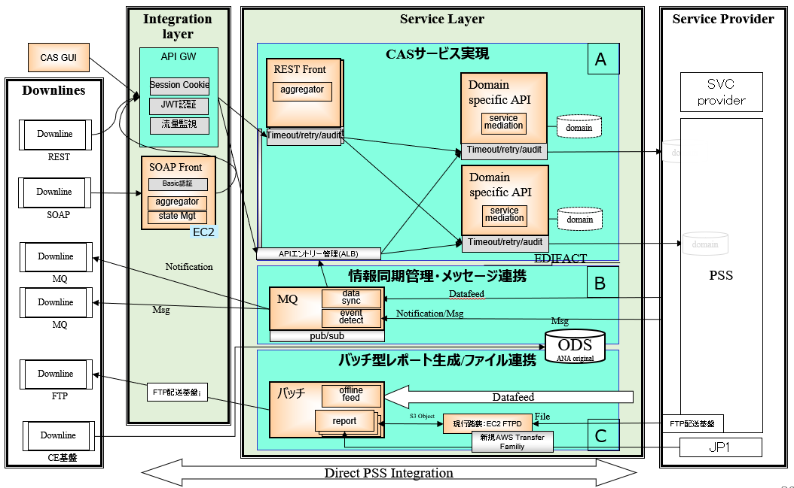

PLUSアプリケーションは、3つの機能群から構成される。

1. A. PLUSサービス実現
    - PSS, ProviderおよびPLUSが保持するデータを複合的に利用したサービスを提供する責務を持つ。
    - また、PSSの持つODSをPLUSのODSで代替する責務を持つ。

2. B. オンライン非同期処理
    - PSSの持つODSやPLUS業務で必要なデータを管理する責務を持つ。
    - また、PSSでのODS変更を周辺システムに適宜連携する責務を持つ。

3. C. バッチ処理
    - PLUS の持つODS状況を周辺システムに随時連携する責務を持つ。

## 6.2 アプリケーションの基本構造

- 本章の参照者</br>

|各ビジネス機能</br>(A01)|各ビジネス機能</br>(B01)|各ビジネス機能</br>(C01)|システム機能共通|共通機能|DB-API|
| :----:| :----: | :----: | :----: | :----: | :----: |
|○  |○ |○ |× |○ |○ |
<BR>


ここでは、アプリケーションの基本構造について述べる。本書では、基本的にSpring bootベースのアプリケーションを構築する上で必要なコンポーネントとその実装例について示す。また、Spring boot以外に生産性が向上するツール・ライブラリについて紹介する。

### 6.2.1 実装パターン別コンポーネント
ここでは、具体的に開発するAPIの論理構造のイメージをつけるため、Spring bootを用いたAPIの論理構造について述べる。

#### 基本構造のレイヤリング
APIの基本構造を主要な責務により以下のレイヤーに分割して各論理クラスを定義する。


A. オンライン同期処理／B. オンライン非同期処理

- 本章の参照者</br>

|各ビジネス機能</br>(A01)|各ビジネス機能</br>(B01)|各ビジネス機能</br>(C01)|システム機能共通|共通機能|DB-API|
| :----:| :----: | :----: | :----: | :----: | :----: |
|○  |○ |× |× |× |× |
<BR>

| レイヤ | 概要 |
| - | - |
| Controller | APIクライアントから呼び出されるRESTのインターフェース部分を実装する |
| Service | ビジネスロジックの実装、Repository層の呼び出しや入出力チェックを実装する |
| Repository | DBへのアクセスや、外部サービスのAPI連携を実装する |


C.バッチ処理

- 本章の参照者</br>

|各ビジネス機能</br>(A01)|各ビジネス機能</br>(B01)|各ビジネス機能</br>(C01)|システム機能共通|共通機能|DB-API|
| :----:| :----: | :----: | :----: | :----: | :----: |
|×  |× |○ |× |× |× |
<BR>


| レイヤ | 概要 |
| - | - |
| JobLauncher | Jobを実行するためのインターフェース |
| Job | JobLauncerから実行されるJobであり、複数のStepからなる |
| Step | Jobを構成する処理の単位 |

#### 論理クラス関連図

A. オンライン同期処理／B. オンライン非同期処理

- 本章の参照者</br>

|各ビジネス機能</br>(A01)|各ビジネス機能</br>(B01)|各ビジネス機能</br>(C01)|システム機能共通|共通機能|DB-API|
| :----:| :----: | :----: | :----: | :----: | :----: |
|○  |○ |× |× |× |× |
<BR>

APIの基本構造を、構成する論理クラスの関連として以下に示す。

> 表4.14

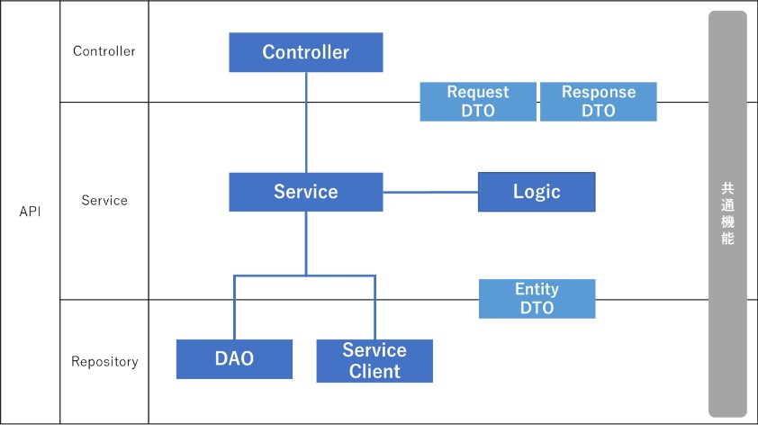

- レイヤー間のデータの受け渡しを行うため、論理クラスとしてDTO(Data Transfer Object)を定義する
- レイヤーを跨って、APIアプリケーション開発を支援するライブラリを提供する

C.バッチ処理</br>
<!--2021.09.30 add 指摘No.18-->
- 本章の参照者</br>

|各ビジネス機能</br>(A01)|各ビジネス機能</br>(B01)|各ビジネス機能</br>(C01)|システム機能共通|共通機能|DB-API|
| :----:| :----: | :----: | :----: | :----: | :----: |
|×  |× |○ |× |× |× |
<BR>


APIの基本構造を、構成する論理クラスの関連として以下に示す。1job1stepを基本とする。

> 表4.15

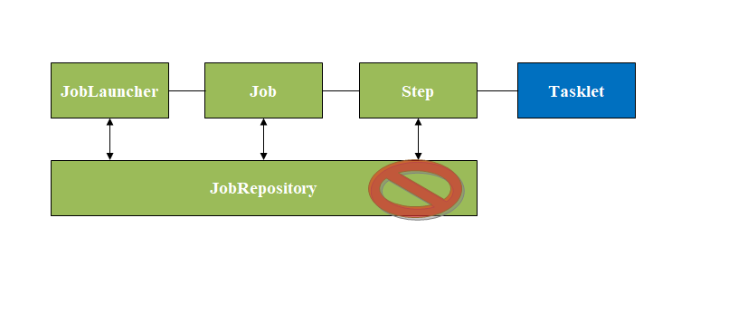

<!--2021.09.30 add end-->


#### 論理クラスの責務
各論理クラスの主な責務は以下の通りである。

A. オンライン同期処理／B. オンライン非同期処理

- 本章の参照者</br>

|各ビジネス機能</br>(A01)|各ビジネス機能</br>(B01)|各ビジネス機能</br>(C01)|システム機能共通|共通機能|DB-API|
| :----:| :----: | :----: | :----: | :----: | :----: |
|○  |○ |× |× |× |× |
<BR>


| レイヤー | 論理クラス | 責務の概要 |
|---|---|---|
| Controller | Controller | REST(HTTP)のインターフェースの実装を行う。</br>入力データに対するバリデーションを行う。</br>Serviceを実行し、処理結果をAPIクライアントに返却する。 |
| ^ | Listener | MQのインターフェース実装を行う。</br>入力データに対するバリデーションを行う。</br>Serviceを実行し、処理結果をMQサーバーに送信する。 |
| Service | Service | APIのビジネスロジックの実装を行う。</br>必要に応じてLogicやRepository層の各クラスを呼び出し、処理結果をResponseDTOとして返却する。 |
| ^ | Logic | DTO間の変換ロジックを実装する。</br>RequestDTO→EntityDTO、EntityDTO→ResponseDTOの間でデータ移送を行う。 |
| Repository | DAO | データベースへのアクセス処理を実装する。</br>データベーステーブルとEntityDTO間のORマッピング機能を提供する。 |
| ^ | Service Client | 外部システム（ImpactedSystem, 他PLUSサービス）との連携処理を実装する。</br>連携インターフェースとして、REST / MQをサポートする。 |
| DTO | RequestDTO | リクエストデータを格納するためのDTO。</br>Serviceを呼び出す際の入力となる。</br>入力データに対する単項目チェックの実装もここで行う。 |
| ^ | ResponseDTO | レスポンスデータを格納するためのDTO。</br>Serviceから処理結果として返却される。 |
| ^ | EntityDTO | データベースアクセスや外部システム連携の入力 / 処理結果データを格納するためのDTO。 |


C.バッチ処理

|各ビジネス機能</br>(A01)|各ビジネス機能</br>(B01)|各ビジネス機能</br>(C01)|システム機能共通|共通機能|DB-API|
| :----:| :----: | :----: | :----: | :----: | :----: |
|×  |× |○ |× |× |× |
<BR>


| レイヤー | 論理クラス | 責務の概要 |
|---|---|---|
| JobLauncher | Application | Jobを実行するためのインターフェース実装を行う。</br>本書では、`@SpringBootApplication`を付与したクラスで実装する。 |
| Job | JobConfig | Job, StepのBean定義を実装する。 |
| Step | ItemReader | データベースやファイルからJavaオブジェクトへの変換を実装する |
| ^ | ItemProcessor | 入力チェックやビジネスロジックを実装する |
| ^ | ItemWriter | Javaオブジェクトからデータベースやファイルへの書き込みを実装する |
<!--2021.09.30 add end-->


#### 共通機能
ここでは、APIの基本構造を実装することを支援するために提供される機能を一覧に示す。原則OSSのフレームワークやライブラリを使用するが、それぞれの機能において各サービス独自の拡張が必要になる可能性があることに注意。


- 本章の参照者</br>

|各ビジネス機能</br>(A01)|各ビジネス機能</br>(B01)|各ビジネス機能</br>(C01)|システム機能共通|共通機能|DB-API|
| :----:| :----: | :----: | :----: | :----: | :----: |
|○  |○ |○ |× |× |× |
<BR>

A. オンライン同期処理／B. オンライン非同期処理／C.バッチ処理
 <!--2021.09.29 mod by NEC-->            

<!--2021.10.28外部サービス呼び出しをOpenFeign(Feignclient)に変更-->

| 機能名称             | 概要                                                         | 提供方法                                          |
| -------------------- | ------------------------------------------------------------ | ------------------------------------------------- |
| 外部サービス呼び出し | 外部サービスのREST APIの呼び出し、およびメッセージキュー（MQ）へのアクセスの実装を支援する | SpringのOpenFeign(REST)、JmsTemplate(MQ)を使用 |
| 例外処理             | アプリケーション内部で発生した例外に対処する共通的な仕組みを提供する | SpringのExceptionHandlerを使用                    |
| リトライ             | 外部システム連携の呼び出しにおけるエラー対応・リトライを行うための仕組みの提供 | Spring Retryを使用                                |
| ログ出力             | アプリケーションからの各種ログ出力を支援する                 | Log4j2を使用                                      |
| バリデーター         | データの妥当性検証の実装を支援する                           | Bean Validation(JavaEE標準)を使用                 |
| Circuit Breaker                         | 各 API から操作される連携サービスに対する操作が接続エラーなどで失敗する場合に、設定内容に従って一時的に接続を遮断する。 | Spring Cloud Circuit Breaker、Resilience4jを使用             |
| メトリクス監視エンドポイント            | メトリクスを監視するためのエンドポイントを提供する。         | Spring Boot Actuator / Micrometerを使用                      |
| 分散トレーシング                        | サービス間連携のトレース情報をログに出力します               | Spring Cloud Sleuthを使用                                    |
|<!--2021.10.11 delete -->                 |||
| JSON ハイジャック対策                   | JSON ハイジャックを防止するため、受け入れるリクエストに制限をかける。 | Spring Boot の `@RequestMapping` に設定                      |
| CORS                                    | XSS や CSRF を防止するために API にアクセス可能なクライアントを制限する。 | Spring Boot の `@CrossOrigin` で設定                         |
| HTTP レスポンスヘッダのセキュリティ対策 | セキュリティ対策されたレスポンスヘッダを返却する。           | <!--2021.10.13 mod by NEC -->  <br/>スクラッチ実装<br/>※詳細は「 [レスポンスヘッダの実装](#レスポンスヘッダの実装) 」を参照<br/> <!--2021.10.13 mod end --> |
| OpenAPI Specification 出力              | OpenAPI Specification の JSON / YAML 出力や、 Swagger UI を提供する。<br />※初期設定では無効化されています | springdoc-openapi                                            |
| 冗長コードの自動生成                    | DTO の setter / getter 等の冗長なコードをコンパイル時に自動生成します | -                                                            |
| 死活監視             | KubernetesのReadiness Probeなどから実施されるヘルスチェックリクエストに応答するための仕組みの提供<font color="red">**(※開発フェーズにて要否と実装方法を検討する(検討チームは要確認)**<font>) | Spring Boot Actuatorを使用                        |
|<!--2021.09.29 mod end-->              |||

<!--TODO:引き継ぎ-->

## 6.3 使用するフレームワーク・ライブラリ

- 本章の参照者</br>

|各ビジネス機能</br>(A01)|各ビジネス機能</br>(B01)|各ビジネス機能</br>(C01)|システム機能共通|共通機能|DB-API|
| :----:| :----: | :----: | :----: | :----: | :----: |
|○  |○ |○ |○ |○ |○ |
<BR>


 <!--2021.09.29 mod by NEC--> 

使用（推奨）するフレームワーク・ライブラリは以下の通り。
| 名称 | 概要 |
| - | - |
| Spring Boot(Spring Framework) | Spring Frameworkが提供する様々な機能を活用してWebアプリケーションの開発生産性の向上を可能にするフレームワーク | - |
| Spring MVC | Springで提供されるREST APIを実装するためのライブラリ |
| Spring JMS | Springが提供するMQサービスを実装するためのライブラリ |
| Spring Retry | Springが提供する処理の再実行（リトライ）を実装するためのライブラリ |
| Mybatis | データベースアクセスおよびORマッピング機能を提供するフレームワーク. ほぼ生のSQLを記述でき、DBのテーブルベースでのアクセスが得意. |
| JDBC | データベースアクセスを提供するJava API. 原則としてオンライン／バッチ処理共通でMyBatisを採用する. 例外として、バッチ処理にて大量レコードを取得するDBアクセスを行うためJDBCを採用する必要性が発生した場合は別途調整を行うこと（調整先については決定次第反映）|
| Connection Pool | DB接続をプールし、再利用するためのライブラリ。 |
| AWS SDK for Java | Amazon Web Services用のJava APIを提供するライブラリ |
| Log4j2 | Javaでログ出力を実装するためのログ出力支援実装を提供するライブラリ |
| JUnit | Javaの単体テストを行うためのテスティング・フレームワーク |
| Spring JUnit | Springベースのアプリケーションに対応したJUnitの拡張ライブラリ |
| DBUnit | データベースへのアクセスを伴う処理の単体テストを効率的に実施するためのJUnit拡張ライブラリ |
| Spring DBUnit | Springベースのアプリケーションに対応したDBUnitの拡張 |
| Spring Boot Test | Spring bootアプリケーションのテストをJUnitベースで記述するための支援ライブラリ |
| TestContainer | JUnitによるコンテナ操作を支援するライブラリ |
| Pact JVM | CDC Testing フレームワークであるPactのJava対応ライブラリ |
| Lombok | Javaクラスのgetter/setter、toStringなどのメソッド作成を自動化するためのライブラリ |
| Spring Cloud Circuit Breaker | Springが提供するフォールトレラント（障害許容）を高くするためのライブラリ |
| Resilience4j | Javaで実装されたサーキットブレイカーライブラリ |
| Spring Boot Actuator / Micrometer | Spring bootアプリケーションのメトリクスをモニタリングシステムで収集するためのライブラリ |
| Spring Cloud Sleuth | Springが提供する入力ポイントと出力ポイントを計測しトレースするためのライブラリ |
| <!--2021.10.11 delete --> |  |
| <!--2021.10.11 delete end --> |  |
| springdoc-openapi | Spring Bootを利用しているプロジェクトでOpenAPI形式のAPIドキュメントを生成するためのライブラリ |
| <!--2021.09.29 mod end--> |  |


## 6.5 論理構造とJavaのパッケージ / クラス構成


- 本章の参照者</br>

|各ビジネス機能</br>(A01)|各ビジネス機能</br>(B01)|各ビジネス機能</br>(C01)|システム機能共通|共通機能|DB-API|
| :----:| :----: | :----: | :----: | :----: | :----: |
|○  |○ |○ |× |○ |○ |
<BR>

4.2.2 実装パターン別コンポーネントで述べたレイヤー、論理クラスと実際に開発するJavaパッケージについて、対応関係とそのパッケージに含めるクラスの概要は以下のようになる。ここで、アプリケーション名を`example`とする。なお、パッケージのPLUSドメイン部分（`jp.co.ana.cas`）については省略する。
<!--#3540 DTOのパッケージ名修正-->
| レイヤー | 論理クラス | 対応するJavaパッケージ | 含まれるクラスの概要 |
| - | - | - | - |
| Controller | Controller | `exmaple.controller` | @RestControllerアノテーションを付与したRESTインターフェースを表現する |
| ^ | Listener | `exmaple.listener` | @JmsListenerアノテーションを付与したMQインターフェースを表現する |
| Service | Service | `example.service` | @Serviceアノテーションを付与したAPI実装の処理を行う |
| Repository | DAO | `example.repository.dao` | ORM(Mybatis)のインターフェース |
| ^ | Service Client | `example.repository.service` | API実装の中で呼び出す外部サービス(REST / MQ)呼び出しの実装 |
| DTO | Request | `example.dto.request` | リクエストがマッピングされる先のオブジェクト |
| ^ | Response | `example.dto.response` | レスポンスの元となるオブジェクト |
| ^ | Entity | `example.dto.database` | DBエンティティを表現するDTO |
| JobLauncher | Application | `exmaple` | `commandLineRunner`を追加した、`@SpringBootApplication`アノテーションを付与したApplicationクラス |
| Job | JobConfig | `example.job` | Job, StepのBean定義を行うConfigurationクラス |
| Step | ItemReader | `example.repository.step` | データベースやファイルからJavaオブジェクトへの変換を実装したクラス |
| ^ | ItemProcessor | ^ | 入力チェックやビジネスロジックを実装したクラス |
| ^ | ItemWriter | ^ | Javaオブジェクトからデータベースやファイルへの書き込みを実装したクラス |

このほかにも、ユーティリティクラスのパッケージ（`example.util`）やコンフィグクラスのパッケージ（`example.config`）などが考えられる。必要に応じてパッケージを作成すること。

## 6.6 REST実装サンプル説明


- 本章の参照者</br>

|各ビジネス機能</br>(A01)|各ビジネス機能</br>(B01)|各ビジネス機能</br>(C01)|システム機能共通|共通機能|DB-API|
| :----:| :----: | :----: | :----: | :----: | :----: |
|○  |○ |○ |○ |○ |○ |
<BR>

<!--サンプルレポジトリに関する扱いを追記-->
REST通信向けマイクロサービスの実装サンプルとして[cas-template-rest-master](https://github.com/ANA-CASG/cas-template-rest-master)が利用できる。
こちらのレポジトリについては他に非機能系基盤処理のサンプルも含む。
サンプルに関する不明点の問い合わせ先はアプリ共通チームとする。

### 6.6.1 Controller層の開発
Controller層の開発では、外部IF仕様に沿って、インターフェースを実装するControllerクラスと、リクエストを表現するDTO（Request）とレスポンスを表現するDTO（Response）が対象となる。

以下のリポジトリのAPIテンプレートコード作成&修正の手順に沿って、外部設計書のAPI仕様からOpenAPI Generatorを使ってテンプレートコードを作成する。</br>

> リポジトリ: [1.3 参照ドキュメント一覧](#13-参照ドキュメント一覧) 「テンプレートコード作成修正」

<!--
TODO:上記「テンプレートコード作成修正」の必要性について確認
-->

OpenAPI Generatorで自動生成される内容は以下の通りである。

| 論理クラス | 概要 |
| - | - |
| Request | API仕様をもとに、リクエストがマッピングされる先のオブジェクトが生成される |
| Response | API仕様をもとに、レスポンスの元となるオブジェクトが生成される |
| IController | API使用をもとに、RESTインターフェースを表現するInterfaceが生成される。 |
| Controller | IControllerの具象化クラスが生成される。 |

OpenAPI Generatorによる自動生成は、以下の方針を推奨する。
- Request / Responseは、手動による修正が少ないと思われるため設計変更のたび自動生成で対応する
- IControllerは、インターフェースであり手動による修正が少ないと思われるため設計変更のたび自動生成で対応する
- Controllerは、ほとんどが手動による実装のため手動修正で対応する

RESTインターフェースのController層の開発では、自動生成されたControllerクラスに対して、IControllerインターフェースのメソッドをオーバーライドする形で、実際の業務処理を実装していく。

例）MailApiControllerの実装
```java
@RestController
@RequestMapping("${openapi..base-path:/api/v1}")
public class MailApiController implements I_MailApi {

    private final NativeWebRequest request;

    // 1. ServiceのDI
    @Autowired
    RequestMailService requestMailService;

    @org.springframework.beans.factory.annotation.Autowired
    public MailApiController(NativeWebRequest request) {
        this.request = request;
    }

    @Override
    public Optional<NativeWebRequest> getRequest() {
        return Optional.ofNullable(request);
    }

    // 2. Service呼び出しとResponse返却
    @Override
    public ResponseEntity<MailResponseInfoDTO> requestMail(@ApiParam(value = "ASW TAからのメール要求受信" ,required=true )  @Valid @RequestBody ReservationInfoDTO reservationInfoDTO) {

        // ① Service呼び出しによるビジネスロジックの実行
    	int resultCode = requestMailService.sendMailRequest(reservationInfoDTO);

        // ② ResponseDTOの作成 イミュータブルにする
    	MailResponseInfoDTO mailResponseInfoDTO = new MailResponseInfoDTO(String.valueOf(resultCode));

        // ③ Responseの返却
    	return ResponseEntity.ok(mailResponseInfoDTO);
    }

}
```

Controllerの実装でのポイントは、以下の3点である。

**1. ServiceのDI**
Controller内で使用するServiceクラス（実際にビジネスロジックを行うクラス）をDIする。DIは、Springのアノテーション である`@Autowired`をインスタンス変数の宣言部に付与することで実現できる。

**2. Service呼び出しとResponse返却**
Controllerクラスの責務はインターフェースの提供のため、実際のビジネスロジックはServiceクラスが行う。そのため、基本的には以下のような処理を実装する。
1. DIしたServiceクラスのメソッドを呼び出す形でビジネスロジックを実行する。
2. クライアントに返却するインターフェースに合わせるため、Serviceクラスのメソッドの戻り値からResponseDTOを作成する。
3. ResponseDTOをクライアントに返却する。

※RESTAPIにおいてレスポンスデータの項目に値がない場合にはnullをセットすること。（【アプリ】、【PLUSGUI】、【DB-API】共通とする。）

**3. SpringBootrunの定義**
SpringBootを起動させるrunメソッドを定義する。基本的には以下のような処理を実装する。
1. Controller層のクラスにSpringのアノテーションである`@SpringBootApplication`を付与する。
2. 付与した`@SpringBootApplication`にscanBasePackagesにて対象クラスをパッケージを指定する。
3. runメソッドを定義する。


例）SpringBootrunの定義の例
```java
// @SpringBootApplicationアノテーションの付与
// scanBasePackagesにて対象クラスをパッケージを指定
@SpringBootApplication(scanBasePackages = {"jp.co.ana.cas.proto.online.service", "jp.co.ana.cas.proto.online.repository"})
@RestController
@RequestMapping("/service/crudresults")
public class DbCrudApiController {

  // runメソッドの定義
  public static void main(String[] args) {
    SpringApplication.run(DbCrudApiController.class, args);
  }

  // ServiceクラスのDI
  @Autowired
  private DbCrudApplication dbCrudApplication;

  // Serviceの呼び出しと返却
  @RequestMapping(method = RequestMethod.GET)
  public List<LiftCpnInfo> index(@ModelAttribute LiftCpnInfo liftCpnInfo) {
    return dbCrudApplication.getAll();
  }
}
```

### 6.6.2 Service層の開発
Service層の開発では、Controllerから呼び出されるビジネスロジックの実装を行う。実装する処理は操作による差異はあるものの、大きくは以下2つとなる。
- ビジネスロジックを実行する
- Repository層を利用してDBや外部サービスを呼び出す

例1）SendMailServiceのクラス定義とインスタンス変数定義
```java
// 1. @Serviceアノテーションの付与
@Service
public class SendMailService implements I_SendMailService {

    // 2. Repository層のクラスのDI
    @Autowired
    SampleHttpClient sampleHttpClient; // Service Client(REST)
	
    @Autowired
    CasReportPublisher casReportPublisher; // Service Client(MQ)

    @Autowired
    SendMailRepository sendMailRepository; // DAO

    @Value("${app.compf.root-url}")
    String comPfUrl;

    private static final String COM_PF_REQUEST_URI = "/deliveries";
```

Serviceクラスのクラス定義とインスタンス変数定義でのポイントは、以下の２点である。

**1. `@Service`アノテーションの付与**
Serviceクラスには`@Service`アノテーションを付与する。

**2. Repository層のクラスのDI**
基本的にはControllerクラスと同様に、Service内で使用するRepository層のクラス（DAOやService Client）をDIする。

---
例2）SendMailServiceのメソッド定義
```java
    // 省略

    // 1. トランザクション処理
    @Transactional
    // 2. DAOを用いたDBアクセス処理
    @Override
    public void saveMailRequest(String mailSequenceId, String mailRequestAsJson, int errorCode) {
        sendMailRepository.saveMailRequest(mailSequenceId, mailRequestAsJson, errorCode);
    }
```

Serviceクラスのメソッド定義でのポイントは、以下の2点である。

**1. トランザクション処理**
Springのアノテーション である`@Transactional`をpublicメソッドに付与すると、メソッド単位でのトランザクションが開始され、管理される。
一般的に、トランザクションはServiceクラスレベルで管理するため、Serviceクラスのメソッドに対して`@Transactional`を付与している。
上記の例では、ServiceクラスにてDBアクセス処理を呼び出すメソッドに`@Transactional`を付与し、トランザクション管理を行っている。
PLUSにおけるトランザクション管理方針については、4.9.7 トランザクション方針で記述する。

**2. DAOを用いたDBアクセス処理**
DIされたRepository層のクラスのDAO(`sendMailRepository`)を用いてDBアクセスを行なっている。

### 6.6.3 Repository層の開発

Repository層のクラスとして考えられるものは、以下の２つである。
1. DAO: DBアクセスを行う
2. Service Client: 外部サービスへのアクセスを行う

**1. DAOの開発**
DAOの開発では、MyBatisによるDBアクセスのクラス群との2つのファイルを作成する。これらは、MyBatisGeneratorを用いることで生成する。
MyBatisGeneratorでは、稼働中のDBのテーブルから以下の実装が自動生成される。
| クラス名 | 概要 |
| - | - |
| `[テーブル名]Mapper.java` | JavaのDAOインタフェース。SELECT、INSERT、UPDATE、DELETEの基本的なメソッドが用意されている。 |
| `[テーブル名]Mapper.xml` | MyBatisのMapper XMLファイル。TABLEのカラムとJavaで実装したDTOをMappingする機能や、SQLを生成する機能を持つ。xmlファイルは、`[テーブル名]Mapper.java`に対応した実装が自動生成されている。 |
| `[テーブル名].java` | JavaのDTOクラス。DBのテーブル定義に沿ったフィールドが用意される。Updateやinsertの時は、このクラスを引数として用いる |

これらの自動生成されたファイルに対して修正、追加を行なっていく形で開発を進める。


独自に定義したSQLを利用したい場合は、主に以下のようなフローで開発を行う。
1. `Mapper.xml`にSQL定義を追加する
2. `Mapper.java`にSQL定義に対応するメソッドを追加する

以降の例は、以下のようなテーブルからMybatisGeneratorで自動生成した`Mapper.xml`, `Mapper.java`である。
| カラム名 | 型 |
| - | - |
| ID | `int` |
| NAME | `varchar(30)` |

例) `Mapper.xml`のSQL定義の例
```xml
  <!-- SQLコンポーネント（列名のリスト、自動生成） -->
  <sql id="Base_Column_List">
    <!--
      WARNING - @mbg.generated
      This element is automatically generated by MyBatis Generator, do not modify.
    -->
    id, name
  </sql>
  
  <!-- 主キー検索（自動生成） -->
  <!-- ① SQLを定義 -->
  <select id="selectByPrimaryKey" parameterType="java.lang.Integer" resultMap="BaseResultMap">
    <!--
      WARNING - @mbg.generated
      This element is automatically generated by MyBatis Generator, do not modify.
    -->
    select 
    <!-- ② includeタグによる、SQLコンポーネントの展開 -->
    <include refid="Base_Column_List" />
    from public.hoge
    <!-- ③ パラメータの使用 -->
    where id = #{id,jdbcType=INTEGER}
  </select>

  <!-- 挿入（自動生成） -->
  <insert id="insertSelective" parameterType="com.example.demoproducer.domain.database.Hoge">
    <!--
      WARNING - @mbg.generated
      This element is automatically generated by MyBatis Generator, do not modify.
    -->
    insert into public.hoge
    <!-- ④ 制御タグによるSQLの動的組み立て -->
    <trim prefix="(" suffix=")" suffixOverrides=",">
      <if test="id != null">
        id,
      </if>
      <if test="name != null">
        name,
      </if>
    </trim>
    <trim prefix="values (" suffix=")" suffixOverrides=",">
      <if test="id != null">
        #{id,jdbcType=INTEGER},
      </if>
      <if test="name != null">
        #{name,jdbcType=VARCHAR},
      </if>
    </trim>
  </insert>
```

`Mapper.xml`のSQL定義では、以下の4つのポイントが存在する。
1. `select`, `insert`などのタグでSQLのタイプを指定し、SQL定義を開始する</br>`parameterType`属性に、SQLが受け取るパラメータの型を指定する
2. `Mapper.xml`では、SQLのコンポーネントを部品化することができる</br>`include`タグで、部品化したSQLコンポーネントをSQL定義に展開することができる
3. `#{パラメータ名}`、`${パラメータ名}`で、受け取ったパラメータをSQL定義に展開することができる
4. `Mapper.xml`では、SQL組み立てのために(`if`, `trim`など)制御文を利用して動的なSQLを定義することができる</br>利用できる主なタグについては、以下を参照。</br>https://mybatis.org/mybatis-3/ja/dynamic-sql.html

例) `Mapper.xml`のSQL定義の手動定義例
```xml
 <select id="getMindsDataWork" resultMap="BaseResultMap">
    SELECT
        to_char(current_timestamp, 'YYMMDDHH24MISS') as "pro_tim",
        rpad(S.fqt_num,20,' ') as "mem_num",
        substr(substr(trim(PI.las_nam), 0 ,27) || '/' || PI.fir_nam, 0, 29) as "pas_nam",
        A.car_cod as "car_cod",
        A.fli_num as "fec_num",
        to_char(A.fli_seg_dep_dat, 'YYYYMMDD') as "boa_dat",
        A.dep_air_cod as "sta_air_cod",
        A.arr_air_cod as "arr_air_cod",
        ' ' as "res_com_cla",
        A.boo_cla as "res_sel_cla",
        A.boo_cla as "boa_cla",
        rpad(substr(L.cus_che_in_sec_id, 0, 3), 3, '0') as "boa_num",
        L.sea_num as "sea_num",
        '        ' as "res_sto_cod",
        '        ' as "tic_sto_cod",
        T.tic_num as "avi_tic_num",
        A.fli_seg_dep_tim as "std",
        ' ' as "reg_med_cod",
        substr(S.fqt_car_cod, 0, 2) || 'F' as "all_pro_cod",
        substr(rpad(S.fqt_num, 10, ' '), 0, 10) as "ana_cus_num",
        substr(A.car_cod, 0, 2) || ' ' || substr(to_char(A.fli_num, '999'), 0, 4) as "ope_fec_nam",
        A.boo_cla as "cod_sha_boo_cla",
        rpad(T.tic_num, 13, '0') as "par_tic_num",
        ' ' as "lev_div_opt",
        A.pnr_rec_loc as "pnr_loc",
        '  ' as "res_cha_cod_maj",
        '  ' as "res_cha_cod_mid",
        '  ' as "res_cha_cod_lit",
        '  ' as "tic_cha_cod_maj",
        '  ' as "tic_cha_cod_mid",
        '  ' as "tic_cha_cod_lit",
        '  ' as "set_cha_cod",
        '  ' as "pay_met_mai",
        ' ' as "pay_met_sub",
        ' ' as "etk_pas_fla",
        ' ' as "res_rec_fla",
        to_char(H.pnr_cre_dat, 'YYYYMMDD') as "res_dat",
        to_char(T.fa_cre_dat, 'YYYYMMDD') as "tic_dat",
        ' ' as "aut_che_in_fla",
        ' ' as "sma_e_che_in_ope",
        ' ' as "pre_pri_fla",
        ' ' as "far",
        ' ' as "tou_cod",
        '               ' as "rem_fla_for_tri",
        '3' as "che_in_sta_fla",
        '        ' as "tic_sal_off_num",
        '   ' as "col",
        '               ' as "fil",
        to_char(H.pnr_cre_dat, 'YYYYMMDD')  as "pnr_cre_dat_str",
        '1'  as "upd_tim",
        '1' as "pas_pas_tat_num",
        '1' as "iti_seg_tat_num",
        '1' as "acc_fla"
    
    FROM
        pnr_header H
    INNER JOIN  pnr_airseg A ON
        A.pnr_rec_loc = H.pnr_rec_loc
    INNER JOIN pnr_paxinfo PI ON
        PI.pnr_rec_loc = H.pnr_rec_loc
    INNER JOIN pnr_pdiled L ON
        L.pnr_rec_loc = H.pnr_rec_loc
    INNER JOIN pnr_ssrffp S ON
        S.pnr_rec_loc = H.pnr_rec_loc
    INNER JOIN pnr_tktinfo T ON
        T.pnr_rec_loc = H.pnr_rec_loc

    WHERE
        H.upd_dat >= to_timestamp(#{proTimDate}, 'YYYY-MM-DD HH24:MI:SS')
    AND
        A.fli_seg_dep_dat >= to_date(#{startUpDate}, 'YYYY-MM-DD') - 4
    </select> 
```

---

例) `Mapper.java`のインターフェース定義の例(自動生成)
```java
@Repository
@Mapper
public interface HogeMapper {
    // 省略

    /**
     * This method was generated by MyBatis Generator.
     * This method corresponds to the database table public.hoge
     *
     * @mbg.generated
     */
    int insertSelective(Hoge record);

    /**
     * This method was generated by MyBatis Generator.
     * This method corresponds to the database table public.hoge
     *
     * @mbg.generated
     */
    Hoge selectByPrimaryKey(Integer id);

    // 省略
}
```

新規に`Mapper.java`を自動生成する場合、クラス宣言部にSpringのアノテーションである`@Repository`を付与する。
`Mapper.java`では、`Mapper.xml`で定義したSQLに対応するメソッドを追加する。
各メソッドは、メソッド名に`id`属性が一致する`Mapper.xml`のSQLを実行する。

例) `Mapper.java`のインターフェース定義の例(手動定義)
```java
@Mapper
public interface MindsDataWorkOperationMapper {
    
    MindsDataWorkOperation getMindsDataWork(Map<String, String> argMap);
}
```

---

例) Serviceクラスからの利用例
```java
@Transactional
public HogeResponse doService(HogeRequest request) {
    // Hoge型は、MybatisGeneratorで自動生成されるEntityDTO
    // hogeMapperはDI済みとする

    // ① DAOクラス利用し、SQLを実行
    Hoge entity = this.hogeMapper.selectByPrimaryKey(request.getId());

    // ② DBの返却結果に応じてビジネスロジックを行う

    // ③ 必要に応じてResponseDTOに詰め替えを行う
    HogeResponse res = new HogeResponse();
    res.setId(entity.getId());
    res.setName(entity.getName());

    return res;
}
```

上記は、DAOクラスをServiceクラスから利用する例である。
Serviceクラスでの利用では、以下の3つのポイントが存在する。
1. DAOクラスのメソッドを利用し、DBにたいしてSQLを実行する
2. DBの返却結果に応じてビジネスロジックを実行する
3. 必要に応じて、EntityDTOをResponseDTOに詰め替え、Controllerに返却する

**2. Service Clientの開発**
<br/><!--2021.10.13 mod by NEC -->  <br/>
外部サービス（ HTTP ）連携では、連携する対象のサービスから正常応答以外のレスポンスが返された場合に処理を異常とし、 fallback 処理を実行します。

SampleHttpClient に実装されている各メソッドで正常と判断するステータスコードは、 API 標準化規約に従い下表のとおりとなります。それ以外のステータスコードを受信した場合は異常と判断します。

|メソッド|正常と判断するステータスコード|
|----|----|
|post|200 (OK),201 (Created)|
|get|200 (OK)|
|getAll|200 (OK)|
|put|200 (OK), 204 (No Content)|
|delete|204 (No Content)|

異常ステータスコードを受信した場合は上表のメソッドは以下の例外をスローします。なお、例外が発生すると、fallbackメソッドに処理が委譲されます。

|ステータスコード|スローされる例外|
|----|----|
|4xx|org.springframework.web.client.HttpClientErrorException|
|5xx|org.springframework.web.client.HttpServerErrorException|
|その他|org.springframework.web.client.RestClientException|

以下、本テンプレートで初期実装されているメッセージ送信の実装に対するカスタマイズの方法を説明します。

##### 1. application-production.yml に外部サービスのURLを設定

外部サービス に HTTP リクエストを送る場合はまず `application-production.yml` に外部サービスの URL や HTTP ヘッダーを定義します。

この時必要に応じURL内に {id} 等のプレースフォルダーを記載することでプログラムから渡したパラメータをURLに埋め込むことができます。

また、以下ではプロダクション環境とテスト環境でアクセス先が変わることを想定し、外部サービスのURLは環境変数から取得しています。

```yaml
external-service:
  services:
    sample:
      url:
        get: ${EXTERNAL_SERVICE_SAMPLE_BASE_URL}/{id}
        getall: ${EXTERNAL_SERVICE_SAMPLE_BASE_URL}
      header:
        content-type: application/json
        X-Requested-With: XMLHttpRequest
```

##### 2. HttpClient を修正する

`application-production.yml` で指定した URL / HTTP ヘッダー情報を、`application-production.yml` にあるサービスのキー ( `sample` ) を指定して取得します。

URL の取得の際は、複数のURLを指定可能としているため、さらに `application-production.yml` にある URL 毎のキー ( `get` や `getall` ) を指定して取得します。

また、URLに {id} 等のプレースフォルダーを利用している場合は、置き換える値を `restTemplate.exchange()` メソッドの最後のパラメータとして追加してください。

```java
    private static final String EXTERNAL_SERVICE_NAME = "sample";
    private static final String EXTERNAL_SERVICE_URL_GET = "get";
    
    public SampleHttpClientDto get(String id) {
        HttpHeaders headers = createHeader(config.getServices().get(EXTERNAL_SERVICE_NAME).getHeader());
        Map<String, String> urls = config.getServices().get(EXTERNAL_SERVICE_NAME).getUrl();
        HttpEntity<String> entity = new HttpEntity<>(headers);
        String url = urls.get(EXTERNAL_SERVICE_URL_GET);
        ResponseEntity<SampleHttpClientDto> response = this.restTemplate.exchange(url, HttpMethod.GET, entity,
                SampleHttpClientDto.class, id);

        return response.getBody();
    }
```
<!--2021.10.13 mod end -->  <br/>


## 6.7 SOAP実装サンプル説明

- 本章の参照者</br>

|各ビジネス機能</br>(A01)|各ビジネス機能</br>(B01)|各ビジネス機能</br>(C01)|システム機能共通|共通機能|DB-API|
| :----:| :----: | :----: | :----: | :----: | :----: |
|○  |× |× |○ |× |× |
<BR>

PLUSシステムにおけるSOAP受信インターフェースは、原則SOAP Frontにより吸収されるため、REST実装と同じ実装となる。

> 図.4.7.1 SOAP Front経由時のデータの流れ
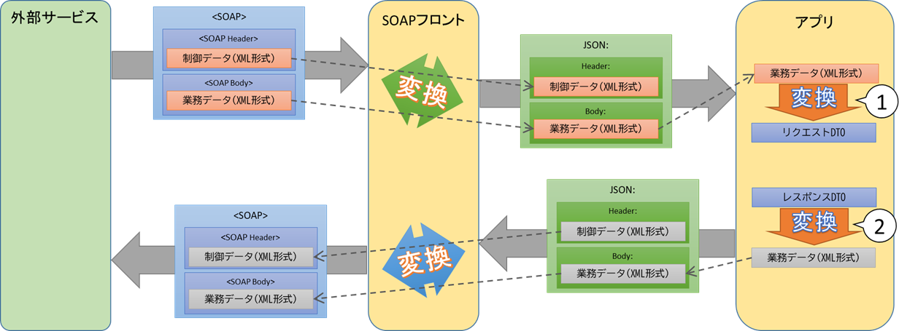

SOAP Front経由で外部サービスから呼び出されるプロバイダーを実装する場合は、SOAP FrontからJSONの中に設定したXML形式の文字列を受信し、SOAP Frontに返却するレスポンスにはXML形式の文字列を設定する必要がある。  

この際に必要となるXMLとDTO間の変換(上図の①②)方法については、下記に記載する。  

> 「4.9.1 外部サービス呼び出し実装方針と実装例」の [1. RESTインターフェース呼び出し](#1-restインターフェース呼び出し)

また、外部サービスのリクエスト／レスポンスに対応するDTOの作成方法については、下記の資料に記載する。  
> 補足：[WSDL/XSDからのJavaソース生成手順](appendix/xcj-usage.md)
  

## 6.8 MQ実装サンプル説明

- 本章の参照者</br>


|各ビジネス機能</br>(A01)|各ビジネス機能</br>(B01)|各ビジネス機能</br>(C01)|システム機能共通|共通機能|DB-API|
| :----:| :----: | :----: | :----: | :----: | :----: |
|×  |○ |× |× |× |× |
<BR>

ここでは、MQインターフェースを持つサービスの実装サンプルについて説明する。
ただし、Service層, Repository層についてRESTと同様のため省略する。

<!--サンプルレポジトリに関する扱いを追記-->
①MQ通信向けのアプリケーション実装方式は以下の記載を参照</br>
・アプリケーション実装方式設計書(オンライン編)-34.MQ連携</br>
・アプリケーション実装方式設計書(オンライン編)-35.SNS+SQS連携</br>

②内部連携用のMQに関しては、機能・非機能要件に応じてActiveMQとSNS＋SQSの使い分けが必要。使い分けの方針については、以下の資料を参照</br>
「SQS+SNSとActiveMQ使い分け.xslx」

③MQ通信向けマイクロサービスの実装サンプルとして以下を利用すること。</br>
・cas-template-activemq-master</br>
・cas-template-sns-master</br>
・cas-template-sqs-master</br>

④SNS+SQSで分散トレーシング対応を実装する場合、Spring Cloud Sleuthではなく個別の実装が必要なため、該当の処理をCommon22/23として共通部品化としている。共通部品の仕様についてはシステム機能要件書参照。</br>
「SMDI_CAS_APL_システム機能要件書_アプリ共通処理.docx」


#### 6.8.1 Controller層の開発
Controller層の開発では、外部IF仕様に沿って、メッセージの受け取りを行うListenerクラスを実装する。また、送受信するメッセージを表現するDTOを実装する。

##### 1. 送受信するメッセージを表現するDTOの開発
送受信するメッセージをPOJOとして扱うためにDTOのクラスを作成する。

例）MailSendRequestの実装
```java
/**
 * 自システムのINPUTとなるメール送信要求を表すドメインエンティティ.
 */
@Data
@Builder
public class MailSendRequest {

    String mailTemplateId;
    String mailSequenceId;

    String mailDiv;
    String pnrRecordLocator;
    MailInfo mailInfo;
	
}
```

DTOのクラスを定義する際、以下のアノテーションを付与する。
| アノテーション | 概要 |
| - | - |
| `@Data` | 対象クラスにgetter/setterが自動生成され、`toString`, `hashCode`, `equals`がオーバーライドされる。 |
| `@Builder` |　対象クラスに`builder`メソッドが自動生成され、Builderパターンを用いたインスタンスを生成することができる。 |

##### 2. Listenerの開発
Listenerの開発では、MQからメッセージを受信しService層を呼び出しビジネスロジックを実行する処理を実装する。

例）SendMailListenerの実装
```java
/**
 * メール送信要求の受け手となるクラスです.
 */
@Component
public class SendMailListener {
    // 省略

    @Autowired
    SendMailService sendMailService;

    // ① @JmsListenerによるMQメッセージの受信待受
    @JmsListener(destination = "mail_send", containerFactory = "jmsListenerContainerFactory")
    public void consume(String message) throws InterruptedException, JsonProcessingException {

        // ②. 受信メッセージをDTOに変換
    	// メッセージを要求オブジェクトに変換（以下はメッセージのコンテンツがJSON形式の場合の例です）
        ObjectMapper mapper = new ObjectMapper();
    	MailSendRequest mailSendRequest = mapper.readValue(message, MailSendRequest.class);

        // ③. Service呼び出しによるビジネスロジックの実行
        int errorCode = MAIL_REQUEST_ERROR_CODE_OK;
        try {
        	sendMailService.requestReport(mailSendRequest.getPnrRecordLocator());
        	sendMailService.sendMail(mailSendRequest);
        } catch (Throwable e) {
        	logger.error(e.getMessage(), e);
        	errorCode = MAIL_REQUEST_ERROR_CODE_NG;
        } finally {
    	    sendMailService.saveMailRequest(mailSendRequest.getMailSequenceId(), message, errorCode);
    	}
    }
    // 省略
}
```

Listenerクラスでは、基本的には以下のような処理を実装する。
1. Springのアノテーション である`@JmsListener`を付与し、MQメッセージの待受を行う（付与されたメソッドがメッセージ受信時に実行される）
2. 受信メッセージを受信メッセージを表現するDTOに変換する
3. RESTと同様に、DIしたServiceを呼び出すことでビジネスロジックを実行する

`@JmsListener`で受信待受を行う対象となるMQサーバーへの接続情報は、環境変数で定義する。
ActiveMQの設定は application.yml の spring.activemq に記載されているので、必要に応じて変更する。


## 6.9 共通機能実装方針

- 本章の参照者</br>

|各ビジネス機能</br>(A01)|各ビジネス機能</br>(B01)|各ビジネス機能</br>(C01)|システム機能共通|共通機能|DB-API|
| :----:| :----: | :----: | :----: | :----: | :----: |
|○  |○ |○ |○ |○ |○ |
<BR>

ここでは、ログ出力やバリデーションなどの、業務に依存しない共通機能の実装についての方針を記述する。


<!--2021.09.30 mod 指摘No.18-->

<!--2021.10.28外部サービス呼び出しをOpenFeign(Feignclient)に変更-->

以下の機能について方針を記述する。

| 機能名称 | 概要 | 提供方法 |
| - | - | - |
| 外部サービス呼び出し | 外部サービスのREST　APIの呼び出し、およびメッセージキュー（MQ）へのアクセスの実装を支援する | SpringのOpenFeign(REST)、JmsTemplate(MQ)を使用 |
| FTP機能 | FTPサーバを使用して外部サービスとのファイル送受信の仕組みを提供 | AWS SDKを使用 |
| 例外処理 | アプリケーション内部で発生した例外に対処する共通的な仕組みを提供する | SpringのExceptionHandlerを使用 |
| リトライ | 外部システム連携の呼び出しにおけるエラー対応・リトライを行うための仕組みの提供 | Spring Retryを使用 |
| ログ出力 | アプリケーションからの各種ログ出力を支援する | Log4j2を使用 |
| バリデーター | データの妥当性検証の実装を支援する | Bean Validationを使用 |
| トランザクション処理 | Serviceクラスのメソッドに対してトランザクション管理を行う | Springの`@Transactional`を使用 |
| 暗号化処理 | ファイルの暗号化/復号化処理、文字列の暗号化/復号化処理を提供する | |<!--#2553 mod by NEC-->GW機能にて処理を実施する。 |
|<!--2021.09.29 mod by NEC-->|||
|Circuit Breaker|各 API から操作される連携サービスに対する操作が接続エラーなどで失敗する場合に、設定内容に従って一時的に接続を遮断する。|Spring Cloud Circuit Breaker、Resilience4jを使用|
|メトリクス監視エンドポイント|メトリクスを監視するためのエンドポイントを提供する。|Spring Boot Actuator / Micrometerを使用|
|分散トレーシング|サービス間連携のトレース情報をログに出力します|Spring Cloud Sleuthを使用|
| <!--2021.10.11 delete --> |||
|JSON ハイジャック対策|JSON ハイジャックを防止するため、受け入れるリクエストに制限をかける。|Spring Boot の `@RequestMapping` に設定|
|CORS|XSS や CSRF を防止するために API にアクセス可能なクライアントを制限する。|Spring Boot の `@CrossOrigin` で設定|
|HTTP レスポンスヘッダのセキュリティ対策|セキュリティ対策されたレスポンスヘッダを返却する。|スクラッチ実装|
|OpenAPI Specification 出力|OpenAPI Specification の JSON / YAML 出力や、 Swagger UI を提供する。<br />※初期設定では無効化されています|springdoc-openapi|
|冗長コードの自動生成|DTO の setter / getter 等の冗長なコードをコンパイル時に自動生成します|lombok|
| <!--2021.10.11 delete --> |  |  |
|<!--2021.09.29 mod end-->|||
|<!--2021.09.30 mod end-->|||

#### 6.9.1 外部サービス呼び出し実装方針と実装例
ここでは、外部サービス呼び出しに関する実装方針について記述する。

##### 1. RESTインターフェース呼び出し
外部サービスの呼び出しを行う場合は、アプリはRESTインターフェースを実装して、SOAP Frontにリクエストする。
SOAP FrontにてRESTからSOAPリクエスト変換を行い外部サービスを呼び出す方式となる。
 <br/><!--2021.10.13 mod by NEC -->  <br/>
RESTインターフェースの実装は、Spring Bootで提供する`Spring Cloud OpenFeign`を使用する。

| 機能名称 | 概要 |
| - | - |
| ログ出力 | Request / Response電文など外部サービス呼び出しで必要になるログ出力を行う |
| 共通ヘッダ設定 | 外部サービス呼び出しの際に必要なヘッダーを予め設定する |
| セキュリティ設定 | SSLのための処理などを行う |

<!-- 参考: https://qiita.com/totto357/items/8a462027a3c2bb2c8134 -->

例）`Spring Cloud OpenFeign`を用いたRESTインターフェースクライアントの実装
```java

@FeignClient(name = "sampleHttpClient", url = "${external-service.services.sample.base-url}")
public interface SampleHttpClient {

    @PostMapping(path = "", consumes = MediaType.APPLICATION_JSON_VALUE)
    public ResponseEntity<SampleHttpClientDto> post(@RequestBody SampleHttpClientDto dto);

    default ResponseEntity<SampleHttpClientDto> postFallback(SampleHttpClientDto dto, Throwable cause) {
        log.error("post failed. dto={}", dto);
        return new ResponseEntity<>(null, HttpStatus.SERVICE_UNAVAILABLE);
    }
}

```

RESTインターフェースクライアントの実装でのポイントは以下の２点である。
1. `Spring Cloud OpenFeign`を使用するため、DIする
2. `Spring Cloud OpenFeign`によって生成された`FeignClient`を使用する
<br/><!--2021.10.13 mod by NEC -->  <br/>

外部サービスがI/FにSOAPを使用している場合、SOAP FrontへのリクエストにSOAPボディの情報（XML形式）を文字列としてJSONの１項目に設定する必要があり、その際にDTOをXML（文字列）に変換する必要がある。  
また、SOAP FrontからのレスポンスもXML形式の文字列として返却されるため、XMLをDTOに変換する必要がある。  
以下にJAXBを使用したXML⇔DTO変換の実装例を示す。  

例）SOAP Front呼び出しの実装
```java
    //// ① SOAPボディの作成
    SampleSoapBodyRequestDto soapBody = createSoapBody(domain);
    // 文字列を格納するWriter
    StringWriter writerSoapBody = new StringWriter();
    // XMLに変換するMarshallerの生成
    Marshaller reqestBodyMarshaller =
        JAXBContext.newInstance(SampleSoapBodyRequestDto.class).createMarshaller();
    // XML宣言を出力しない様に指定
    reqestBodyMarshaller.setProperty(Marshaller.JAXB_FRAGMENT, true);
    // DtoをXMLに変換
    reqestBodyMarshaller.marshal(soapBody, writerSoapBody);

    // ② SOAPフロント用のリクエスト生成
    SampleSoapFrontRequestDto request = SampleSoapFrontRequestDto.builder()
        .header(writerSoapHeader.toString()) // 生成したSOAPヘッダをセット
        .body(writerSoapBody.toString())     // 生成したSOAPボディをセット
        .build();

    // ③ SOAP Frontの呼び出し
    ResponseEntity<SampleSoapFrontResponseDto> response = sampleSoapFrontClient.post(request);
    if (response.getBody() == null) {
      return null;
    }

    //// ④ SOAPフロントからのレスポンス(XML)をDTOに変換
    // DTOに変換するUnmarshallerの生成
    Unmarshaller responseBodyUnmarshaller =
        JAXBContext.newInstance(SampleSoapBodyResponseDto.class).createUnmarshaller();
    // XMLをDTOに変換
    SampleSoapBodyResponseDto dtoResponse = (SampleSoapBodyResponseDto) responseBodyUnmarshaller
        .unmarshal(new StringReader(response.getBody().getBody()));

   ・・・
```
SOAP Front呼び出しの実装のポイントは、以下の通り。
1. SOAP Front経由で呼び出すWebサービスのSOAPボディ（リクエスト）に対応したDTOに値を設定した後、`Marshaller#marshal`を使用してXML形式の文字列に変換する。
2. SOAP Frontに送るリクエストに対応したDTOに 1.で作成したXML形式の文字列を設定する。  
例では、SOAPヘッダも設定しているが、通常は設定不要になる。
3. SOAP Frontを呼び出す処理は、通常のRESTサービスの呼び出しなので「4.6.3 Repository層の開発」の「2. Service Clientの開発」を参照のこと。
4. SOAP Frontから返却されたレスポンスを、`Unmarshaller#unmarshal`を使用してSOAPボディ（レスポンス）に対応したDTOに変換する。

尚、JAXBを使用するには、build.gradle の dependenciesに下記を追加する必要がある。

```groovy
    implementation 'org.springframework.ws:spring-ws-core:3.0.10.RELEASE'
    implementation "org.glassfish.jaxb:jaxb-runtime:2.3.3"
    implementation 'jakarta.activation:jakarta.activation-api:1.2.2'
```

また、外部サービスのリクエスト／レスポンスに対応するDTOの作成方法については、下記の資料に記載する。  
> 補足：[WSDL/XSDからのJavaソース生成手順](appendix/xcj-usage.md)

<br>

##### 2. MQインターフェース呼び出し
MQインターフェースで外部サービス呼び出しを行う場合には、`JmsTemplate`クラスをDIして使用する。

例) `JmsTemplate`を用いたMQインターフェースクライアントの実装
```java
@Repository
public class HogeMqClient {

    @Value("${app.queue_mail:mail_send}")
    private String queueName;

    // ① JmsTemplateのDI
    @Autowired
    private JmsTemplate jmsTemplate;

    public void call(String inputMessage) {
        // ② MessageCreatorの生成
        MessageCreator mc = session -> session.createTextMessage(inputMessage);

        // ③ JmsTemplateによるメッセージの送信
        jmsTemplate.send(queueName, mc);
    }
}
```

MQインターフェースクライアントの実装でのポイントは以下の３点である。

1.  `JmsTemplate`のDI
   メッセージ送信に使用するJmsTemplateクラスをDIする。DIは、Springのアノテーション である`@Autowired`をインスタンス変数の宣言部に付与することで実現できる。
   取得したJmsTemplateには、application.yml の spring.activemq に定義された接続情報がセットされている。
2. `MessageCreator` の生成
   送信するメッセージを生成する`MessageCreator`を生成する。
   例ではテキスト（JSON形式）を送るために`TextMessage`を作成しているが、バイナリのメッセージを送信したい場合は、`session.createBytesMessage()`を使用して`ByteMessage`を作成し返却する様に処理を変更する必要がある。
3. `JmsTemplate`によるMQインターフェース呼び出し
   `JmsTemplate`に宛先と`MessageCreator`を渡して、メッセージを送信する。


### 6.9.2 FTP機能の実装方針

- 本章の参照者</br>

|各ビジネス機能</br>(A01)|各ビジネス機能</br>(B01)|各ビジネス機能</br>(C01)|システム機能共通|共通機能|DB-API|
| :----:| :----: | :----: | :----: | :----: | :----: |
|○  |○ |○ |× |× |× |
<BR>

<!--2021.09.30 add 指摘No.18-->

ここでは、FTPサーバを使用した外部サービスへのファイル転送や外部サービスからのファイル受信を行う場合のFTP機能の概要 及び アプリの実装方針を記述する。

#### 外部サービスへのファイル送信の概要イメージ
<!--2021.09.30.add指摘事項No.21-->
> 表4.16
<!--2021.09.30.modend-->
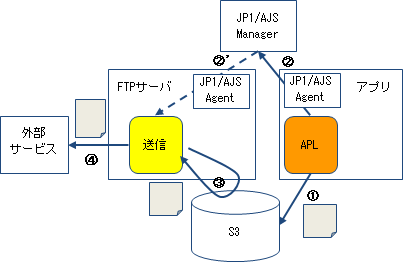
<br>①アプリにて送信ファイルをS3にアップロード
<br>②(即時処理の場合)
<br>　アプリが「JP1/AJS Agent」に通知を行い、「JP1/AJS Maneger」にてFTPサーバの送信モジュールを起動
<br>②'(時間指定処理の場合)
<br>　「JP1/AJS」のジョブで送信モジュールを起動
<br>③送信モジュールにてS3のファイルをダウンロード
<br>④送信モジュールが外部サービスに送信する<br>

上記の外部サービスへのファイル送信の概要を踏まえ、アプリの実装方針としては、以下となる。
<br><font color="Red">①送信ファイルをS3にアップロード(実装サンプルは「S3にファイルをアップロード」を参照)
<br>②(即時処理の場合)
<br>　「JP1/AJS Agent」に通知(実装サンプルは「JP1/AJS Agentに通知」を参照)
<br>②'(時間指定処理の場合)
<br>　「JP1/AJS Agent」に通知は行わない
<br></font>

#### 外部サービスからのファイル受信の概要イメージ
<!--2021.09.30.add指摘事項No.21-->
> 表4.17
<!--2021.09.30.modend-->
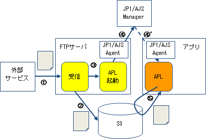
<br>①外部サービスがFTPサーバにファイル送信
<br>②受信モジュールが受信したファイルをS3にアップロード
<br>③受信モジュールがAPL起動モジュールを起動
<br>④(即時処理の場合)
<br>　APL起動モジュールが「JP1/AJS Agent」に通知を行い、「JP1/AJS Maneger」にてアプリを起動
<br>④'(時間指定処理の場合)
<br>　「JP1/AJS」のジョブでアプリを起動
<br>⑤アプリにてS3のファイルをダウンロード

上記の外部サービスからのファイル受信の概要を踏まえ、アプリの実装方針としては、以下となる。
<br><font color="Red">①S3からファイルをダウンロード(実装サンプルは「 S3からファイルをダウンロード」を参照)</font>


#### **S3にファイルをアップロード**

ここでは、S3にファイルをアップロードする実装方針を記述する。

例) S3にファイルをアップロードする例
```java
public class S3_upload() {

    public void upload() throws Exception{

        // 認証処理
        AmazonS3 client = Authentication.auth();

        try {
            //①リクエスト生成
            final PutObjectRequest putRequest = 
                new PutObjectRequest("バケット名", "オブジェクト名", new File("ファイルパス"));

            // ②権限の設定
            putRequest.setCannedAcl(CannedAccessControlList.PublicRead);

            // ③アップロード
            client.putObject(putRequest);
        } catch(AmazonServiceException e) {
            System.out.println("ERROR!");
        }
        return;
    }
}
```

S3にファイルをアップロードする実装のポイントは以下の３点である。

1. リクエスト生成をするために'PutObjectRequest'を使用する
2. 権限の設定をするために'setCannedAcl'を使用する（どの権限を付与するかは別途検討の上、記載予定）
3. S3へのアップロードするために'putObject'を使用する。

#### **S3からファイルをダウンロード**

ここでは、S3からファイルをダウンロードする実装方針を記述する。

例) S3からファイルをダウンロードする例

```java
public class S3_download() {

    public void download() throws Exception{

        // 認証処理
        AmazonS3 client = Authentication.auth();

        try {
            //①ダウンロードファイル名設定
            final GetObjectRequest getRequest = 
                new GetObjectRequest("バケット名", "オブジェクト名");

            //②ダウンロード
            S3Object object = client.getObject(getRequest);

            //③出力先設定
            final FileOutputStream fos = new FileOutputStream(new File("ファイルパス"));
            IOUtils.copy(object.getObjectContent(), fos);

            fos.close();
        } catch(AmazonServiceException e) {
            System.out.println(e.getErrorMessage());
        } catch (FileNotFoundException e) {
            System.out.println(e.getMessage());
        } catch (IOException e) {
            System.out.println(e.getMessage());
        }
        return;
    }
}
```

S3からファイルをダウンロードする実装のポイントは以下の３点である。

1. S3のオブジェクトを生成をするために'GetObjectRequest'を使用する
2. S3からのダウンロードするために'getObject'を使用する
3. 取得したオブジェクトからダウンロード先のファイルに書き込む

####  **JP1/AJS Agentに通知**

ここでは、JP1/AJS Agentに通知する実装方針を記述する。

例) JP1/AJS Agentに通知する例

```java
//別途、確認後に追記予定。
```
<!--TODO:引き継ぎ-->

### 6.9.3 例外処理方針
<!--2021.09.30.add指摘事項No.19-->
<!--2021.09.30.addend指摘事項No.19-->
<!--
> 出典: https://drive.google.com/drive/folders/1KsZ9qBIW3WqQeMvR7UAJbp40137Z7k-g
-->
ここでは、例外処理の方針について記述する。
サービスの持つインターフェースごとの例外処理方針は以下の通りである。

##### RESTサービス
- システムエラーで回復不可能なものは例外として処理し、HTTP status 5xxとして応答する。その際はトランザクションロールバックを行う。
- アプリケーションエラーで回復処理を行わないものは例外として処理することも可能とし、HTTP status 4xxとして応答する。
- RestControllerを付与したクラスのバリデーションに`@Valid`を使用すると複数の項目エラーを含んだExceptionが発行される。

##### MQ
- アプリケーション処理での回復不能エラーはトランザクションロールバックとし、入力メッセージをデッドレターキュー（DLQ）に移動する。デッドレターキュー（DLQ）の設定はインフラで構成設定する。
- DB接続・Webサービス呼び出しでエラーが発生した場合は、リトライする。その際はトランザクションロールバックではなく、後述のリトライ処理を使用し、アプリケーション内部でリトライする。

例外処理は、Springの`ExceptionHandler`を使用する。基本的には以下のような処理を実装する。
1. ResponseEntityExceptionHandlerを継承したExceptionHandlerクラスを作成する。
2. REST APIで発生したエラー情報を保持するクラスを作成する。
3. ExceptionHandlerクラスに例外をハンドリングするメソッドを追加して、例外処理を行う。

以下に実装例を示す。

例1）ResponseEntityExceptionHandlerを継承したExceptionHandlerクラス
```java
// @RestControllerAdviceのアノテーションを付与して全クラス共通の例外を設定する。
@ControllerAdvice
public class ExceptionHandler extends ResponseEntityExceptionHandler {

    @Inject
    MessageSource messageSource;

    @Override
    protected ResponseEntity<Object> handleExceptionInternal(Exception ex,
            Object body, HttpHeaders headers, HttpStatus status,
            WebRequest request) {
        Object responseBody = body;
        if (body == null) {
            responseBody = createApiError(request, "E999", ex.getMessage());
        }
        return new ResponseEntity<Object>(responseBody, headers, status);
    }

    private ApiError createApiError(WebRequest request, String errorCode,
            Object... args) {
        return new ApiError(errorCode, messageSource.getMessage(errorCode,
                args, request.getLocale()));
    }

}
```
例2）REST APIで発生したエラー情報を保持するクラス
```java
public class ApiError {

    private final String code;

    private final String message;

    @JsonSerialize(include = Inclusion.NON_EMPTY)
    private final String target;

    @JsonSerialize(include = Inclusion.NON_EMPTY)
    private final List<ApiError> details = new ArrayList<>();

    public ApiError(String code, String message) {
        this(code, message, null);
    }

    public ApiError(String code, String message, String target) {
        this.code = code;
        this.message = message;
        this.target = target;
    }

    public String getCode() {
        return code;
    }

    public String getMessage() {
        return message;
    }

    public String getTarget() {
        return target;
    }

    public List<ApiError> getDetails() {
        return details;
    }

    public void addDetail(ApiError detail) {
        details.add(detail);
    }

}
```

例3-1）RESTサービスのシステム例外のハンドリングメソッド（HTTP status 500）
```java
// @ExceptionHandlerのアノテーションを付与
@ExceptionHandler(Exception.class)
public ResponseEntity<Object> handleSystemError(Exception ex,
        WebRequest request) {
    ApiError apiError = createApiError(request, "E500");
    return handleExceptionInternal(ex, apiError, null,
            HttpStatus.INTERNAL_SERVER_ERROR, request);
}
```
例3-2）RESTサービスのリソース未検出例外のハンドリングメソッド（HTTP status 404）
```java
// @ExceptionHandlerのアノテーションを付与
@ExceptionHandler(ResourceNotFoundException.class)
  public ResponseEntity<Object> handleResourceNotFoundException(
        ResourceNotFoundException ex, WebRequest request) {
    return handleResultMessagesNotificationException(ex, null,
           HttpStatus.NOT_FOUND, request);
}
```
<!--
例4）MQにおける例外処理実装例
```java
T.B.D MQについては詳細が決定次第反映する
```
-->
<!--TODO:引き継ぎ-->

<!--2021.09.30 add 指摘No.18-->
### Batch
ここでは、Batchの例外処理の方針について記述する。
APIではSpringのアノテーション`@Exceptionhandler`を使用していたが、バッチアプリケーションでは以下のようにExceptionhandlerメソッドを実装する形で例外処理を行う。

例）Job層へのExceptionHandlerの実装例
```java
private ExceptionHandler exceptionHandler() {
    return new ExceptionHandler() {

        @Override
        public void handleException(RepeatContext context, Throwable throwable) throws Throwable {
            // api接続でエラー
            int i = context.getStartedCount();
            System.out.println("api接続でエラー:" + Integer.toString(i)+ "回目");
            
            try {
                Thread.sleep(10000); // 10秒(1万ミリ秒)間だけ処理を止める
            } catch (InterruptedException e) {
                e.printStackTrace();
            }

            if (i == 3) {
                throw new Exception();
            }
        }
    };
}
```
<!--2021.09.30 add end-->
<!--2021.09.29.add by NEC-->

##### 共通エラーハンドリング

API の処理実行中に発生した例外は例外ハンドラでハンドリングし、例外の種類によってエラーレスポンスを返します。例外ハンドラは各 API エンドポイント（リソース層の Controller クラスで `@RequestMapping` が指定されている各メソッド）に AOP で差し込まれています。

**参考：例外ハンドリングに関する資料**

- [アドバイスの作成 - ＠ControllerAdvice - 独習 Spring](

<!--2021.09.29 add end-->


### 6.9.4 リトライ処理実装方針と実装例
<!--
> 出典: https://drive.google.com/drive/folders/1KsZ9qBIW3WqQeMvR7UAJbp40137Z7k-g
-->

ここでは、リトライ処理の実装方針について記述する。
RESTインターフェース呼び出し・DB接続を伴う処理では、基本的にリトライが必要になる。
リトライ処理は、Spring Retryの機能を用いて実装する。その際、外部サービス、DBの要件に合わせてリトライ回数、リトライ待機時間を指定する。

Spring Retryでのリトライ実装はアノテーションを使用した方法を利用する。
- `@Retryable`: Spring AOPを活用したリトライ指定が可能なアノテーション


例）`@Retryable`を用いたリトライ処理実装
```java
@Retryable(value = { ResourceAccessException.class }, maxAttempts = 3, backoff = @Backoff(delay = 1000))
public void retryService() throws SQLConnectionException {

// RESTインターフェース呼び出しなどを伴う処理
```

`@Retryable`アノテーションの機能は以下の通りである。

| 引数名 | 概要 |
| - | - |
| value | リトライ対象となる例外を指定。valueに指定された例外がメソッド内で発生した場合にリトライを行う。 |
| maxAttempts | リトライを実施する最大回数を指定する。 |
| backoff | リトライ待機時間のポリシーを指定する。指数関数的に待機時間を拡大していくなどが指定可能。 |

### 6.9.5 ログ出力実装方針と実装例
<!--2021.09.30.add指摘事項No.19-->
アプリケーションログの出力は「[ログ出力設計_アプリケーション開発標準](https://docs.google.com/spreadsheets/d/1MhterePU3krkt2-43MIM7rGFPXyxwCmb/edit#gid=473181419)」参照

### 6.9.6 バリデーション実装方針と実装例
ここでは、バリデーション実装方針について記述する。
バリデーションは、Bean Validationを使用して実装する。

例1）データ項目へのバリデーションの指定
```java
  @Size(min = 36, max = 36)
  @NotNull()
  private String id;

  @Pattern(regexp = "^[a-zA-Z\\s]+$")
  @NotNull()
  private String name;
```

データ項目に対してバリデーションを指定するには、Bean Validationのアノテーション（`javax.validation.constraints`）を用いる。
主なBean Validationのアノテーションは以下を参照する。
https://docs.jboss.org/hibernate/beanvalidation/spec/2.0/api/

---
例2）バリデーションの実施
```java
@RestController
@RequestMapping("hoge")
// ① パスパラメータなどのバリデーションの実施
@Validated
public class HogeController {
    @GetMapping
    public HogeGetResponse get(
        @PathVariable @Size(min=36, max=36) String id
    ) {
        ...
    }

    @PostMapping
    public HogePostResponse post(
        // ② データ項目に対してバリデーションを指定したDTOに対するバリデーションの実施
        @RequestBody @Validated HogeRequest req
    ) {
        ...
    }
}
```

バリデーションの実施部分の実装でのポイントは以下の２点である。
1. パスパラメータなどのバリデーションでは、メソッド引数に対して直接バリデーションを指定した上で、クラスに対して`@Validated`を指定することでバリデーションが実施される。
2. 例1のようにデータ項目に対してバリデーションを指定したDTOに対するバリデーションでは、メソッド引数対して`@Validated`を指定することでバリデーションが実施される。

※主なBean Validationのアノテーション以外にサービス独自のアノテーションを実装することを可とする。<br>
実装したアノテーションに関しては各サービスのレポジトリ内での管理とする。


### 6.9.7 トランザクション方針
ここでは、トランザクション管理の方針について記述する。
トランザクション管理では、Springのアノテーションの`@Transactional`を用いた宣言的トランザクション管理を用い、Serviceクラスのメソッドレベルで宣言する。

<!--TODO:引き継ぎ-->

### 6.9.8 暗号化処理
ここでは、暗号化/復号化処理の方針について記述する。
暗号化/復号化においては、ファイルの暗号化/復号化、文字列の暗号化/復号化の機能を<!--#2553 mod by NEC-->GW機能にて実施する。そのためアプリとしての実装は不要とする<!--mod end-->。


<!--2021.09.29.add by NEC-->

### 6.9.9 Circuit Breaker

ここでは、Circuit Breakerについて記述する。Circuit Breakerは各 API から操作される連携サービスに対する操作が接続エラーなどで失敗する場合に、設定内容に従って一時的に接続を遮断する。

#### Circuit Breaker 境界

Circuit Breaker は連携先サービスと接続する Repository / Gateway で受け持ちます。

#### Circuit Breaker の仕様

Repository および Gateway の各処理に Circuit Breaker を設定し、それぞれに Fallback 処理を定義します。

#### Circuit Breaker の設定

このテンプレートでは Resilience4j を利用して Circuit Breaker を実装しています。    
Circuit Breaker の状態は Prometheus 向けのメトリクス取得エンドポイント（ `/prometheus` ）で確認することができます。 

Circuit Breaker の開放 / 短絡の条件は Resilience4j のデフォルトと同じ設定が初期設定されており、アプリケーション設定ファイル（ `application-production.yml` ）で任意に変更可能です。   

#### Fallback 処理

また Fallback 処理は全て正常応答の場合の HTTP ステータスコードを返却するよう NOP とし、エラー内容を調査可能なようにエラーログを出力します。

#### Circuit Breaker およびフォールバック処理の有効 / 無効を切り替える（サービス全体）

Circuit Breaker の機能を利用しないメソッドでは `@CircuitBreaker` アノテーションを削除します。

```java
    //@CircuitBreaker(name = "postgres", fallbackMethod = "registerFallback")
    public SampleDomain register(SampleDomain dto) {
       int rows = sampleMapper.insert(dto);
       if (rows == 0) {
            return null;
        }
        return dto;
    }
```

このテンプレートを利用したサービス全体で Circuit Breaker を利用しない場合は、全ての箇所で `@CircuitBreaker` アノテーションを削除します。 

```xml
        <!-- Resilience4j -->
        <dependency>
            <groupId>io.github.resilience4j</groupId>
            <artifactId>resilience4j-spring-boot2</artifactId>
            <version>${resilience4j.version}</version>
        </dependency>
```

#### Circuit Breaker の設定を変更する

Circuit Breaker のパラメータはサービスの仕様によってカスタマイズすることができます。パラメータを変更する場合は application-production.yml を修正します。

利用可能なコンフィグレーションは [Resilience4j のドキュメント](https://resilience4j.readme.io/docs/getting-started-3#configuration) を参照してください。

#### 設定ファイルで対応する場合

```yaml
resilience4j:
  # CircuitBreaker設定
  circuitbreaker:
    configs:
      # CircuitBreaker設定の既定値
      default:
        event-consumer-buffer-size: 10                                          # イベントバッファサイズ, 既定値:100, 下限値:1
        sliding-window-size: 10                                                 # SlidingWindowのサイズ(CLOSED状態の時に呼び出し結果を記録する), 既定値:100, 下限値:1
        # sliding-window-type: COUNT_BASED                                        # SlidingWindowの種類, 既定値:COUNT_BASED
        # 閉塞状態(OPEN)への遷移条件
        failure-rate-threshold: 50                                              # 失敗率の閾値(パーセント), 失敗発生率がこの値を超えるとCircuitBreakerがOPEN状態に遷移する, 既定値:50%, 有効値:1.0～100.0
        # slow-call-duration-threshold: 60s                                       # 応答遅延時間の閾値時間, この時間を超えて完了しない処理を応答遅延と判断する, 既定値:60秒
        # slow-call-rate-threshold: 100                                           # 応答遅延率の閾値(パーセント), 応答遅延率がこの値を超えるとCircuitBreakerがOPEN状態に遷移する, 既定値:50%, 有効値:1.0～100.0
        # minimum-number-of-calls: 100                                            # エラー率(失敗率, 応答遅延率)の算出前に必要なSlidingWindow内のリクエスト件数, 既定値:100, 下限値:1, 注意:ここで設定した件数に到達するまでのリクエストでエラーが発生してもCircuitBreakerをOPEN状態に遷移させることはできない
        # record-failure-predicate:                                               # 例外に基づいて失敗の判定を行うPredicateクラス名(FQCN)
        # record-exceptions: []                                                   # 失敗としてカウントする例外クラス名(FQCN)の一覧
        # ignore-exceptions: []                                                   # 失敗としてカウントしない例外クラス名(FQCN)の一覧
        # 復旧試行状態(HALF_OPEN)への遷移条件
        automatic-transition-from-open-to-half-open-enabled: true               # trueを指定すると遷移条件の監視スレッドを起動し、wait-duration-in-open-state時間が経過すると自動的にHALF_OPEN状態に遷移させる, falseを指定するとwait-duration-in-open-state時間が経過後の新しいリクエスト実行時に遷移させる
        wait-duration-in-open-state: 5s                                         # OPEN状態からHALF_OPEN状態への遷移を待機する時間, 既定値:60秒, 下限値:1ミリ秒
        # max-wait-duration-in-half-open-state: 0                                 # OPEN状態に遷移する前に、HALF_OPEN状態にとどまることができる最大待機時間, 既定値:0(許可されたすべての呼び出しが完了するまで、HALF_OPEN状態を維持し続ける)
        permitted-number-of-calls-in-half-open-state: 10                        # HALF_OPEN状態の時に許可される呼び出しの上限数, 既定値:10, 下限値:1
        # 運用監視
        # writable-stack-trace-enabled: true                                      # Boolean
        allow-health-indicator-to-fail: true                                    # Boolean
        register-health-indicator: true                                         # Boolean
        # リトライ制御
        # enable-exponential-backoff: false                                       # trueを指定するとリトライ制御をExponential backoff and jitterとして構成する, 既定値:なし
        # exponential-backoff-multiplier:                                         # Exponential backoff and jitterにおけるリトライ間隔の乗数, 既定値:なし, 有効値:Double型
        # exponential-max-wait-duration-in-open-state:                            # Duration
        # enable-randomized-wait: false                                           # trueを指定するとリトライ制御をランダム時間で構成する, 既定値:なし, 注意:enable-exponential-backoffが無効(未設定 or false)の場合のみ設定可能
        # randomized-wait-factor:                                                 # Double
    instances:
      postgres:
        base-config: default
      httpclient:
        base-config: default
    metrics:
      enabled: true

```

#### フォールバック処理を変更する

Circuit Breaker が設定されているメソッドで例外が発生した場合、フォールバックメソッドに実行が移ります。デフォルトでは FailFast（例外をスローする）で構成されているため、処理が実装されていませんが、独自の処理を実装する場合は `@CircuitBreaker` アノテーションの `fallbackMethod` に指定されているメソッドのコードを変更してください。

```java
    @CircuitBreaker(name = "postgres", fallbackMethod = "registerFallback")
    public SampleDomain register(SampleDomain dto) {
        int rows = sampleMapper.insert(dto);
        if (rows == 0) {
            return null;
        }
        return dto;
    }

    // SDE-MSA-PRIN 障害を隔離する (MSA-PRIN-SD-03)
    public SampleDomain registerFallback(SampleDomain dto, Throwable t) {
        log.error("Insert data to Postgres is failed. dto = '{}'", dto);

        // このメソッドに処理を実装します

        return null;
    }
```
### 6.9.10 メトリクス監視エンドポイント

メトリクス監視用として以下のエンドポイントを提供します。

| エンドポイント      | 説明                                                         |
| ------------------- | ------------------------------------------------------------ |
| `/health`           | 死活状況、業務疎通状況を含む全てのヘルスチェック状況を監視するエンドポイント。 |
| `/health/liveness`  | 死活状況を監視するエンドポイント。（※）                      |
| `/health/readiness` | 業務疎通状況を監視するエンドポイント。アプリケーションが依存するサービスとの疎通状態をチェックする。疎通できないサービスがあった場合はデフォルトで HTTP/503 を返却する。（※） |
| `/info`             | バージョン情報を出力するエンドポイント。                     |
| `/prometheus`       | JavaVM メトリクスやアクセス数など、 Micrometer で計測可能な Prometheus 向けエンドポイント。 |

（※） MS テンプレートが Kubernetes にデプロイされる場合のみ有効になります。

すべての利用可能なエンドポイントは [Spring Boot Actuator のドキュメント](http://docs.spring.io/spring-boot/docs/current/reference/html/production-ready-endpoints.html) を参照してください。 

#### サンプル

`/health`

```json
{
  "status":"UP",
  "components":{
    "binders":{
      "status":"UP",
      "components":{
        "outputMessage":{
          "status":"UP",
          "details":{
            "version":"3.7.5"
          }
        }
      }
    },
    "db":{
      "status":"UP",
      "details":{
        "database":"PostgreSQL",
        "result":1,
        "validationQuery":"SELECT 1"
      }
    },
    "ping":{
      "status":"UP"
    }
  },
  "groups":[
    "liveness",
    "readiness"
  ]
}
```

`/health/liveness`

```json
{
  "status": "UP"
}
```

`/health/readiness`

```json
{
  "status":"UP",
  "components":{
    "db":{
      "status":"UP",
      "details":{
        "database": "PostgreSQL",
        "result": 1,
        "validationQuery": "SELECT 1"
      }
    }
  }
}
```

### 6.9.11 分散トレーシング

ここでは、分散トレーシングについて記述する。分散トレーシングはサービス間連携のトレース情報をログに出力します。

#### 分散トレーシングの仕様

REST API のアクセスログにはリクエストのトレース情報が付与され、リクエストの追跡をログから実施することができます。
詳細はSMDI_CAS_INF_アーキテクチャ・インフラ方式設計書_7_8_マイクロサービスアーキテクチャ_v1.00.00【秘】.docx

出力されるログの詳細はログ出力設計_アプリケーション開発標準.xlsxを参照してください。


### 6.9.12 JSON ハイジャック対策

ここでは、JSON ハイジャック対策について記述する。JSON ハイジャックを防ぐために以下の対策を実施しています。

- `X-Requested-With: XMLHttpRequest` 以外のリクエストをエラーにする。
- レスポンスヘッダに `Content-Type: application/json; charset=utf-8` を設定する。

この対策はリソースモジュールに相当する Controller クラスに `@RequestMappng` のパラメータとして設定します。

### 6.9.13 CORS

ここでは、CORSについて記述する。XSS や CSRF を防止するために API にアクセス可能なクライアントを制限する CORS (Cross-Origin Resource Sharing) を実装しています。

#### CORS の設定

初期設定では以下の設定になっています。

| ヘッダ                           | 設定値                  | 説明                                                         |
| -------------------------------- | ----------------------- | ------------------------------------------------------------ |
| Access-Control-Allow-Origin      | `http://localhost:9000` | 同一サーバの 9000 ポートで起動しているクライアントからのみアクセスを受け入れる。 |
| Access-Control-Allow-Methods     | 各メソッド毎に指定      | メソッド毎に `POST` 、 `PUT` 、 `GET` 、 `DELETE` を受け入れるように設定。 |
| Access-Control-Allow-Credentials | `true`                  | リクエストの資格情報モードが `include` である場合に、レスポンスをフロントエンドの JavaScript コードに公開する。 |
| Access-Control-Allow-Headers     | `ALL`                   | 全てのヘッダを受け入れる。                                   |
| Access-Control-Max-Age           | `1800`                  | キャッシュの有効期間は 1800 ms 。                            |

このテンプレートでは、 CORS(Cross-Origin Resource Sharing) の設定を実装しています。

API のエンドポイントを実装している各 Controller のメソッドにアノテーションでデフォルト値を指定しています。設定を変更する場合はアノテーションに指定されているパラメータを変更してください。

```java
    @CrossOrigin(
        origins = { "http://localhost:9000" },
        methods = { RequestMethod.POST },
        allowCredentials = "true",
        allowedHeaders = CorsConfiguration.ALL,
        exposedHeaders = {},
        maxAge = 1800)
    public SamplePostDto post(@RequestBody @Validated SamplePostDto dto) {

    }
```

`@CrossOrigin` アノテーションに指定する値は [Spring Framework のドキュメント](https://spring.io/guides/gs/rest-service-cors/) を参照してください。

### 6.9.14 HTTP レスポンスヘッダのセキュリティ対策

HTTP レスポンスヘッダのセキュリティ対策として、 MS テンプレートでは下記のレスポンスヘッダが必ず設定されます。

| **キー**                 | **値**          | **説明**                                                     |
| ------------------------ | --------------- | ------------------------------------------------------------ |
| `X-Content-Type-Options` | `nosniff`       | Internet Explorer の Content Sniffering 対策                 |
| `X-XSS-Protection`       | `1; mode=block` | Internet Explorer で XSS 検出ブロック機能が無効になっている場合の対策 |
| `X-Frame-Options`        | `deny`          | 指定したページがフレーム内で読み込まれることを許可しない     |
| `Cache-Control`          | `no-store`      | キャッシュの利用を許可しない                                 |

#### リクエストパラメータのバリデーション

このテンプレートでは、 API のリクエストパラメータのバリデーションを実装しています。

##### リクエストボディ（ JSON ）に対するバリデーション

DTO のプロパティに制約アノテーション（下記例の場合は `@UUID` ）を付与することで検証ルールを指定します。制約アノテーションが指定されていない場合は型検証のみ行います。

```java
public class SamplePostDto implements Serializable {

    /** ID(UUID) */
    @Id
    @UUID
    private String id;

}
```

##### HTML 制御文字の禁止設定

このテンプレートではセキュリティの観点から、初期状態で HTML で利用される制御文字（ `<` 、 `>` 、 `&` 、 `'` 、 `"` 、 `/` ）をリクエストボディに設定される値に利用できないよう実装されています。

たとえば以下のように `@DenyHTML` アノテーションが指定されているフィールドに対して上述の禁止文字を入力した場合に HTTP/400 エラーとなります。

```java
public class SamplePostDto implements Serializable {

    /** ID(UUID) */
    @DenyHTML
    private String stringData;

}
```

エラーになるリクエストボディの例）

```json
{
    "string_data": "string>"
}
```

`@DenyHTML` アノテーションで規定される禁止文字を入力したい場合は、リクエストボディに利用している DTO クラスの定義から `@DenyHTML` アノテーションを削除してください。

アノテーションを削除することで利用可能になる文字列は用途によってはサニタイズが必要となる場合があります。アノテーションを削除する際は、 XSS （クロスサイトスクリプティング）の対応が適切に行われるよう注意して実装してください。

##### クエリパラメータに対するバリデーション

Controller のメソッド引数に制約アノテーション（下記例の場合は `@UUID` ）を付与することで検証ルールを指定します。制約アノテーションが指定されていない場合は型検証のみ行います。

```java
    public ResponseEntity<SampleGetDto> get(@PathVariable("id") @UUID String id) {
    }
```

#### レスポンスヘッダの実装

このテンプレートでは、 API のレスポンスをセキュアなレスポンスとするためにレスポンスヘッダを格納するクラスをオーバーライドしています。

実装済みのすべての Controller のレスポンスは `SecureHttpHeaders` クラスを利用してレスポンスヘッダの設定を行っているので、開発で利用する場合もこのクラスを利用するようにしてください。

```java
    public ResponseEntity<SamplePostDto> post(@RequestBody @Validated SamplePostDto dto) {
        SecureHttpHeaders headers = new SecureHttpHeaders();

        SampleDto retDto = postgresSservice.register(dto);

        return new ResponseEntity<>(retDto, headers, HttpStatus.CREATED);
    }
```

##### レスポンスヘッダに値を追加する

レスポンスヘッダに値を追加する場合は、 Controller のメソッドでインスタンス化されている `headers` オブジェクトの `add` メソッドを利用します。( `add` メソッドについては `SecureHttpHeaders` のスーパークラス `HttpHeaders` の `add` メソッドの API 仕様を参照してください)

```java
    public ResponseEntity<SamplePostDto> post(@RequestBody @Validated SamplePostDto dto) {
        SecureHttpHeaders headers = new SecureHttpHeaders();

        headers.add("Custom-Res-Header", "value"); // <- headers.add() で値を追加します

        SampleDto retDto = postgresService.register(dto);

        return new ResponseEntity<>(retDto, headers, HttpStatus.CREATED);
    }
```

##### レスポンスヘッダにCookieを設定する

レスポンスヘッダに Cookie を設定する場合は、 `SecureHttpHeaders.addCookie()` メソッドを利用します。このメソッドを利用することで、 `Set-Cookie` ヘッダに対して `secure; httponly` オプションが自動で付与されます。

```java
    public ResponseEntity<SamplePostDto> post(@RequestBody @Validated SamplePostDto dto) {
        SecureHttpHeaders headers = new SecureHttpHeaders();

        headers.addCookie("Cookie-Name", "Cookie-Value"); // <- headers.addCookie() で値を追加します

        SampleDto retDto = postgresService.register(dto);

        return new ResponseEntity<>(retDto, headers, HttpStatus.CREATED);
    }
```

`addCookie` メソッドのオプションは JavaDoc を参照してください。

### 6.9.15 OpenAPI Specification 出力

ここでは、 OpenAPI Specification 出力について記述する。[springdoc-openapi](https://github.com/springdoc/springdoc-openapi) を利用することで下記の機能を提供します。

- OpenAPI Specification （ JSON ）のダウンロード用エンドポイントの公開
- Swagger UI のエンドポイントの公開

開発支援用途のため初期状態ではいずれのエンドポイントも非公開に設定されています。

#### OpenAPI Specification の出力設定

本テンプレートでは、 [springdoc-openapi](https://github.com/springdoc/springdoc-openapi) を利用することで下記の機能を実現しています。

- OpenAPI Specification （ JSON ）のダウンロード用エンドポイントの公開
- Swagger UI のエンドポイントの公開
- OpenAPI Specification に記載される API の説明の変更

##### エンドポイントの公開

OpenAPI Specification ダウンロード用エンドポイントと [Swagger UI](https://swagger.io/swagger-ui/) のエンドポイントは application-production.yml の設定により公開します。

| 有効にするエンドポイント           | springdoc.api-docs.enabled | springdoc.swagger-ui.enabled |
| ---------------------------------- | :------------------------: | :--------------------------: |
| OpenAPI Specification              |           `true`           |           `false`            |
| OpenAPI Specification + Swagger UI |           `true`           |            `true`            |

※ Swagger UI のみを公開することはできません。（内部で OpenAPI Specification を参照するため）

##### **application-production.yml**

```yaml
# OpenAPI / Swagger Settings
springdoc:
  api-docs:
    enabled: false
    path: /v3/api-docs
  swagger-ui:
    enabled: false
    path: /swagger-ui.html
```

設定を有効にしたら OpenAPI Specification は http://localhost:8080/v3/api-docs 、 Swagger UI は http://localhost:8080/swagger-ui.html にアクセスしてください。（ localhost:8080 の部分は配備したホストのホスト名としてください）

また、 application-staging.yml のように別プロファイルの設定ファイルを用意することで実行時に設定を切り替えることも可能です。

###### **application-staging.yml の設定を利用する例**

```shell
$ java -jar -Dspring.profiles.active=staging ssfw-ssfw-springboot-template-rest.jar
```

##### OpenAPI Specification に記載される API の説明の変更

OpenAPI Specification に記載される API のタイトル、説明を変更したい場合は application-production.yml を修正します。

###### **application-production.yml**

```yaml
api-docs:
  title: MSテンプレート APIインタフェース仕様
  description: PostgreSQLとデータの送受信を行います。
```

| 設定項目             | 説明                         |
| -------------------- | ---------------------------- |
| api-docs.title       | API のタイトルを指定します。 |
| api-docs.description | API の説明を指定します。     |

バージョンを変更する場合は pom.xml の `<project><version>` を修正します。

###### **pom.xml**

```xml
<project xmlns="http://maven.apache.org/POM/4.0.0" xmlns:xsi="http://www.w3.org/2001/XMLSchema-instance"
         xsi:schemaLocation="http://maven.apache.org/POM/4.0.0 http://maven.apache.org/xsd/maven-4.0.0.xsd">
    <modelVersion>4.0.0</modelVersion>
    <groupId>com.nec</groupId>
    <artifactId>ssfw-springboot-template-rest</artifactId>
    <version>1.9.0-SNAPSHOT</version>
    <packaging>jar</packaging>
```

この例の場合、 `1.9.0-SNAPSHOT` がバージョンとして Swagger Specification に出力されます。

##### 制限事項

PUT 、 DELETE の API では、パスパラメータの必須入力検証が実装されています。 springdoc-openapi ではこの実装を正しく OpenAPI Specification に反映することができず、たとえば以下のような 2 つの API が出力される制限があります。

たとえば `[PUT] /api/v1/sample/postgres/{id}` の場合

- `[PUT] /api/v1/sample/postgres/{id}`
- `[PUT] /api/v1/sample/postgres` ※不要な API 仕様

の 2 つの API 仕様が出力されます。 springdoc-openapi で出力される OpenAPI Specification を基にした API 仕様を作る際はこの例のように不要な API 仕様を出力結果から削除して利用してください。なお、 open-perspective モデルの開発では API 仕様を先に作成して実装を開始するプロセスが定義されているため、通常は springdoc-openapi 起因の API 仕様を利用することはありません。

##### 注意事項

OpenAPI Specification の公開と Swagger UI の公開は開発向けの機能であり、本番リリース時には削除しておくべきです。また、ランタイムレベルでも開発向けということもあり積極的なセキュリティアップデートが行われない可能性が否定できないため、セキュリティの観点から pom.xml に記述される依存関係から削除するべきです。

本機能をアプリケーションから削除するには、以下を修正します。

- pom.xml から `springdoc-openapi` の依存関係を削除する。
- `OpenAPIConfig.java` クラスを削除する。（※）
- ソースコード中の `io.swagger.v3.oas.annotations.Parameter` を削除する。（※）

（※） pom.xml から `springdoc-openapi` の依存関係を削除するとコンパイルエラーになるので、その該当か所を削除します。

### 6.9.16 冗長コードの自動生成

ここでは、 冗長コードの自動生成について記述する。[Project Lombok](https://projectlombok.org/) を導入し、 DTO の setter / getter 等の冗長なコードをオウンコードせずにコンパイル時に自動生成するようにしています。

以下のアノテーションを利用しています。

| アノテーション       | 用途                                                         |
| -------------------- | ------------------------------------------------------------ |
| `@Data`              | DTO に対して getter / setter / toString / equals / hashCode といった典型的なコードを追加します。 |
| `@EqualsAndHashCode` | ドメインオブジェクトの同一性チェックに全フィールドではなく識別子のみを利用するようにしています。 |
| `@ToString`          | `toString` メソッドで文字列化するフィールドを制限しています。 MS テンプレートではホワイトリスト方式を採用し、初期状態ですべてのフィールドを出力する設定にしています。 |
| `@Log4j2`            | ロガーを自動生成します。                                     |

<!--2021.09.29 add end-->

## 6.10 外部パラメータの実装方針

- 本章の参照者</br>

|各ビジネス機能</br>(A01)|各ビジネス機能</br>(B01)|各ビジネス機能</br>(C01)|システム機能共通|共通機能|DB-API|
| :----:| :----: | :----: | :----: | :----: | :----: |
|○  |○ |○ |○ |○ |○ |
<BR>


ここでは外部パラメータを設定し、コードの中で取得する実装について記述する。

### 6.10.1 外部パラメータとして設定すべき値
以下の値は外部パラメータとして設定し、ハードコードは行わない。
- DB,MQ,他APIなど、環境により異なる接続情報
- テスト容易性などの目的で外部化しておくべき値
- 性能チューニングなどの目的でチューニングを行うことが想定される値

### 6.10.2 外部パラメータの実装方法
環境により異なる外部パラメータはOS（コンテナ）環境変数として設定し、application.propertiesで取得する。環境によらない外部パラメータはapplication.propertiesに直接記載する。

例）application.propertiesのサンプル
```properties
springfox.documentation.swagger.v2.path=/api-docs
spring.jackson.date-format=jp.co.ana.cas.proto.util.RFC3339DateFormat
spring.jackson.serialization.WRITE_DATES_AS_TIMESTAMPS=false

spring.datasource.driver-class-name=org.postgresql.Driver
spring.datasource.url=${COMMON_DB_CONF_CONNECTION_URL_ANAORG}
spring.datasource.username=${COMMON_DB_CONF_USER}
spring.datasource.password=${COMMON_DB_CONF_PASSWORD}

spring.activemq.broker-url=${COMMON_MQ_CONF_BROKER_URL}
spring.activemq.user=${COMMON_MQ_CONF_USER}
spring.activemq.password=${COMMON_MQ_CONF_PASSWORD}
spring.activemq.prefetch-policy.queue-prefetch=1

app.compf.root-url=${COMPF_URL}

logging.file.name=/var/cas/log/cas-303_M0002.log
logging.level.root=WARN
```

例）プログラムからの利用方法
```java
@Service
public class SendMailService implements I_SendMailService {

	@Value("${app.compf.root-url}")
	String comPfUrl;

```

アプリケーションで必要とする環境変数は内部設計の「コンテナパラメータ」にて定義するため、実装フェーズで新たに環境変数を追加する場合は「コンテナパラメータ」をあわせて修正すること。
また、DB,MQ,他APIの接続情報についてはPLUS共通で提供される環境変数を利用する。

<!--2021.09.29 add by NEC-->

#### PostgreSQL との接続設定

PostgreSQL との接続に利用している接続プールには HikariCP を利用しています。 HikariCP の設定は application-production.yml に実装されています。利用可能な設定は [HikariCP のドキュメント](https://github.com/brettwooldridge/HikariCP) を参照してください。

```yaml
# PostgreSQL
  datasource:
    url: jdbc:postgresql://${POSTGRES_HOST:localhost}:${POSTGRES_PORT:3306}/${POSTGRES_DATABASE:sampledb}
    username: ${POSTGRES_USER:user}
    password: ${POSTGRES_PASSWORD:pass}
    hikari:
      auto-commit: false
      connection-timeout: 30000
      idle-timeout: 0
      max-lifetime: 0
      connection-test-query: SELECT 1
      minimum-idle: 10
      maximum-pool-size: 10
      pool-name: ConnectionPool
      initialization-fail-timeout: -1
      validation-timeout: 5000
```

<!--2021.09.29 add end-->

-   設定ファイルの管理方針


プログラムやシステムにおける定数・設定値情報は、プロパティ情報として管理するが、
設定値の格納先は下記から選択する。


|定数カテゴリ| 例 | 定義先 | 理由/背景 |
| :---- |:---- |   :----| :----|
| システム系定数（環境固有）| •DB接続情報(エンドポイント/認証情報)<BR>•他システム/内部API接続情報(エンドポイント/認証情報) |k8s ConfigMap.yml<BR>k8s Ex-Secrets.yml |  この定数は、アプリケーションコードの変更とは関係なく変更されうる値である。<BR>アプリコード自体の変更が無いにもかかわらず、<BR>定数変更のたびにアプリの再ビルドが必要になるような事態を回避するため、<BR>アプリケーションコードからは外部化し、KubernetesのConfigMapで<BR>定数を定義・管理する方針とする。
| システム系定数（環境共通）| •コネクションプール数<BR>•ヘルスチェック設定<BR>•タイムアウト値<BR>•その他フレームワーク設定 |k8s ConfigMap.yml |この定数も同様、アプリケーションコードの変更とはライフサイクルが異なるため<BR>外部化し、ConfigMapに定義・管理する方針とする。また、チューニング時に<BR>頻繁にこの値の設定変更が行われることが想定され、<BR>変更都度のビルドが不要になるメリットもある。
| アプリケーション固有定数 | •テーブル定義に出てくる属性に対して取りうる<BR>キーとバリュー値の定義情報 | application-{env}.yml<BR>ConstantsEnum.java | この定数は、アプリケーションが自身のプログラム内で使用する定数になるため、<BR>ライフサイクルを分離する必要はなく、<BR>application.ymlまたはEnum型の定数クラスを作成する方針とする。
| ビジネスルール系定数 |•業務ルール変更に伴い変更されうるアプリ定数限定<BR>ex) 処理対象フラグ・区分<BR>ex) xx分前に実行などの処理条件<BR>•ランパラでなければならない明確な理由がある定数 | DBマスタ情報参照 | 定数の変更が業務ルールの変更/ユーザー依頼によって<BR>行われるなどの理由があり、<BR>定数変更時にアプリケーションの<BR>再ビルド/再デプロイ(プロセス再起動)を回避したい場合は、この格納先を選択する。


DBコード値、エラーコード値など、アプリケーションが独自で定義し管理する変数については、application.ymlで定義する。  
全環境共通のプロパティはapplication-common.yml、環境差異があるプロパティはapplication-{env}.ymlでそれぞれ定義する。

- application-{env}.ymlの設定・利用方法

■ディレクトリ構成（例）
```properties
└── src
├── main
│ ├── java
│ └── resources
│    ├── application-common.yml
│    ├── application-prd.yml
│    ├── application-stg.yml
│    ├── application-dev.yml
│    ├── application-local.yml
│    ├── application.yml
```
■application.yml(例)
```properties
spring.profiles.group
  production:
    - prd 
    - common
  staging:
    - stg
    - common
  local:
    - local
    - common

※commonはどのプロファイルでも共通で読まれる。
```

■application-prd.yml(例)
```properties
spring.profiles: prd
spring:
  logging:
    level:
      jp.co.ana.cas.xxxxxxx.service.http.SampleHttpClient: DEBUG

```
デプロイ時は、環境変数`SPRING_PROFILES_ACTIVE`でプロファイルを切り替える（k8s manifestで定義を想定)。application-dev.ymlが読み込まれてSpring Bootが起動する。
※便宜上Deploymentで定義しているが、ConfigMapでも可である。

- k8s ConfigMap.yml の設定・利用方法

■k8s manifest(例)
```properties
kind: Deployment
spec:
  containers:
  - name: demo-app
    image: demo-app
    env:
    - name: SPRING_PROFILES_ACTIVE
      value: “dev”
```


データベースの接続情報など、アプリチームの管轄外の要因で変更されうる定数は、アプリケーションのコード変更(再ビルド)とライフサイクルを分離するため、jar/Dockerfileからも外部化することを検討する（コネクションプールなど、頻繁にチューニングする要素もここに含む）。
Secretsについては、SecretsManagerに登録し、External-Secretsでk8s secretsを自動生成する方針とする。


■application-prd.yml(例)   
※application.ymlの設定はすべて変数にすること。

```properties
spring.profiles: prd
spring.profiles.include:
  - common

spring:
  datasource:
    url: jdbc:postgresql://${DB_URL_PRD:localhost}:${DB_PORT:5432}/${DATABASE_NAME:postgres}
    username: ${DB_USERNAME:postgres}
    password: ${DB_PASSWORD:password}

```

- k8s ExternalSecret.yml の設定・利用方法

■k8s ExternalSecret.yml(例)   
KubernetesのSecretsについては、GitHubに機密情報をコミットすることを防ぐため原則Manifestに記載はせず、AWS Secrets Managerに登録し、External Secretsを経由してSecretsを自動作成する方針とする。</br>（deploymentに登録するenvの動作確認をローカルKubernetesで行うケースなどは除く。）  

k8s secrets作成までの流れ

> 表4.18

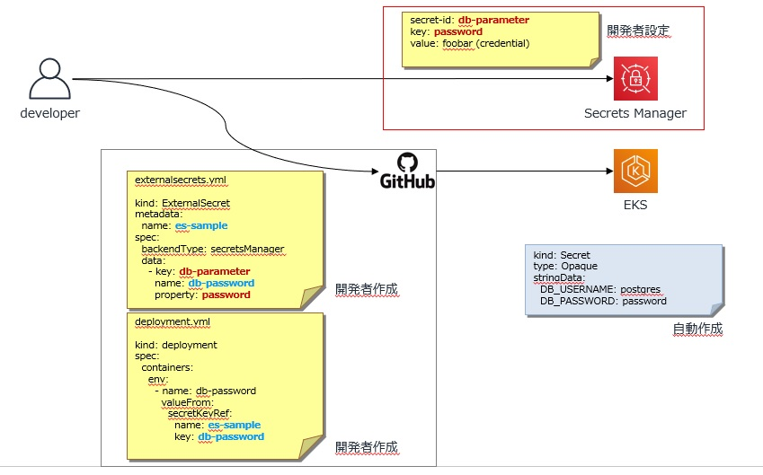

- ランタイムパラメータ（DBマスタ情報直接参照）

■定数をRDB(パラメータテーブル)に保持させて、参照させる。</BR>
※PLUSGUIにパラメータテーブルのデータメンテナンス用画面を作成する。

> 表4.19

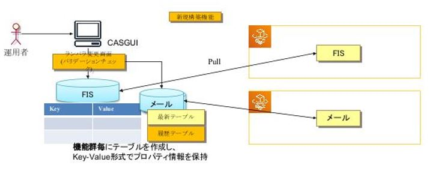

<!---->


## 6.11 Configクラス実装方針

- 本章の参照者</br>

|各ビジネス機能</br>(A01)|各ビジネス機能</br>(B01)|各ビジネス機能</br>(C01)|システム機能共通|共通機能|DB-API|
| :----:| :----: | :----: | :----: | :----: | :----: |
|○  |○ |○ |○ |○ |○ |
<BR>

Spring bootのJava Configを使用したBean定義を行うConfigクラスの実装方針を記述する。
このBean定義は、主にコンポーネントスキャンによる自動登録ができない場合に（外部ライブラリに含まれるクラスのBean登録時等に）実装する。

Configクラスの実装では、4つのポイントが存在する。

1. Springのアノテーションである`@Configuration`を付与する
2. Java ConfigのBeanを返却するメソッドに、Springのアノテーションである`@Bean`を付与する
3. `@Bean`を付与したメソッドでは、引数で別のBeanを注入することができる
4. Beanとなるインスタンスを返却する

<!--2021.09.30 add 指摘No.18-->

例) JMSに関するConfigクラスの例

```java
// ① @Configurationアノテーションを付与
@Configuration
@EnableJms
@Profile("prod")
public class JmsConfig {

    // ② @Beanアノテーションを付与
    @Bean
    // ③ 引数による別Beanの参照
    public DefaultJmsListenerContainerFactory jmsListenerContainerFactory(
            @Qualifier("jmsConnectionFactory") ConnectionFactory connectionFactory
    ) {
        DefaultJmsListenerContainerFactory factory = new DefaultJmsListenerContainerFactory();
        factory.setConnectionFactory(connectionFactory);
        factory.setSessionTransacted(true);
        factory.setCacheLevel(DefaultMessageListenerContainer.CACHE_NONE);

        // ④ Beanを返す
        return factory;
    }
}
```

## 6.12 Batch実装サンプル説明

- 本章の参照者</br>

|各ビジネス機能</br>(A01)|各ビジネス機能</br>(B01)|各ビジネス機能</br>(C01)|システム機能共通|共通機能|DB-API|
| :----:| :----: | :----: | :----: | :----: | :----: |
|×  |× |○ |× |× |× |
<BR>

### 6.12.1 JobLauncher層の開発
JobLauncher層の開発では、Jobを実行するためのインターフェースを実装する。

例）クラス宣言部の実装
```java
@EnableTask
@EnableBatchProcessing
@SpringBootApplication(scanBasePackages = { "jp.co.ana.smartdi" })
public class BatchApplication {

```

JobLauncher層のクラスを定義する際、以下のアノテーションを付与する。
| アノテーション | 概要 |
| - | - |
| `@EnableTask` | Springのアノテーション</br>Spring Cloudの機能で、Spring BatchアプリケーションをKubernetes上で実行可能にする |
| `@EnableBatchProcessing` |　Springのアノテーション</br>Spring Batch関連のBeanを使用可能にする |

---

例) インスタンス変数宣言部の実装
```java
@Autowired
private BatchConfigProperties batchConfig;

@Autowired
private JobLauncher jobLauncher;

@Autowired
private Job job;
```

インスタンス変数宣言部では、主に以下の変数をDIする。
| インスタンス変数 | 概要 |
| - | - |
| `JobLauncher` | `Job`を実行するためのインスタンス |
| `Job` |　実行する`Job` |

---

例) `CommandLineRunner`の実装
```java
/**
 * ジョブ起動
 * @return CommandLineRunner コマンドランナー
 */
// ① @Beanを付与
@Bean
public CommandLineRunner commandLineRunner() {
    // ② 処理を実行する関数を返却
    return args -> {
        log.debug(() -> "commandLineRunner execute ..." + Arrays.toString(args));

        // ③ コンフィグやコマンドライン引数を設定
        if (!batchConfig.isCommandRunable()) {
            return;
        }

        String para1 = batchConfig.getS3Bucket();
        String para2 = batchConfig.getDataFile();
        boolean useRandom = batchConfig.isUseRandomParameter();
        if (args.length >= 2) {
            para1 = args[0];
            para2 = args[1];
        }
        if (args.length > 2) {
            useRandom = true;
        }
        if (!StringUtils.hasText(para1) || !StringUtils.hasText(para2)) {
            log.warn("--- target is missing. {}, {}", para1, para2);
            return;
        }

        JobParametersBuilder builder = new JobParametersBuilder()
            .addString("s3.bucket.id", para1)
            .addString("s3.bucket.fileid", para2);
        if (useRandom) {
            builder.addString("random", String.valueOf((long)(Math.random() * 100000)));
        }

        // ④ Jobを実行
        JobExecution jobExecution = jobLauncher.run(job, builder.toJobParameters());
        log.debug("jobId={}, status={}", jobExecution.getJobId(), jobExecution.getExitStatus());
    };
}
```

`CommandLineRunner`の実装では、以下の4つのポイントが存在する。
1. Springのアノテーションである`@Bean`を付与する
2. コマンドライン引数を受け取り、バッチ処理を実行する関数を返却する
3. バッチ処理に関するコンフィグやコマンドライン引数を元に、Jobのパラメータを設定
4. `JobLauncher`を用いて、`Job`を実行する

### 6.12.2 Job層の開発
Job層の開発では、JobとStepのBeanを定義する。
Bean定義では、Job, Stepの構成要素を指定する。

例）クラス定義部の実装
```java
@Configuration
@Lazy(value = true)
public class JobConfig {

```

JobConfigクラスを定義する際、以下のアノテーションを付与する。
| アノテーション | 概要 |
| - | - |
| `@Configuration` | Springのアノテーション</br>Bean定義を可能にする |
| `@Lazy`(Option) |　Springのアノテーション</br>SpringのBeanを遅延評価する |

---

例）インスタンス変数宣言部の実装
```java
@Resource
private JobBuilderFactory jobBuilderFactory;

@Resource
private StepBuilderFactory stepBuilderFactory;

@Autowired
private JobRunListener jobRunListener;

@Autowired
private StepRunListener stepRunListener;

@Autowired
private BatchConfigProperties batchConfig;

@Autowired
private AggregateItemReader aggregateItemReader;

@Autowired
private AggregateItemProcessor aggregateItemProcessor;

@Autowired
private AggregateItemWriter aggregateItemWriter;
```

インスタンス変数宣言部では、主に以下の変数をDIする。
| インスタンス変数 | 概要 |
| - | - |
| `JobBuilderFactory` | `Job`のビルダーを生成するインスタンス</br>このインスタンスにより、JobのBeanを定義する |
| `StepBuilderFactory` | `Step`のビルダーを生成するインスタンス</br>このインスタンスにより、JobのBeanを定義する |
| Job / Stepで実行する処理要素のクラス | ItemReaderクラスなど、必要なクラスをDIしたインスタンス |

---

例) StepのBean定義の実装
```java
/**
 * データ取込Job Step定義
 * @return Step
 */
@Bean
public Step dataFeedStep() {
    // ① StepBuilderを取得
    return stepBuilderFactory.get("dataFeedStep") 
            // ② データのチャンクが含むデータ数を設定
            .<List<PurgeTktRec>, List<PurgeTktEntity>>chunk(batchConfig.getChuck())
            .faultTolerant()
            // ③ リトライ設定
            .retryLimit(batchConfig.getRetryLimit())
            .retry(Exception.class)
            // ④ スキップ設定
            .skipLimit(batchConfig.getSkipLimit())
            .skip(Exception.class)
            // ⑤ Step層のインスタンスを設定
            .reader(aggregateItemReader)
            .processor(aggregateItemProcessor)
            .writer(aggregateItemWriter)
            .listener(stepRunListener)
            .build();
            // set reader count rollback with .readerIsTransactionalQueue()
            // set rerun as completed with .allowStartIfComplete
            // set rerun limit with .startLimit(5)
}
```

StepのBean定義の実装では、以下の4つのポイントが存在する。
1. `StepBuilderFactory`から`StepBuilder`を取得する
2. ItemReaderが読み込むデータをチャンクに分割する際の、データ数を指定する
3. Stepでの例外発生時の処理のリトライに関する設定を行う
4. Stepでの例外発生時の処理のスキップに関する設定を行う
5. 実行するItemReader, ItemProcessor, ItemWriterを指定する

---

例) JobのBean定義の実装
```java
/**
 * Job定義
 * @return Job
 */
@Bean
public Job dataFeedJob() {
    // ① JobBuilderを取得
    Job job = jobBuilderFactory.get("dataFeedJob")
        // ② Jobの実行IDをインクリメントするIncrementerを指定
        .incrementer(new RunIdIncrementer())
        // ③ 実行するStepを設定する
        .start(dataFeedStep())
        .next(xxxxxStep())
        .listener(jobRunListener)
        .build();
    System.out.println("--- job --" + job.isRestartable());
    return job;
}
```

StepのBean定義の実装では、以下の4つのポイントが存在する。
1. `JobBuilderFactory`から`JobBuilder`を取得する
2. Jobの実行IDをインクリメントする`RunIdIncrementer`のインスタンスを指定する
3. Jobで実行するStepを設定する

※複数のStepを実行するフローは、シーケンシャルFlowと条件付きFlowがある。以下URLを参照して実装する。

https://spring.pleiades.io/spring-batch/docs/current/reference/html/step.html#controllingStepFlow

### 6.12.3 Step層の開発

Step層のクラスとして考えられるものは、以下の3つである。
1. ItemReader: データベースやファイルから取得したデータをJavaオブジェクトに変換する
2. ItemProcessor: ItemReaderによって取得したデータの入力チェックや、ビジネスロジックを行う
3. ItemWriter: Javaオブジェクトをデータベースやファイルに書き込む

以降では、S3に格納されているファイルのデータを対象としている。

**1. ItemReaderの開発**
例) クラス宣言部の実装
```java
@Log4j2
@Component
@StepScope
public class AggregateItemReader extends AbstractItemStreamItemReader<List<PurgeTktRec>> {

```

ItemReaderクラスを定義する際、以下のアノテーションを付与する。
| アノテーション | 概要 |
| - | - |
| `@Component` | Springのアノテーション</br>クラスをDI可能にする |
| `@StepScope` |　Springのアノテーション</br>Spring Beanをシングルトンではなく、Step単位で初期化する |

---

例) インスタンス変数宣言部の実装
```java
// ① S3にアクセスするためのServiceをDI
@Autowired
private S3Service s3Service;

// ② JobパラメータからS3の対象物の設定を読み込み
@Value("#{jobParameters['s3.bucket.id']}")
private String s3Bucket = "";

@Value("#{jobParameters['s3.bucket.fileid']}")
private String s3FileKey = "";

/**
 * 内蔵Reader
 */
// ③ 標準のファイル用ItemReaderをDI
@Autowired
private FlatFileItemReader<PurgeTktRec> itemReader;

/**
 * 未処理レコードリスト
 */
private List<PurgeTktRec> unholds = new ArrayList<>();

/**
 * 保持用グループID
 */
private String groupId = "";

/**
 * 保持用サロゲートキー
 */
private Long surroId = 0L;

/**
 * 保持用読み済みグループ件数
 */
private int readGroup = 0;

/**
 * スキップ必要のグループ件数
 */
private int needSkipGroups = 0;
```

インスタンス変数宣言部の実装では、以下の2つのポイントが存在する。
1. S3にアクセスするためのServiceをDIする</br><!--#2395Delete　PLUSライブラリにより提供予定-->
2. JobパラメータからS3のバケットのIDとファイルのIDを取得
3. Spring Batchで用意されているファイル用ItemReaderをDIする

---

例) `read`メソッドのオーバーライド
```java
/**
 * ファイル読み込みを行う。
 * <pre>同一グループIDまで読み込んだ結果を纏めるのリストを処理対象とする。</pre>
 */
@Override
public List<PurgeTktRec> read()
        throws Exception, UnexpectedInputException, ParseException, NonTransientResourceException {
    ResultHolder holder = new ResultHolder();
    // スキップ行数がある場合、処理する。
    if (this.needSkipGroups > 0) {
        processSkip();
    }
    // グルーピングデータを処理する。
    while (process(holder)) {
        continue;
    }

    if (holder.records.size() > 0) {
        // ① 読み込んだデータを返却する
        return holder.records;
    } else {
        // ② 返却するItemがない場合はnullを返却する
        return null;
    }
}
```

`read`メソッドの実装では、以下の2つのポイントが存在する。
1. 読み込んだデータを返却する</br>上記のコードでは、`process`メソッドにより読み込んだデータをholderに格納している
2. `read`メソッドは呼び出される度にデータを返却する</br>ファイルのデータを読み込み終わり返却するデータがない場合は、`null`を返却する</br>※ `read`メソッドは`null`を返却するまで呼び出され続ける

---

例) S3からのファイル読み込み実装
```java
private boolean process(ResultHolder holder) throws UnexpectedInputException, ParseException, Exception {
    // read file
    // ② 標準ItemReaderでファイルからデータを読み込み 
    PurgeTktRec value = itemReader.read();
    // 省略
}

// 省略

private void prepare(ExecutionContext ctx) {
    // リソース設定
    // ① 読み込みを行うファイルをストリームで指定
    this.itemReader.setResource(new InputStreamResource(s3Service.readObjectStream(s3Bucket, s3FileKey)));
    // スキップグループ数設定
    this.needSkipGroups = ctx.getInt("linesToSkip", 0);
    log.debug(() -> "--- reader need skip groups :" + this.needSkipGroups);
}
```

S3からのファイル読み込みの実装では、以下の2つのポイントが存在する。
1. ItemReaderに読み込む対象のファイルをストリームで指定する
2. `ItemReader.read`メソッドで対象のファイルからJavaオブジェクトを取得する

**2. ItemProcessorの開発**
例) クラス宣言部の実装
```java
@Log4j2
@Component
@StepScope
public class AggregateItemProcessor implements I_ItemProcessor<List<PurgeTktRec>, List<PurgeTktEntity>> {

```

ItemReaderクラスを定義する際、以下のアノテーションを付与する。
| アノテーション | 概要 |
| - | - |
| `@Component` | Springのアノテーション</br>クラスをDI可能にする |
| `@StepScope` |　Springのアノテーション</br>Spring Beanをシングルトンではなく、Step単位で初期化する |

---

例) `process`メソッドのオーバーライド
```java
/**
 * レコード編集を行い、エンティティに変換する。
 * @param  items 読込結果レコードリスト
 * @return エンティティリスト
 */
@Override
public List<PurgeTktEntity> process(final List<PurgeTktRec> items) throws Exception {
    // ビジネスロジックを実行する
    final List<PurgeTktEntity> results = new ArrayList<>();
    int incEr = INIT_SEQ;
    int incSeq = INIT_SEQ;
    String processRecName = "";
    boolean ticketHeaderFlag = false;
    final PurgeTktTicketHeader ticketHeader = new PurgeTktTicketHeader();
    for (final PurgeTktRec rec : items) {
        log.debug("process: {}, {}, {}", rec.getGroupId(), rec.getRecIndentify(), rec.getSurroId());
        final String recClassName = ClassUtils.getShortName(rec.getClass());
        if (HEADER_RECORDS.replace("_", "").contains(recClassName)) {
            //Ticket Header Records
            processRecord(rec, ticketHeader, null, 0);
            ticketHeaderFlag = true;
        } else if (EXCHANGE_RECORDS.replace("_", "").contains(recClassName)) {
            // Exchange Records process
            processExchangeRecord(results, rec, ticketHeader.getTktDate(), incEr++);
        } else {
            // Others Records (FileTailer change to FileHeader)
            // レコードタイプが変わったら、処理順番を初期値に設定する。
            if (!processRecName.equals(recClassName)) {
                processRecName = recClassName;
                incSeq = INIT_SEQ;
            }
            final String entityClassName = resolveEntityName(recClassName);
            final PurgeTktEntity entity = (PurgeTktEntity) ClassUtils.resolveClassName(entityClassName, null).newInstance();
            processRecord(rec, entity, ticketHeader.getTktDate(), incSeq++);
            results.add(entity);
        }
    }
    if (ticketHeaderFlag) {
        results.add(ticketHeader);
    }
    return results;
}
```

`process`メソッドの実装では、`ItemReader.read`メソッドにより読み込まれたデータを引数にとり、データを使用したビジネスロジックを実装する。

**3. ItemWriterの開発**
例) クラス宣言部の実装
```java
@Log4j2
@Component
@StepScope
public class AggregateItemWriter implements I_ItemWriter<List<PurgeTktEntity>> {

```

ItemWriterクラスを定義する際、以下のアノテーションを付与する。
| アノテーション | 概要 |
| - | - |
| `@Component` | Springのアノテーション</br>クラスをDI可能にする |
| `@StepScope` |　Springのアノテーション</br>Spring Beanをシングルトンではなく、Step単位で初期化する |

---


例) `write`メソッドのオーバーライド
```java
 /**
 * データ書き込みを行う。
 * <pre>
 * 1番目のファイルヘッダーの書き込みにより、サロゲートキーが自動採番される。
 * 2番目以降のレコードに上記取得したサロゲートキーを更新して、書き込む処理を行う。
 * 最後のファイルヘッダー（実際はテーラー）、レコード追加ではなく、更新を行う。
 * </pre>
 * @param items 統合されたデータ
 * @exception Exception 例外
 */
@Override
public void write(final List<? extends List<PurgeTktEntity>> items) throws Exception {
    int inc = 0;
    // ① JPAでのDBアクセスを行うためのEntityManagerを準備
    final EntityManager entityManager = EntityManagerFactoryUtils.getTransactionalEntityManager(entityManagerFactory);
    if (entityManager == null) {
        throw new DataAccessResourceFailureException("Unable to obtain a transactional EntityManager");
    }
    // ② ItemProcessorからのデータを書き込む
    for (final List<PurgeTktEntity> item : items) {
        for (final PurgeTktEntity rec : item) {
            log.debug("write data : {}, {}, \n {}", inc, this.surroId.get(), rec);
            if (rec instanceof PurgeTktFileHeader) {
                processFileHeader(entityManager, (PurgeTktFileHeader) rec);
            } else {
                // Purge ETKTサロゲートキー設定
                if (this.surroId.get() > 0L) {
                    Reflections.setPrivateField(rec, SURROKEY, this.surroId.get());
                }
                // データを保存する。
                entityManager.persist(rec);
            }
        }
        inc++;
    }
}
```

`write`メソッドの実装では、以下の2つのポイントが存在する。なお、このItemWriterではDBへの書き込みを行うものである。
1. ORMの一種であるJPAを使用したDBアクセスを行うためのEntityManagerを準備する
2. ItemProcessorにより加工されたデータを受け取り、`entityManager.persist`によりDBにデータを書き込む


### 6.12.4 SpringBatchでメタテーブルを使用しない場合の実装について
SpringBatchのメタテーブルは利用しない方針とする。</br>
実装方法の例は以下のDefaultBatchConfigurerを継承したクラスをbean登録する方法を参照すること。</br>
参考</br>
https://github.com/ANA-CASG/CASP-A103001_01/blob/develop/app/src/main/java/jp/co/ana/cas/a103001_01/job/H2BatchRepositoryConfigurer.java
</br>


##  <u>［各ビジネス機能(B01)向け実装方針］</u>
以下参照※要見直し</br>
 -  4.1 PLUSアプリケーション概要
 -  4.2.アプリケーションの基本構造について　※移動
 -  4.3 使用するフレームワーク・ライブラリ
 -  4.3 API実装サンプルについて
 -  4.4 論理構造とJavaのパッケージ / クラス構成
 -  4.5 REST実装サンプル説明
 -  4.7 MQ実装サンプル説明
 -  4.8 共通機能実装方針
 -  4.9 FTP機能の実装方針
 -  4.10 外部パラメータの実装方針
 -  4.11 Configクラス実装方針

##  <u>［各ビジネス機能(C01)向け実装方針］</u>
以下参照※要見直し</br>
 -  4.1 PLUSアプリケーション概要
 -  4.2.アプリケーションの基本構造について　※移動
 -  4.3 使用するフレームワーク・ライブラリ
 -  4.3 API実装サンプルについて
 -  4.4 論理構造とJavaのパッケージ / クラス構成
 -  4.5 REST実装サンプル説明
 -  4.6 SOAP実装サンプル説明
 -  4.7 MQ実装サンプル説明
 -  4.8 共通機能実装方針
 -  4.9 FTP機能の実装方針
 -  4.10 外部パラメータの実装方針
 -  4.11 Configクラス実装方針
 -  4.12 Batch実装サンプル説明

##  <u> ［システム機能共通向け実装方針］</u>
以下参照※要見直し</br>
 -  4.1 PLUSアプリケーション概要
 -  4.2.アプリケーションの基本構造について
 -  4.3 使用するフレームワーク・ライブラリ
 -  4.3 API実装サンプルについて
 -  4.4 論理構造とJavaのパッケージ / クラス構成
 -  4.5 REST実装サンプル説明
 -  4.8 共通機能実装方針
 -  4.10 外部パラメータの実装方針
 -  4.11 Configクラス実装方針

##  <u> ［共通機能向け実装方針］</u>
以下参照※要見直し</br>
 -  4.1 PLUSアプリケーション概要
 -  4.2.アプリケーションの基本構造について　※移動
 -  4.3 使用するフレームワーク・ライブラリ
 -  4.4 API実装サンプルについて
 -  4.4 論理構造とJavaのパッケージ / クラス構成
 -  4.8 共通機能実装方針
 -  4.10 外部パラメータの実装方針
 -  4.11 Configクラス実装方針

##  <u> ［DB-API向け実装方針］</u>
以下参照※要見直し</br>
 -  4.1 PLUSアプリケーション概要
 -  4.2.アプリケーションの基本構造について　※移動
 -  4.3 使用するフレームワーク・ライブラリ
 -  4.3 API実装サンプルについて
 -  4.4 論理構造とJavaのパッケージ / クラス構成
 -  4.8 共通機能実装方針
 -  4.10 外部パラメータの実装方針
 -  4.11 Configクラス実装方針

# 7. アプリケーションテスト方針

<!--2021.09.30 mod 指摘No.19-->
<!--ここでは、単体テストおよびCDC Testingの方針について記述する。-->
ここでは、単体テストおよびCDC Testingの方針について記述する。
<!--mod20210930 modend-->

## 7.1 単体テスト実施方針

### 7.1.1 単体テスト概要
<!--2021.09.30.add指摘事項No.19
> > 出典: [1.3 参照ドキュメント一覧](#13-参照ドキュメント一覧) 「単体テスト概要」
2021.09.30.addend指摘事項No.19-->

<!--
> 出典: https://drive.google.com/drive/folders/18iCFISR95vhNhvZg-CxnTbINczCTCFjg
-->

単体テストおよびCDC Testingは、以下の方針をとる。

1. 単体テストでは詳細設計を入力とした関数IFレベルでのテストとし、可能な限り完全自動化を図る。
    - 完全自動化のための`gradle test`, `gradle check`などのコマンドで一括実行されるテスト環境
    <!--2021.09.30.add　9/28テスト定例指摘事項-->
2. 単体テストの品質基準はC0カバレッジ、C1カバレッジ100%以上とし、テストコードは開発チーム内でレビューを行う。
    - MyBatisGeneraterでのコード自動生成の場合は、100%でなくてよい。MyBatisGenerater以外を利用する場合は、統括スクラムマスター、スクラムマスターにて方針を検討することとする。
    <!--
    MyBatisGenerator以外のツール利用の場合は、スクラムマスター同士で判断し、本ガイドに追記する。
    -->
    <!--2021.09.30.addend　9/28テスト定例指摘事項-->
3. CDC Testingの実施対象の考え方は以下の通り。
    - PLUS内でのコンポーネント間は必要に応じて実施する。</br>
      **※実施有無はスクラムマスターが判断**</br>

※カバレッジ測定は単体テスト結果を使用してコード検証で測定する。
※テストケース数はロジックの複雑さに依存する。

### 7.1.2 処理パターン別実施環境
ここでは、単体テストおよびCDC Testingの実施環境について記述する。
以下の実施環境を構築するコンポーネントごとに説明する。
1. Gradle
2. AWSサービスの利用
3. AWSサービス以外のサービスの利用
4. 外部サービスの利用

##### 1. Gradle
PLUSサービスでは、ビルドツールとしてGradleを採用する。
Gradleでは、タスクと呼ばれる一連の処理をGroovyスクリプトで定義することができる。
PLUSサービスの単体テストおよびCDC Testingでは、完全自動化を目指す。
そのため、`gradle test`や`gradle check`など1つのタスクで、テストの実施とテストに必要なセットアップを完了できることを目指す。

##### 2. AWSサービスの利用
単体テストでは、AWSのクラウドサービスを直接利用せず、ローカル環境にAWSのフェイクサービスを構築する。
AWSのフェイクサービスの構築には、AWS LocalStackを利用する。
AWS LocalStackとは、Dockerコンテナを用いてAWSのフェイクサービスを構築するフレームワークである。
AWS LocalStackで提供されるAWSサービスは以下の通り。
- API Gateway
- Kinesis
- DynamoDB
- DynamoDB Streams
- Elasticsearch
- S3
- Firehose
- Lambda
- SNS
- SQS
- Redshift
- ES (Elasticsearch Service)
- SES
- Route53
- CloudFormation
- CloudWatch

##### 3. AWSサービス以外のサービスの利用
AWSサービス以外のミドルウェアやソフトウェア、AWSサービスだがLocalStackで提供されないサービスをDockerコンテナを用いてOSS実行環境を構築する。
該当サービスは、以下の通り。
- PostgreSQLコンテナ: Amazon Aurora for PostgreSQLを代用する
- ActiveMQコンテナ: Amazon MQを代用する
- IBM MQコンテナ: IBM MQサーバーを代用する

##### 4. 外部サービスの利用
外部サービスとは、Impacted SystemやPLUSサービスを指す。
単体テスト時に外部サービスの連携が必要な場合は、CDC TestingフレームワークであるPactを利用して実施する。
Pactでは、CDC Testingの考えに則ってサービス利用者側で定義した契約（想定リクエスト / レスポンス）をもとに、モックサービス作成することができる。
Pactで作成できるモックサービスで外部サービスをモックして利用する。

### 7.1.3 静的解析ツール
ここでは、静的解析ツールの利用方法を示す。

#### 7.1.3.1 SonarQubeの利用
SonarQubeの利用方法を示す。

##### 1. SonarQubeとは
「バグ発見」、「脆弱性発見」、「メンテナンス困難なコード検出」等を自動的に検出するツールである。

##### 2. SonarQubeへのログイン
以下のURLにアクセスして、SonarQube画面を表示する。
```
https://sonarqube.dev-cas.dev-ana.net/
```
※SonarQubeへのログイン情報についてはRedmineのWikiを参照：[各種クレデンシャル情報](https://cas-asy.cloud.redmine.jp/projects/knowledge/wiki/%5B%E4%BF%9D%E5%AE%88%E9%96%8B%E7%99%BA%E7%92%B0%E5%A2%83%5D%E5%90%84%E7%A8%AE%E3%82%AF%E3%83%AC%E3%83%87%E3%83%B3%E3%82%B7%E3%83%A3%E3%83%AB%E6%83%85%E5%A0%B1/)
##### 3. SonarQube画面での確認方法
SonarQube画面で確認するには、対象ブランチをコミット ⇒ プッシュすると、  
SonarQube画面で結果が確認できる。  

【Project】画面 ⇒ 【各リポジトリ名のプロジェクト】を押下する。  
以下が確認できる項目。
- Bugs：バグの発見  
- Vulnerabilities：脆弱性の発見 ※OWASP DependencyCheckの解析結果連携
- Securitiy HotSpos：脆弱性とは違うが高リスクになる部分  
- Debt：技術的負債  
- Code Smells：ソースコードに深刻な問題を起こす可能性がある  ※CheckStyle、Spotbugsの解析結果連携
- Coverage：網羅率  ※Junit,Jacocoの解析結果連携
- Duplications Lines：重複したコード  

##### 4. SonarQubeでの解析結果の対応

 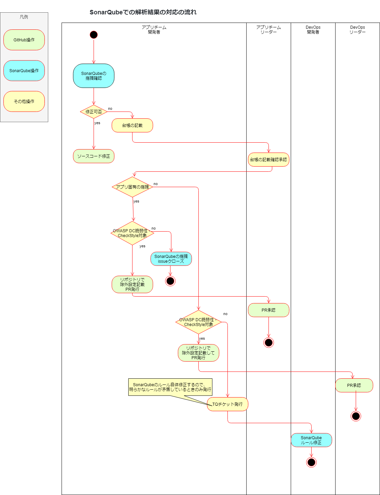


SonarQubeのQualityGateで以下の5つの基準の閾値チェックを行う。
- Bugs：0件　※恒久対応
- Critical Severity Vulnerabilities：0件 　※恒久対応
- High Severity Vulnerabilities：0件 　※恒久対応
- Code Smells：100件以下 　※基準値は暫定値。最終目標は0件。
- Coverage：50.0%以上 　※基準値を暫定値。最終目標は100％

##### バグ、Vulnerabilities、CodeSmellsの検出結果に関して

検出結果にあわせてソースコードを修正する。

スクラムマスターと合意して指摘を修正しない判断をした場合、
横展開のため管理台帳に記載し、SonarQubeの検出結果をクローズへ変更する。
[[Smart_DI_CAS]SonarQube指摘台帳](https://drive.google.com/drive/folders/11D6rfZJiSdbRZ57hxCYYlW4hZyJOEFiy)

検出結果のうちVulnerabilitiesの指摘またはCodeSmells内のCheckStyleの指摘について、
アプリチーム全体として指摘を修正しない判断をした場合は、SonarQubeの設定変更ではなく各ツールからの解析除外設定を行う。

##### SonarQubeの検出結果のクローズへの変更方法
1. 修正が不要の場合、Issue 内の [Open] をクリックし、[Resolve as won’t fix]を選択する。
2. コメントの記入を求められるため、判断理由を入力し [Comment] ボタンを押下する。
3. ステータスが[Resolved (Won’t fix)] に変化し、コメントが追加されたことを確認する。

 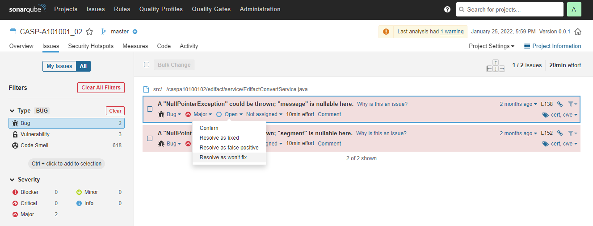

アプリチーム全体としてルールを修正すると判断をした場合、
SonarQube自体のルールや他定義を見直す必要があるためDevSecOps宛にTQチケットを発行する。

##### Critical Severity VulnerabilitiesまたはHigh Severity Vulnerabilitiesの指摘の除外設定
アプリチーム全体として指摘を修正しない判断をした場合、OWASP DependencyCheckの解析からの除外設定を行う。
  - 除外設定の詳細内容は以下を参照  
[Dependency Checkの解析除外設定](https://github.com/ANA-CASG/cicd-guideline/blob/main/com/Appendix/dependencycheckexclusions.md)

アプリチーム全体として指摘を修正すると判断をした場合、
  - 以下のファイルを修正して、DecSecOpsチーム宛にPR発行する。※stagingブランチ宛

https://github.com/ANA-CASG/app-pipeline-template/blob/main/config/dependencycheck/cicd-dependency-check-suppressions.xml

##### CodeSmells内のCheckStyleの指摘の除外設定
アプリチーム全体として指摘を修正しない判断をした場合、CheckStyleの解析からの除外設定を行う。
  - 除外設定の詳細内容は以下を参照  
[開発環境構築ガイドライン](https://github.com/ANA-CASG/local-dev-env/blob/main/README.md#41-checkstyle)（参照箇所：【4.ツール利用手順】-【4.1 CheckStyle】）

アプリチーム全体として指摘を修正すると判断をした場合、
  - 以下のファイルを修正して、DecSecOpsチーム宛にPR発行する。

https://github.com/ANA-CASG/common-definitions-file/blob/main/checkstyle.xml

#### 7.1.3.2 Jtestの利用
Jtestの利用方法を示す。

##### 1. Jtestとは
Java対応の静的解析・単体テストツールである。  
PLUSではPCIDSS要件に準拠したコーディングルールへの違反を検出するために利用する。  

##### 2. Jtest解析結果の確認方法
対象ブランチをコミット ⇒ プッシュすることで、  
CircleCIのARTIFACTSにJtestの解析結果が出力される。  
対象パイプラインの【ARTIFACTS】画面 ⇒ 【~/test-results/jtest/jtest/report.html】を押下して解析結果を確認する。  
以下が確認できる項目。
- All Findings by Category：静的解析ルールごとに検出された違反の件数  
- Findings by File：プロジェクト、パッケージおよびファイルごとに検出された違反の件数や違反の詳細  
  - 【ディレクトリ名】を押下して開いていくと、違反の検出されたファイルと該当箇所の行数、詳細が確認できる  
  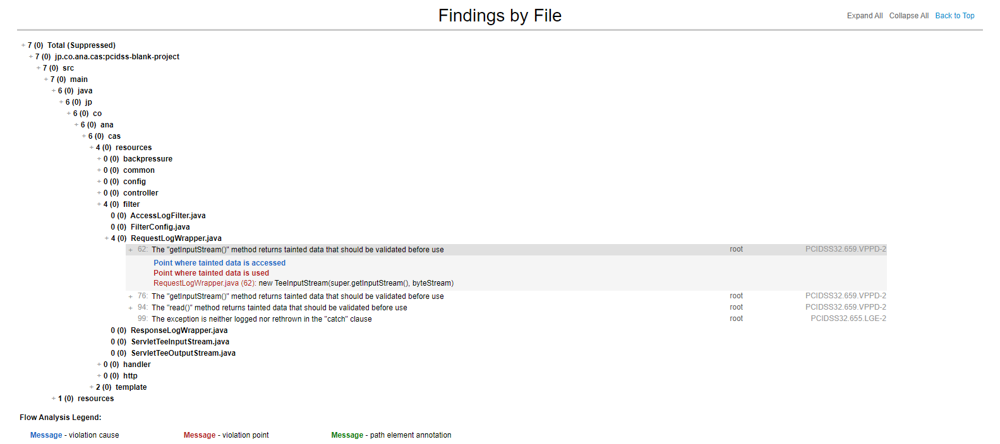
- Setup Problems：セットアップ上の問題  

## 7.2 コンポーネント別実装方針
ここでは、各コンポーネントごとに実装例を示す。

<!--2021.09.30 指摘No.18-->
なお、バッチアプリケーションでは、以下の単位で単体テストを実装する。
| テスト単位 | 概要 |
| - | - |
| Job | JobLauncherでJobを実行することでJobをテストする |
| Step | ItemReader / ItemWriter / ItemProcessorのメソッドを実行することでテストする |
| Functional | ローカル環境で一気通貫のバッチ処理を行うテストを行う |
<!--2021.09.30-->
### 7.2.1 共通実装
コンポーネントによらず、テストフレームワークであるJUnitを使用する上で必要な実装項目について記述する。

テストクラスのメソッドに付与するアノテーションは以下の通り。
| アノテーション | 概要 |
| - | - |
| `@Test` | JUnitのアノテーション</br>付与したメソッドがテスト対象となり、JUnitテストが実施される。 |
| `@BeforeEach` | JUnitのアノテーション</br>テスト前に毎回実施する処理を記載する。</br>例：モックの初期化、クラスのインスタンス化 |
| `@AfterEach` | JUnitのアノテーション</br>各テストが終わったあとの処理を記載する</br>例：DBの初期化、DBの切断 |

<!--2021.09.30 指摘No.18-->
### 7.2.2 テストデータの作成（Batch以外）
<!--2021.09.30-->
テストデータでは、以下の2種類のデータを作成する必要がある。
これらのデータはファイルとして保存し、テスト実装で読み込むことで利用する。
1. リクエスト / レスポンスのボディを表すJSON
2. DB初期データおよび想定DBデータ状態を表すCSV

##### 1. リクエスト / レスポンスボディを表すJSON
JSONテストデータは、対応するDTOクラスに合わせて作成を行う。

##### 2. DB初期データを表すCSV
DBテストデータは、テーブルごとにCSVファイルを作成し、DBUnitの機能でDBにデータを挿入する。
テストデータのファイル名は、DBのテーブル名を指定する。（`<TABLE名>.csv`）
CSVファイルの書式は、1行目にフィールド名、2行目以降に挿入するデータを入力する。
また、DBUnitでデータを挿入する際、`table-ordering.txt`というファイルが必要となる。
`table-ordering.txt`には、以下のような内容を記述する。
```
<TABLE名1>
<TABLE名2>
```
<!--2021.09.30 指摘No.18-->
### 7.2.3 テストデータの作成（Batch）
テストデータでは、インプットとなるファイルを準備する必要がある。
これらのデータはファイルとして保存し、テスト実装で読み込むことで利用する。
また、バッチアプリケーションのインプットとなるファイルは、スクラッチで作成するのではなく提供されたものを使用する可能性が高いため、作成手順は省略する。
<!--2021.09.30-->

### 7.2.4 Controllerクラスの単体テスト実装例
ここでは、Controllerクラスの単体テストの実装例を示す。
Controllerクラスの単体テストでは、MockMVCによりエンドポイントをモックし、モックしたエンドポイントにリクエストを行う。

例) クラス宣言部の実装
```java
@ExtendWith(SpringExtension.class)
@SpringBootTest
@AutoConfigureMockMvc
public class HogeControllerTest {

```

クラス宣言部では、主に以下のアノテーションが必要となる。
| アノテーション | 概要 |
| - | - |
| `@ExtendWith` | JUnitのアノテーション</br>`SpringExtesion.class`を指定する |
| `@SpringBootTest` | Springのアノテーション</br>SpringBootの機能を利用するため付与する |
| `@AutoConfigureMockMvc` | Springのアノテーション</br>MockMvcの設定を自動で行うため付与する |

---
例) インスタンス変数宣言部の実装
```java
// ① MockMvcをDI
@Autowired
private MockMvc mockMvc;

// ② ServiceレイヤのクラスのモックをDI
@MockBean
private RequestMailService service;

// ③ Serviceレイヤのクラスのモックが注入されたControllerをDI
@InjectMocks
private MailApiController controller;

// ④ モックへの引数を取得
@Captor
ArgumentCaptor<ReservationInfoDTO> argCaptor;

@Autowired
MessageSourceAccessor messageSourceAccessor;

```

インスタンス変数宣言部では、以下の4つのポイントが存在する。
1. JUnit内でSpringMVCの挙動を再現するテストツールであるMockMvcのインスタンスをDIする
2. Mockitoのアノテーションである`@MockBean`により、ServiceレイヤのクラスのモックをDIする
3. Mockitoのアノテーションである`@InjectMocks`により、ServiceレイヤのクラスのモックをDIしたテスト対象のControllerクラスをDIする
4. Mockitoのアノテーションである`@Captor`により、テスト対象のControllerクラスのモックに対する引数を取得する

---
例) テストメソッドの実装
```java
@Test
    void test01_requestMail_正常系() throws Exception {
        // ① 使用するリクエストボディの定義
        Path path = Paths.get("src/test/java/jp/co/ana/cas/proto/cas303/m0001/controller/test01.json");
        List<String> lines = Files.readAllLines(path, StandardCharsets.UTF_8);
        String reqestBody = String.join(DELIMITER_BLANK, lines);    

        // ② モックしたサービスの挙動を設定する
        ObjectMapper mapper = new ObjectMapper();
        ObjectNode root = mapper.createObjectNode().put("resultCode", "0");
        String responseBody = mapper.writeValueAsString(root);    
        doReturn(0).when(service).sendMailRequest(any(ReservationInfoDTO.class));    

        // ③ MockしたAPIを叩く
        this.mockMvc
        	.perform(post("/api/v1/mail/request").contentType(MediaType.APPLICATION_JSON).content(reqestBody))
        	.andDo(print())
        	.andExpect(status().isOk())
        	.andExpect(content().json(responseBody));    

        // ④ モックしたインスタンス内のsendMailRequestメソッドが正しく呼び出されたかを確認する
        verify(service, times(1)).sendMailRequest(argCaptor.capture());
        ApplicationDataDTO expect = new ObjectMapper().readValue(reqestBody, ReservationInfoDTO.class).getApplicationDataDTO();
        ApplicationDataDTO actual = argCaptor.getValue().getApplicationDataDTO();
        assertThat(actual.getMailDiv()).isEqualTo(expect.getMailDiv());
        assertThat(actual.getPnrRecordLocator()).isEqualTo(expect.getPnrRecordLocator());
        assertThat(actual.getMailInfoDTO().getSendMailAddress()).isEqualTo(expect.getMailInfoDTO().getSendMailAddress());
    }
```

テストメソッドの実装のポイントは以下の4つである。
1. 作成したテストデータファイルから使用するリクエストボディを読み込む
2. モックしたServiceクラスのメソッドの挙動を設定する
3. MockMvcを用いて、モックしたControllerクラスに対応するAPIを叩く（Controller内のService呼び出しは、3で設定された通りに動作する）
4. Controllerクラスの意図したメソッドが呼び出されたことを検証する</br>
※contentメソッドは下記パッケージのものを使用すること。</br>
　import static org.springframework.test.web.servlet.result.MockMvcResultMatchers.content;

### 7.2.5 Listenerクラスの単体テスト実装例

ここでは、Listenerクラスの単体テストの実装例を示す。
Listenerクラスの単体テストでは、待受キューをモックし、モックした待受キューにメッセージを送信する。

例) クラス宣言部の実装
```java
@ExtendWith(SpringExtension.class)
@SpringBootTest
public class HogeListenerTest {

```

クラス宣言部では、主に以下のアノテーションが必要となる。
| アノテーション | 概要 |
| - | - |
| `@ExtendWith` | JUnitのアノテーション</br>`SpringExtension.class`を指定する |
| `@SpringBootTest` | Springのアノテーション</br>SpringBootの機能を利用するため付与する |

---
例) インスタンス変数宣言部の実装
```java
// ① Serivceレイヤのクラスをモック
@MockBean
HogeService hogeService;

// ② Serviceクラスのモックが注入されたテスト対象のListenerクラスをDI
@InjectMocks
HogeListener hogeListener;

// ③ MockQueueにアクセスするためのJmsTemplateをDI
@Autowired
@Qualifier("utJmsTemplate")
private final JmsTemplate jmsTemplate;

// ④ MockQueueをDI
@Autowired
private final MockQueue mockQueue;

// ⑤ モックへの引数を取得
@Captor
ArgumentCaptor<HogeRequest> argCaptor;
```

インスタンス変数宣言部では、以下の5つのポイントが存在する。
1. Mockitoのアノテーションである`@MockBean`により、ServiceレイヤのクラスのモックをDIする
2. Mockitoのアノテーションである`@InjectMocks`により、ServiceレイヤのクラスのモックをDIしたテスト対象のListenerクラスをDIする
3. モックされたMQに対してメッセージを送信するためのJmsTemplateをDIする
4. Listenerクラスのインターフェースをテストするために、MQのモックであるMockQueue(Mockrunner)をDIする
5. Mockitoのアノテーションである`@Captor`により、テスト対象のControllerクラスのモックに対する引数を取得する

---
例) テストメソッドの実装
```java
@Test
    void test01_正常系() throws Exception {
        // ① 使用するリクエストボディの定義
        String message = Files.lines(
                Paths.get(ClassLoader.getSystemResource(RESOURCE_PATH + "/request.json").toURI()),
                StandardCharsets.UTF_8).collect(Collectors.joining());

        // ② モックしたServiceクラスの挙動を設定する
        HogeResponse expect = new HogeResponse(0, "HOGE");
        doReturn(expect).when(hogeService).doService(any(HogeRequest.class));

        // ③ MockQueueに対して、メッセージを送信しAPIを実行、処理完了まで待機
        jmsTemplate.convertAndSend(mockQueue, message);
        Thread.sleep(1000);

        // ④ モックしたインスタンス内のsendMailRequestメソッドが正しく呼び出されたかを確認する
        verify(service, times(1)).doService(argCaptor.capture());
        HogeRequest expect = new ObjectMapper().readValue(message, HogeRequest.class);
        HogeRequest actual = argCaptor.getValue();
        assertThat(actual).isEqualTo(expect);
    }
```

テストメソッドの実装のポイントは以下の4つである。
1. 作成したテストデータファイルから使用するリクエストボディを読み込む
2. モックしたServiceクラスのメソッドの挙動を設定する
3. MockQueueを用いて、モックしたListenerクラスに対応するAPIを叩く（Listener内のService呼び出しは、3で設定された通りに動作する）
4. Listenerクラスの意図したメソッドが呼び出されたことを検証する

### 7.2.6 Serviceクラスの実装
ここでは、Serviceクラスの単体テストの実装例を示す。
Serviceクラスの単体テストでは、呼び出し先のクラスはMockを利用する。

例) クラス宣言部の実装
```java
@ExtendWith(SpringExtension.class)
@SpringBootTest
public class SendMailServiceTest {

```

クラス宣言部では、主に以下のアノテーションが必要となる。
| アノテーション | 概要 |
| - | - |
| `@ExtendWith` | JUnitのアノテーション</br>`SpringExtension.class`を指定する |
| `@SpringBootTest` | Springのアノテーション</br>SpringBootの機能を利用するため付与する |

---
例) インスタンス変数宣言部の実装
```java
// 省略

// ① テスト対象サービスで利用するDAO, Service clientをモック
@Mock
CasReportPublisher casReportPublisher;

@Mock
SendMailRepository sendMailRepository;

// ② 各種Repositoryレイヤのクラスのモックを注入した、テスト対象のServiceクラスをDI
@InjectMocks
SendMailService sendMailService;

＠Captor
ArgumentCaptor<String> mailSequenceIdCaptor;
ArgumentCaptor<String> mailRequestAsJsonCaptor;
ArgumentCaptor<Integer> errorCodeCaptor;
```

インスタンス変数宣言部では、以下の2つのポイントが存在する。
1. Mockitoのアノテーションである`@Mock`により、Repositoryレイヤのクラス（DAO, Service client）をモックする
2. Mockitoのアノテーションである`@InjectMocks`により、Repositoryレイヤのクラスのモックを注入した、ServiceクラスをDIする

---
例) テストメソッドの実装
```java
@Test
void saveMailRequest() {

    // ① テスト対象のServiceクラスのメソッドを呼び出す
	String mailRequestAsJson = "{\"hoge\":\"123\"}";
	sendMailService.saveMailRequest("123456", mailRequestAsJson, 0);

    // ② Repositoryレイヤのクラスが呼び出されたことを確認
	// Repositoryクラスのメソッドがただ1回だけ呼ばれたことを確認
	verify(sendMailRepository, times(1)).saveMailRequest(mailSequenceIdCaptor.capture(),
			mailRequestAsJsonCaptor.capture(), errorCodeCaptor.capture());
    
    // ③ Repositoryレイヤのクラスに対する引数を確認
	// 各引数を確認
	assertThat(mailSequenceIdCaptor.getValue(), is("123456"));
	assertThat(mailRequestAsJsonCaptor.getValue(), is(mailRequestAsJson));
	assertThat(errorCodeCaptor.getValue(), is(0));
}
```

テストメソッドの実装のポイントは以下の4つである。
1. テスト対象のServiceクラスのメソッドを呼び出す
2. テスト対象のメソッド内で使用されるRepositoryレイヤのクラスの想定されるメソッドが呼び出されているかを確認する
3. Repositoryレイヤのクラスのメソッドに対する引数が、期待した引数と一致しているかを確認する
4. Serviceクラスの返却値が期待した返却値と一致しているかを確認する

### 7.2.7 DAOクラスの実装
ここでは、DAOクラスの単体テストの実装例を示す。
DAOクラスの単体テストでは、DAOクラスのメソッドにより、データベースに対して期待する処理が行われているかを検証する。

例) クラス宣言部の実装
```java
@SpringBootTest
public class MailDaoTest {

```

クラス宣言部では、主に以下のアノテーションが必要となる。
| アノテーション | 概要 |
| - | - |
| `@SpringBootTest` | Springのアノテーション</br>SpringBootの機能を利用するため付与する |

---
例) インスタンス変数宣言部の実装
```java
// ① DBUnitのテストツールを準備
// DbUnitのテストファイルパス
static final String CURRENT_DIR_PATH = "./src/test/java/"
		+ SendMailRepositoryTest.class.getPackage().getName().replaceAll("\\.", "/") + "/";

IDatabaseTester databaseTester;

// ② DBの接続情報をプロパティから取得
@Value("${spring.datasource.driver-class-name}")
String driverClassName;

@Value("${spring.datasource.url}")
String url;

@Value("${spring.datasource.username}")
String username;

@Value("${spring.datasource.password}")
String password;

// ③ テスト対象のDAOクラスをDI
@Autowired
SendMailRepository sendMailRepository;
```

インスタンス変数宣言部では、以下の3つのポイントが存在する。
1. DBUnitで投入するテストデータファイルのパスと、DBUnitのテストユーティリティクラス（`IDatabaseTester`）を準備する
2. DBの接続情報をSpringのプロパティから取得する
3. テスト対象のDAOクラスをDIする

---
例) テストメソッドの実装
```java
// ① テストケース実行前にDBの状態を初期化
@BeforeAll
	static void setUp (@Autowired DataSource dataSource) {
		try (Connection conn = dataSource.getConnection()) {
			ScriptUtils.executeSqlScript(conn, new ClassPathResource("create_table.sql"));
			// テスト対象のデータが入っていた場合は事前に削除
			ScriptUtils.executeSqlScript(conn, new ClassPathResource("delete.sql"));
			// テスト対象のデータをINSERT
			ScriptUtils.executeSqlScript(conn, new ClassPathResource("insert.sql"));

			// 自動コミットオフなのでコミット
			conn.commit();
		} catch (Exception e) {
			// TODO 自動生成された catch ブロック
			e.printStackTrace();
		}
	}
	// ② テストケース実行後にDBのデータを削除
	@AfterAll
	static void tearDown (@Autowired DataSource dataSource) {
		try (Connection conn = dataSource.getConnection()) {
			ResourceDatabasePopulator rdp = new ResourceDatabasePopulator();
			rdp.setSqlScriptEncoding("UTF-8");
			rdp.setIgnoreFailedDrops(true);
			rdp.setContinueOnError(false);
			rdp.addScript(new ClassPathResource("drop_table.sql"));
			rdp.populate(conn);
			
			// 自動コミットオフなのでコミット
			conn.commit();
		} catch (Exception e) {
			// TODO 自動生成された catch ブロック
			e.printStackTrace();
		}
	}


@Test
void saveMailRequest_正常系() throws Exception {
	// 正常データで登録されているか確認。JSONとしての解釈をしたいわけではないのでスキーマは無視。

    // ③ テスト対象のDAOクラスのメソッドを呼び出す
	String mailRequestAsJson = "{\"hoge\":\"123\"}";
	sendMailRepository.saveMailRequest("123456", mailRequestAsJson, 0);

    // ④ 期待するデータセットと一致するかを確認
	ReplacementDataSet expected = new ReplacementDataSet(
			new XlsDataSet(new File(CURRENT_DIR_PATH + "期待値_SendMailRepository_saveMailRequest_正常系.xlsx")));
	ITable expectedTable = expected.getTable("mail_request");
	QueryDataSet actual = new QueryDataSet(databaseTester.getConnection());
	actual.addTable("mail_request"); // DbUnitにて取得するテーブル名を指定
	ITable actualTable = actual.getTable("mail_request"); // addTableしたものから、比較したいテーブルを抽出

	Assertion.assertEquals(expectedTable, actualTable);
}
```

テストメソッドの実装のポイントは以下の4つである。
1. テストケース実行前に、テストに用いるDBにテーブル・データを作成する

2. テストケース実行後に、テストで用いたDBのテーブル・データを全て削除する

3. テスト対象のDAOクラスのメソッドを呼び出す

4. テスト対象のDAOクラスのメソッドの呼び出しによるDBへの処理が期待通り行われているかを確認するため、期待するデータセットと実際のDBのデータセットを比較し、一致するかを確認する

※テーブル操作に用いるSQLは以下に格納しレポジトリ管理とすること。<BR>
src/test/resources/xxxxx.sql

※ DatabaseTesterを利用してテストを実施する際に空文字のデータをDBに登録する場合、エラーが出力され登録できない状態となる。
Tipsとして以下Redmineチケットを回避策として参照すること
https://cas-asy.cloud.redmine.jp/issues/1570   

### 7.2.8 Service Clientクラスの単体テスト実装
Service Clientクラスの単体テストについては、Pactを用いたCDC Testingが大きく関わるため、3.3 CDC Testing実装方針で記述する。

<!--2021.09.30 add 指摘No.18-->
### 7.2.9 Job単位での単体テスト実装例
ここでは、Job単位の単体テストの実装例を示す。

例) クラス宣言部の実装
```java
@Log4j2
@ActiveProfiles({ "test" })
@SpringBootTest(value = { "batch.config.commandRunable=false" })
@SpringBatchTest
public class BatchJobTest { //extends BaseIntegrationTest {

```

クラス宣言部では、主に以下のアノテーションが必要となる。
| アノテーション | 概要 |
| - | - |
| `@SpringBatchTest` | Springのアノテーション</br>Spring Batchの機能を利用するため付与する</br>コマンドラインからの実行を行わないため`batch.config.commandRunable=false`を指定する |
| `@SpringBootTest` | Springのアノテーション</br>SpringBootの機能を利用するため付与する |

---

例) インスタンス変数宣言部の実装
```java
// Mock Test Flag for localstack:s3
private boolean useMockFlag = true;

// ① S3Serviceをモックする
@MockBean
// @Autowired
private S3Service s3Service;

// ② バッチテストのためのユーティリティクラスをDI
@Autowired
private JobLauncherTestUtils jobLauncherTestUtils;

@Autowired
private JobRepositoryTestUtils jobRepositoryTestUtils;

// テスト用バッケト
private static final String bucket = "test-bucket";

// SFTP送信用セキュリティキー
private static final String sftpSeckey = "icas.id_rsa";
```

インスタンス変数宣言部では、以下の2つのポイントが存在する。
1. `S3Service`インスタンスをモックする
2. バッチテスト用のユーティリティクラスである、`JobLauncherTestUtils`、`JobRepositoryTestUtils`をDIする

---

例) テストデータ作成メソッドの実装
```java
/**
 * Mockデータ準備またはs3Service.readObjectStreamをMockする。
 * @param fileKey Mockデータ
 */
private void makeTestData(String fileKey) {
    // ① useMockFlagがfalseの場合、フェイクS3にテストデータをアップロードする
    if (!useMockFlag) {
        try {
            s3Service.putObject4File(bucket, fileKey,
                    Paths.get(new ClassPathResource("testdata/" + fileKey).getURI()));
        } catch (IOException e) {
            e.printStackTrace();
        }
        return;
    }
    // ② useMockFlagがtrueの場合、S3Service.readObjectStreamをモックする
    Mockito.when(s3Service.readObjectStream(bucket, fileKey)).thenAnswer(invocation -> {
        Object[] args = invocation.getArguments();
        Object mock = invocation.getMock();
        System.out.println("called with arguments: " + Arrays.toString(args) + "," + mock.toString());
        GetObjectResponse resp = GetObjectResponse.builder().contentDisposition("application/octet-stream").build();
        AbortableInputStream ais = AbortableInputStream
                .create(new ClassPathResource("testdata/" + fileKey).getInputStream(), new Abortable() {
                    @Override
                    public void abort() {
                        System.out.println("abort.");
                    }
                });
        
        return new ResponseInputStream<GetObjectResponse>(resp, ais);
    });
}
```

テストデータ作成メソッドの実装では、以下の2つのポイントが存在する。
1. `useMockFlag=false`の場合、Localstackを用いたフェイクS3にテストファイルをアップロードする
2. `useMockFlag=true`の場合、S3Service.readObjectStreamをモックする

---

例) セットアップメソッドの実装
```java
/**
 * prepare test
 */
@BeforeEach
public void setUP() {
    // ① JobRepositoryクラスでJob実行履歴を消去
    jobRepositoryTestUtils.removeJobExecutions();
    if (!useMockFlag) {
        // create bucket
        // ② useMockFlagがfalseの場合、フェイクS3にバケットを作成
        s3Service.createBucket(bucket, Region.of("us-east-1"));
    }
    makeTestData(sftpSeckey);
}
```

セットアップメソッドの実装では、以下の3つのポイントが存在する。
1. `JobRepositoryTestUtils`クラスでJobの実行履歴を掃除する
2. `useMockFlag=false`の場合、フェイクS3にバケットを作成する

---

例) テストメソッドの実装
```java
/**
 * Job test
 */
@Test
public void testJob() throws Exception {
    log.info("--- testJob start ................... ");
    String fileKey = "JOB-0002.prd";

    // upload test data.
    // s3Service.putObject4File(bucket, fileKey, Paths.get(new ClassPathResource("testdata/" + fileKey).getURI()));
    
    // ① テストデータを作成
    makeTestData(fileKey);

    // ② Jobパラメータを準備
    JobParameters paras = new JobParametersBuilder()
        .addString("s3.bucket.id", bucket)
        .addString("s3.bucket.fileid", fileKey)
        .addString("random", String.valueOf((long)(Math.random() * 100000)))
        .toJobParameters();

    // ③ Jobを実行
    JobExecution jobExecution = jobLauncherTestUtils.launchJob(paras);
    log.info("jobId={}, status={}", jobExecution.getJobId(), jobExecution.getExitStatus());

}
```

テストメソッドの実装のポイントは以下の3つである。
1. テストデータを作成する</br>ただし`useMockFlag=true`の場合、フェイクS3を使用しない
2. Job実行のためにJobパラメータを設定する
3. Jobを実行する

### 7.2.10 Step単位での単体テスト実装例

ここでは、Step単位での単体テストの実装例を示す。
Step層では、ItemReader / ItemWriter / ItemProcessorが存在するが、ここではItemReaderを例に説明する。

例) クラス宣言部の実装
```java
@Log4j2
@ActiveProfiles({"test"})
@SpringBatchTest
@SpringBootTest
public class AggregateItemReaderTest extends BaseIntegrationTest {

```

クラス宣言部では、主に以下のアノテーションが必要となる。
| アノテーション | 概要 |
| - | - |
| `@SpringBatchTest` | Springのアノテーション</br>Spring Batchの機能を利用するため付与する</br>コマンドラインからの実行を行わないため`batch.config.commandRunable=false`を指定する |
| `@SpringBootTest` | Springのアノテーション</br>SpringBootの機能を利用するため付与する |

---
例) インスタンス変数宣言部の実装
```java

// ① テスト対象のStep層のクラスをDI
@Autowired
private AggregateItemReader aggregateItemReader;

@Autowired
private JobRepository jobRepository;

// ② S3Serviceをモック
@MockBean
private S3Service s3Service;
```

インスタンス変数宣言部では、以下の2つのポイントが存在する。
1. テスト対象（ここでは`AggregateItemReader`）をDIする
2. S3Serviceをモックする

---
例) テスト準備メソッドの実装
```java
/**
 * テストデータ準備（Mock)
 */
private void prepareTest(String bucket, String fileKey) {
    // ① S3Service.readObjectStreamをモック
    Mockito.when(s3Service.readObjectStream(bucket, fileKey)).thenAnswer(invocation -> {
        Object[] args = invocation.getArguments();
        Object mock = invocation.getMock();
        System.out.println("called with arguments: " + Arrays.toString(args) + "," + mock.toString());
        GetObjectResponse resp = GetObjectResponse.builder().contentDisposition("application/octet-stream").build();
        AbortableInputStream ais = AbortableInputStream
                .create(new ClassPathResource("testdata/" + fileKey).getInputStream(), new Abortable() {
                    @Override
                    public void abort() {
                        System.out.println("abort.");
                    }
                });

        return new ResponseInputStream<GetObjectResponse>(resp, ais);
    });

    // ② テスト用のJobパラメータを準備
    JobParameters paras = new JobParametersBuilder().addString("s3.bucket.id", bucket)
            .addString("s3.bucket.fileid", fileKey)
            .addString("random", String.valueOf((long) (Math.random() * 100000))).toJobParameters();

    // ③ Jobのコンテキストを設定
    JobExecution jobExecution;
    try {
        jobExecution = jobRepository.createJobExecution("dataFeedJob", paras);

        StepSynchronizationManager.register(jobExecution.createStepExecution("dataFeedStep"));
    } catch (JobExecutionAlreadyRunningException | JobRestartException | JobInstanceAlreadyCompleteException e) {
        e.printStackTrace();
    }
}
```

では、以下の3つのポイントが存在する。
1. `S3Service.readObjectStream`を、S3に接続することなく直接ファイルをストリームとして返却するようモックする
2. Jobパラメータを準備する
3. テスト対象のStepを実行するJobのコンテキストを設定する

---

例) テストメソッドの実装
```java
@Test
public void testRead0001() throws Exception {
    log.info("--- testRead0001 start --");
    String bucket = "test-bucket";
    String fileKey = "READ-0001.prd";
    
    // ① テストの準備
    prepareTest(bucket, fileKey);

    try {
        // 1行目：FileHeader
        // ② テスト対象にJob実行コンテキストを設定する
        aggregateItemReader.open(new ExecutionContext());

        // ③ テスト対象のメソッド呼び出し
        List<PurgeTktRec> ret = aggregateItemReader.read();
        ret.forEach(s -> System.out.println(s.toString()));

        // ④ テスト対象のメソッドの戻り値を検証
        assertThat(ret.size(), Is.is(1));
        assertThat(ret.get(0).isHeader(), IsEqual.equalTo(true));
        assertThat(ret.get(0), IsInstanceOf.instanceOf(FileHeaderRecord.class));
        FileHeaderRecord header = (FileHeaderRecord) ret.get(0);
        assertThat(header.getFileDate(), IsEqual.equalTo("120220"));
        assertThat(header.getDateTime(), IsEqual.equalTo("180032"));

        // 省略

    } catch (Exception e) {
        e.printStackTrace();
    }
}
```

テストメソッドの実装のポイントは以下の4つである。
1. テスト準備メソッドで、S3Serviceのモックの設定などテストのための準備を行う
2. テスト対象にJob実行コンテキストを設定する
3. テスト対象のメソッド（ここでは`AggregateItemReader.read`）を呼び出す
4. テスト対象のメソッドの戻り値が期待するデータと一致するかを検証する
<!--2021.09.30 add end-->

## 7.3 Consumer Driven Contract (CDC) テスト実装方針
ここでは、CDC Testingの概要と、Pactを用いたCDC Testingの実装サンプルについて説明する。

### 7.3.1 CDC Testing概要
CDC Testingは，Consumerが定義したContractに基づいてテストを実施するテスト手法である。

CDC Testingの主な目的は、以下の3つである。
1. インテグレーションテストがコンポーネント単体で完結できる
2. サービス間の統合バグのリスクを低減する
3. Provider側での影響範囲の確認が容易で、安心に変更を行える

CDC Testingの主な流れは以下の通り。
- Consumer が特定のリクエストに対応する期待するレスポンスを定義する。
- Provider と Consumer はその Contract について合意する。
- Provider は自身が継続的にその Contract を守れているか検証する。


<!--2021.09.30.add指摘事項No.21-->
> 表5.1
<!--2021.09.30.modend-->
<image src="./images/5.3.1_cdc-overview.png" width="80%">


### 7.3.2 Pact概要
ここでは、CDC Testingの実装に用いるフレームワークであるPactについて記述する。

PactでのCDC Testingの主な流れは以下の通り。
1. Consumer側が単体テストコードにContract(リクエストと期待するレスポンス)を記述し、Providerのモックを用いてテストを実施する
2. テスト実施結果により、Contractファイルが自動生成される
3. Provider側がConsumerのテストにより生成されたContranctファイルを用いて、ConsumerとのContractを充足しているかを検証する 
<!--2021.09.30.add指摘事項No.21-->
> 表5.2
<!--2021.09.30.modend-->
<image src="./images/5.3.1_pact-overview.png" width="50%">

Consumerのテストで生成されるContractファイルをProviderと共有する方法は、主に2通り考えられる。


##### Gitリポジトリで共有
Pact専用のGitリポジトリを作成し、Consumer側で作成・変更を行ったContractファイルをアップロードする。
Provider側はConsumerがアップロードしたContractをダウンロードし、ビルドおよびテストを実施する。
アップロード・ダウンロードの処理はbuild.gradleに実装する。

<!--2021.09.30.del 指摘No.11
後述のPact Brokerを利用する手段ではPact Brokerをホスティングするサーバーの運用管理が必要となるため、分計時点ではこの手段を正面案とする。
-->

Gitリポジトリを用いるメリットは以下の通り。
- Contractファイルの管理をリポジトリで行えるため、Pactファイルのバージョン不一致やデグレードが発生しにくい

Gitリポジトリを用いるデメリットは以下の通り。
- Gitリポジトリを運用できる環境構築が必要


<!--2021.09.30.del 指摘No.11
##### Pact Brokerで共有
Pact Brokerとは、Contractファイルを管理するためのアプリケーションである。
Consumerは、Pact Brokerに生成したContractファイルをアップロードすることで、ProviderにContractファイルを連携できる。

Pact Brokerを用いるメリットは以下の通り。
- Contractファイルの管理をPact Brokerに一任できる
- Web GUIにより、Contractの内容や、ConsumerとProviderの関係が閲覧できる

Pact Brokerを用いるデメリットは以下の通り。
- Pact Brokerを動作させるサーバーが必要

<image src="./images/5.3.1_pact-broker-rel.png">
-->

### 7.3.3 実装サンプル説明
ここでは、PactおよびPact Brokerを用いたCDC Testingの実装サンプルについて説明する。
実装には、以下のライブラリを使用した。

| ライブラリ | 概要 |
| - | - |
| Pact Gradle Plugin | GradleにPact関連のタスクを追加するライブラリ |
| pact-jvm-consumer-java8 | Consumer側の実装を支援するライブラリ</br>主に期待するレスポンスボディを定義するために使用 |
| pact-jvm-consumer-junit5 | Consumer側の実装を支援するライブラリ</br>JUnit5との連携を行うために使用 |
| pact-jvm-provider-junit5 | Provider側の実装を支援するライブラリ</br>JUnit5との連携を行うために使用 |
| pact-jvm-provider-junit5spring | Provider側の実装を支援するライブラリ</br>Spring Bootとの連携を行うために使用 |

##### Consumer側のCDC Testingの実装
ここでは、Consumer側のCDC Testingの実装例について説明する。
3.2.4 Service clientクラスの単体テスト実装は、これに該当する。

Consumer側のCDC Testingの実装は、主に以下の3つのポイントが存在する。
1. 特定のリクエストに対する期待するレスポンス(Contract)を定義する
2. 定義したContractに基づいたProviderのモックサーバーを使用して、クライアントの単体テストを行う
<!--2021.09.30.del 指摘No.11
3. 自動生成されたContractファイルをPact Brokerにアップロードする
-->
例) クラス宣言部の実装
```java
@ExtendWith({PactConsumerTestExt.class})
@PactTestFor(providerName = "HogeProvider", port = "1234")
@SpringBootTest({"external-service.services.hoge.base-url: http://localhost:1234/hoge"})
public class HogeClientTest {

```

クラス宣言部では、主に以下のアノテーションが必要となる。
| アノテーション | 概要 |
| - | - |
| `@ExtendWith` | JUnitのアノテーション</br>`PactConsumerTestExt.class`を指定する |
| `@PactTestFor` | pact-jvmのアノテーション</br>対象となるProviderの名前と起動するモックサーバーのポートを指定する |
| `@SpringBootTest` | Springのアノテーション</br>SpringBootの機能を利用するため付与する</br>また、テスト対象のService clientクラスの接続先をモックサーバーに変更する |

---

例) インスタンス変数宣言部とセットアップ部分の実装
```java
private final Map<String, String> headers = MapUtils.putAll(new HashMap<>(), new String[] {
        "Content-Type", "application/json"
});

// テスト対象のService clientクラスをDI
@Autowired
private HogeClient hogeClient;

@BeforeEach
public void setUp(MockServer server) {
    // ① テスト実施前に、MockServerが起動していることの検証
    assertThat(server, is(notNullValue()));
}
```

インスタンス変数宣言部では、テスト対象であるService clientクラスをDIする。

セットアップ部分では、以下のポイントが存在する。
1. MockServer(Providerのモックサーバー)が起動していることを検証する

---

例) Contract定義の実装
```java
// ① @Pactアノテーションを付与し、Consumer名を指定
@Pact(consumer = "HogeConsumer")
public RequestResponsePact hoge(PactDslWithProvider builder) {
    // ② 特定のリクエストと期待するレスポンスをbuilderを用いて定義
    return builder
            .given("Data exists")
            .uponReceiving("データが存在するケース")
                .path("/hoge/1")
                .method("GET")
            .willRespondWith()
                .status(200)
                .headers(headers)
                .body(newJsonBody(o -> {
                    o.stringMatcher("id", "1");
                    o.stringMatcher("name", "one");
                }).build())
            .toPact();
}
```

Contract定義の実装では、以下の2つのポイントが存在する。
1. pact-jvmのアノテーションである`@Pact`を付与し、Consumer名を指定する
2. 特定のリクエストと期待するレスポンスを`builder`を用いて定義する

上記の定義で用いている各メソッドの概要は、以下の通り。
| メソッド名 | 概要 |
| - | - |
| `.given(String state)` | Contract名を指定する</br>ProviderはこのContract名でContractを判別する |
| `.uponReceiving(String description)` | このメソッドが特定のリクエストを記述するスタートとなる |
| `.path(String path)` | リクエストのパスを指定する |
| `.method(String method)` | リクエストのメソッドを指定する |
| `.willRespondWith()` | このメソッドが期待するレスポンスを記述するスタートとなる |
| `.status(int status)` | レスポンスのステータスコードを指定する |
| `.headers(Map<String, String> headers)` | レスポンスのヘッダーを指定する |
| `.body(DslPart body)` | レスポンスのボディを指定する |

この定義を、クライアントが期待する挙動の数だけ実装する。

---

例) テストメソッドの実装
```java
@Test
// ① @PactTestForアノテーションを付与し、対応するContract定義のメソッド名を指定する
@PactTestFor(pactMethod = "hoge")
void testHoge() {
    // ② テスト対象のクライアントを用いて、MockServerにリクエストを送信し、レスポンスが想定通りかを確認
    HogeResponse res = hogeClient.getHoge(1);
    assertThat(res.getId(), is(1));
    assertThat(res.getName(), is("one"));
}
```

テストメソッドの実装では、以下の2つのポイントが存在する。
1. pact-jvmのアノテーションの`@PactTestFor`を用いて、テストで使用するContract定義のメソッド名を指定する</br>MockServerは、指定されたContract定義に沿った挙動を行う
2. DIしたテスト対象のService clientクラスを用いて、MockServerにリクエストを送信し、レスポンスが想定通りかを確認する</br>テスト対象のService clientクラスは、セットアップ部分でMockServerに接続するよう設定していることに注意

<!--2021.09.30.del 指摘No.11

テスト実施後、Pact Gradle Pluginを使用してPact BrokerにContractファイルをアップロードする必要がある。
Pact Brokerには、以下のコマンドを実行することでアップロードできる。
※ 必要なGradleの設定などは省略する
```sh
./gradlew pactPublish
-->

##### Provider側のCDC Testingの実装
ここでは、Provider側のCDC Testingの実装例について説明する。
Provider側のCDC Testingでは、一気通貫でのテストを行う。すなわち、下位レイヤのクラスをモックすることなくテストを行う。

例) クラス宣言部の実装
```java
@ExtendWith(SpringExtension.class)
@SpringBootTest
@AutoConfigureMockMvc
@Provider("HogeProvider")
@PactBroker
public class HogeControllerCdcTest {

```

クラス宣言部では、主に以下のアノテーションが必要となる。
| アノテーション | 概要 |
| - | - |
| `@ExtendWith` | JUnitのアノテーション</br>`SpringExtension.class`を指定する |
| `@SpringBootTest` | Springのアノテーション</br>SpringBootの機能を利用するため付与する |
| `@AutoConfigureMockMvc` | Springのアノテーション</br>MockMvcの設定を自動で行うため付与する |
| `@Provider` | pact-jvmのアノテーション</br>Provider名を指定する</br>Consumer側で指定したProvider名に合わせる必要がある |

---
<!--2021.09.30 del 指摘No.11
| `@PactBroker` | pact-jvmのアノテーション</br>Pact Brokerを利用するため付与する</br>Pact Brokerの接続情報はSpringのプロパティで指定する |
-->

例) インスタンス変数宣言部とセットアップ部分の実装
```java
// test data dir
private static final String RESOURCE_PATH = "controller/hoge";

// ① MockMvcをDI
@Autowired
private MockMvc mockMvc;

// ② コンテキストを設定
@TestTemplate
@ExtendWith(PactVerificationSpringProvider.class)
void pactVerificationTestTemplate(PactVerificationContext context) {
    context.verifyInteraction();
}

// ③ コンテキストにMockMvcを設定
@BeforeEach
void setUp(PactVerificationContext context) {
    context.setTarget(new MockMvcTestTarget(mockMvc));
}
```

インスタンス変数宣言部とセットアップ部分では、以下の3つのポイントが存在する。
1. JUnit内でSpringMVCの挙動を再現するテストツールであるMockMvcのインスタンスをDIする
2. JUnitテストのコンテキストにPactのコンテキストを設定する
3. Pactのコンテキストにテスト対象としてMockMvcを設定する

---

例) テストメソッドの実装
```java
// ① @Stateを付与し、対応するContract名を指定する
@State("Data exists")
void testHoge() throws Exception {
    // ② 期待するレスポンスを定義
    String expected = Files.lines(
            Paths.get(ClassLoader.getSystemResource(RESOURCE_PATH + "/data-exists/response.json").toURI()),
            StandardCharsets.UTF_8).collect(Collectors.joining());

    // ③ MockMvcにたいしてリクエストを行い、実際のレスポンスが期待するレスポンスと一致するかを確認
    mockMvc.perform(get("/hoge/1"))
            .andExpect(status().isOk())
            .andExpect(content().contentType(MediaType.APPLICATION_JSON))
            .andExpect(content().json(expected, true));
}
```

テストメソッドの実装では、以下の3つのポイントが存在する。
1. pact-jvmのアノテーションの`@State`を付与し、テストするContract名を指定する
2. (Consumerが)期待するレスポンスをファイルから読み込む
3. テストするContractに対応するリクエストを行い、(Consumerが)期待するレスポンスを返却するかを確認する

テストメソッドは、このProviderに向けて定義されたContractを網羅するだけ実装する必要がある。
Contractを網羅できていない場合、テストは失敗する。

<!--TODO:引き継ぎ-->
<!--
## 5.4 機能テスト実施方針
```java
T.B.D テストチームでの検討後、本開発にて機能テストを実施次第、記載
```
-->
