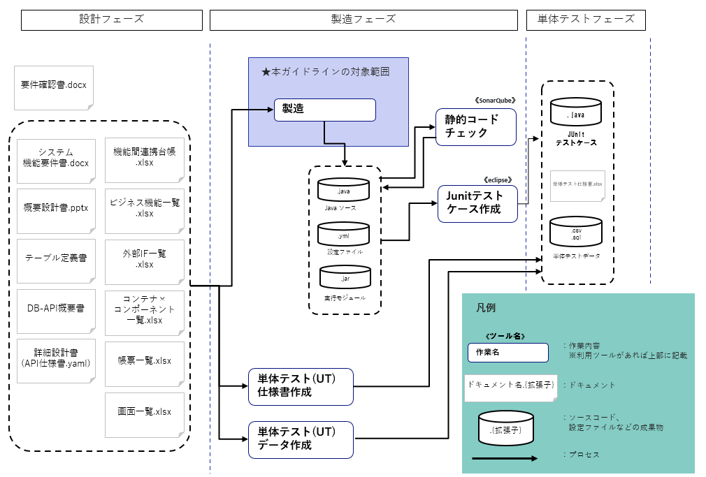
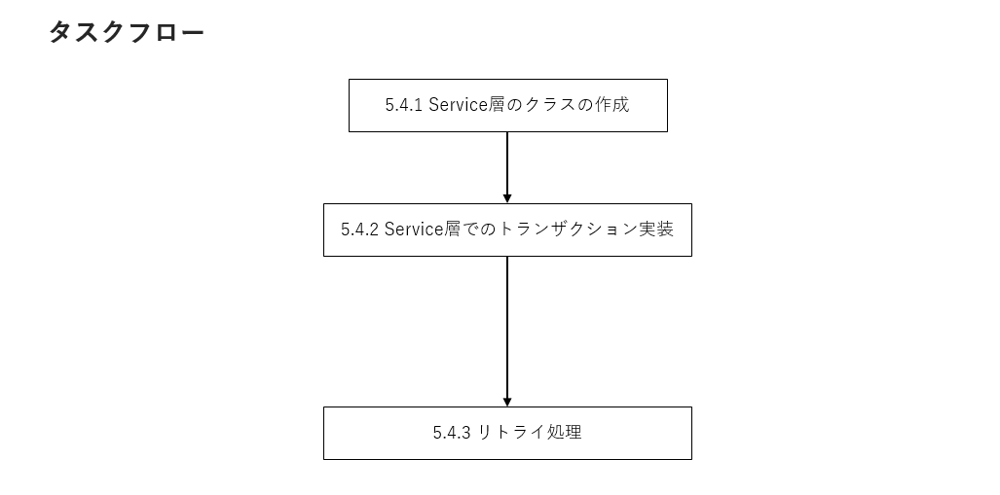

# 実装ガイドライン　オンラインアプリケーション編

# 目次

- [1. はじめに](#1-はじめに)
  - [1.1 目的](#11-目的)
  - [1.2 適用範囲](#12-適用範囲)
- [2. 製造ワークフロー](#2-製造ワークフロー)
- [3. 用語定義](#3-用語定義)
- [4. BlankPJの取り込み手順](#4-テンプレート取り込み手順)
  - [4.1 BlankPJのインポート手順](#41-BlankPJのインポート手順)
  - [4.2 サンプルとなるMSテンプレートの選定](#42-サンプルとなるMSテンプレートの選定)
  - [4.3 設定値の確認とチューニング方法](#43-設定値の確認とチューニング方法)
- [5. 実装](#5-実装)
  - [5.1 共通的な処理](#51-共通的な処理)

  - [5.2 Applicationの実装](#52-Applicationの実装)
  - [5.3 Controller層の実装](#53-Controller層の実装)
    - [5.3.1 Controller層のクラスの作成](#531-リクエストデータのバリデーション) 
       - [5.3.1.1 REST機能における実装手順](#5311-REST機能における実装手順)
       - [5.3.1.2 MQ機能における実装手順](#5312-REST機能における実装手順)
    - [5.3.2 リクエストデータのバリデーション](#532-リクエストデータのバリデーション)
       - [5.3.2.1 リクエストのパス(URI)に含まれるパラメータのバリデーション](#5321-リクエストのパス(URI)に含まれるパラメータのバリデーション)
       - [5.3.2.2 リクエストのデータ項目に対してのバリデーション](#5322-リクエストのデータ項目に対してのバリデーション)  
    - [5.3.3 例外処理](#533-例外処理)
  - [5.4 Service層の実装](#54-Service層の実装)
    - [5.4.1 Service層のクラスの作成](#541-Service層でのトランザクション実装)
    - [5.4.2 Service層でのトランザクション実装](#542-Service層でのトランザクション実装)
    - [5.4.3 リトライ処理](#543-リトライ処理)
  - [5.5 Repository層の実装](#55-Repository層の実装)
    - [5.5.1 データベースへのアクセスを行うクラス作成](#551-データベースへのアクセスを行うクラス作成)
        - [5.5.1.1 MyBatisGeneratorによる自動生成](#5511-MyBatisGeneratorによる自動生成)
        - [5.5.1.2 自動生成後の確認と実装](#5512-自動生成後の確認と実装)
        - [5.5.1.3 データベースへのアクセス処理](#5513-データベースへのアクセス処理)
    - [5.5.2 Repository層でのトランザクション実装](#552-Repository層でのトランザクション実装)
  - [5.6 コンテナ間連携処理](#56-コンテナ間連携処理)
    - [5.6.1 コンテナ間でのMQ連携を行うクラスの作成](#561-コンテナ間でのMQ連携を行うクラスの作成)
        - [5.6.1.1 SNS+SQSを利用したコンテナ間実装](#5611-SNS+SQSを利用したコンテナ間実装)
        - [5.6.1.2 ActiveMQを利用したコンテナ間実装](#5612-ActiveMQを利用した間実装)
    - [5.6.2 コンテナ間でのREST連携を行うクラスの作成](#562-コンテナ間でのREST連携を行うクラスの作成)
    - [5.6.3 連携サービスの接続エラー時に一時的に接続を遮断する](#563-連携サービスの接続エラー時に一時的に接続を遮断する)
  - [5.7 システム間連携処理](#57-システム間連携処理)
    - [5.7.1 システム間でREST連携を行うクラスの作成](#571-システム間でREST連携を行うクラスの作成)
    - [5.7.2 システム間でSOAP連携を行うクラスの作成](#572-システム間でSOAP連携を行うクラスの作成)
    - [5.7.3 システム間でMQ連携を行うクラスの作成](#573-システム間でMQ連携を行うクラスの作成)

# 1. はじめに
本章では、本ガイドで説明する内容の前提となる、目的、適用範囲について説明する。
  
## 1.1 目的
本プロジェクトにおける、オンラインアプリケーション実装時の標準となるガイドを示すことにより、<br>
オンラインアプリケーション作成時の統一性と品質の向上を図ることを目的とする。

## 1.2 適用範囲
本ガイドはオンラインアプリケーション実装に関わる手順を記載する。<br>
設計に関するガイドラインや命名規則等は本ガイドの対象外とする。

# 2. 製造ワークフロー
以下では本プロジェクトにおける製造の流れとなるワークフローを示す。


上記の「製造」手順を詳細に示した本ガイドのワークフローは以下の通りである。<br>
本ガイドでは以下の順序に従い、対応する各章の内容を参照しながら製造を進めること。


# 3. 用語定義
本資料で用いる用語を以下に定める。
|定義語|関連製品|説明|
|:---|:---|:---|
|BlankPJ|java|SpringBootアプリケーションのひな形となるソースコード。リポジトリ名はsample-application。<br>本プロジェクトではオンラインアプリケーションのテンプレートとして扱う。|
|MSテンプレート|java|マイクロサービスアーキテクチャによるクラウドネイティブアプリケーション開発を行うにあたり、個々のマイクロサービスをJavaで実装したソースコード。また、それをもとに各機能用にカスタマイズしたソースコードの総称。<br>本プロジェクトでは直接取り込みは行わず、BlankPJ上での実装の参考とするサンプルコードとして扱う。|
|外部システム|-|本PJにおける外部システムはAmadeus(1A)やCX基盤、その他連携システムを指す。|

# 4. BlankPJの取り込み手順

## 4.1 BlankPJのインポート手順

【前提】<br>
- 開発環境構築が完了していること
> 出典：[開発環境構築ガイドライン](https://github.com/ANA-CASG/local-dev-env)

- 自身の所属する開発チームのスクラムマスターが以下の手順「1.アプリケーションリポジトリ作成」までを実施済みであること。
> 出典：[CI/CD 利用ガイドライン](https://github.com/ANA-CASG/cicd-guideline/blob/main/dev/create-new-sample.md#1%E3%82%A2%E3%83%97%E3%83%AA%E3%82%B1%E3%83%BC%E3%82%B7%E3%83%A7%E3%83%B3%E3%83%AA%E3%83%9D%E3%82%B8%E3%83%88%E3%83%AA%E4%BD%9C%E6%88%90)

【手順】<br>
1. 前提CI/CD利用ガイドラインの「1.アプリケーションリポジトリ作成」で新規作成したGithub上のリポジトリにアクセスする。<br>

2. ブラウザ(github)上で一意になるようにブランチを作成する。<br>
　feature-作業者名#MyRedmineチケット番号<br>

3. 任意のローカルディレクトリにクローンする。<br>
　クローンおよびマージの方法については以下の手順に従うこと。<br>
> 出典：[構成管理ガイドライン](https://github.com/ANA-CASG/scm-guideline/blob/main/README_Usage_guide.md#31-%E3%83%96%E3%83%A9%E3%83%B3%E3%83%81%E9%81%8B%E7%94%A8%E3%83%95%E3%83%AD%E3%83%BC)

4. STSに3でクローンしてきたリポジトリのインポートを行う<br>
5. パッケージ・エクスプローラーを右クリック＞インポート＞既存のGradleプロジェクトを選択する。<br>


6. 手順3でローカルにクローンしたディレクトリを選択する。<br>


7. インポートされたことを確認する。<br>


【注意事項】
- 取り込み時にエラーが発生した場合、ローカルのgradle環境に問題があるため、以下を試行してみること。
該当PJで右クリック＞Gradle＞Gradleプロジェクトのリフレッシュ
メニューのプロジェクトをクリック＞クリーン

## 4.2 サンプルとなるMSテンプレートの選定
【前提】<br>
作成するアプリケーションの機能やユースケースに応じてMSテンプレートを選定する。<br>
なお、本PJでは選定したテンプレートのクラスは実装者の実装を容易にする各機能の実装のサンプルとしての位置づけとなるため、本章(4.2)の手順を飛ばしても良い。

【手順】<br>
1. サンプルのリポジトリを開く。<br>
> 出典：[PLUSリポジトリ](https://github.com/ANA-CASG)

2. 以下のユースケースと業務要件を参考にMSテンプレートを選定する。

|ユースケース|機能|テンプレート名称|
|:---|:---|:---|
|外部サービス（ HTTP ）に対して POST / PUT / GET / DELETE 操作を行うAPI<br>およびPostgreSQL の単一テーブルに対する CRUD 操作を行う APIを実装する場合|REST関連機能|cas-template-rest-master|
|非同期にMQ（メッセージキューイング）のやり取りを行う機能を実装する場合|ActiveMQ関連機能|cas-template-activemq-master|
|サービス間でのメッセージ通信にSQSを用いてを行う機能を実装する場合|SQS関連機能|cas-template-sqs-master|
|サービス間でのメッセージ通信にSNSを用いて行う機能を実装する場合|SNS関連機能|cas-template-sns-master|

各MSテンプレートの詳しい説明はテンプレートのREADMEを参照すること。
MQに関しては、機能・非機能要件に応じてActiveMQとSNS＋SQSの使い分けが必要。使い分けの方針については、以下の資料を参照<br>
> 出典：[SQS+SNSとActiveMQ使い分け.xslx](https://docs.google.com/spreadsheets/d/1OzuiUh3iHIQmSeXMctmlZWq3K6V00E0ySFxjADZgKIU/edit?usp=sharing)

3. 各サンプルクラスの構成を参考に5章以降の実装を進める。<br>
各MSテンプレートのクラス構成をまとめた図が以下に記載されているため合わせて参考とすること。
> 出典:アプリケーション実装方式設計書(オンライン編) 5.アプリケーション構成<br>

【注意事項】<br>
MSテンプレートはは仮想の業務アプリを想定して実装されているため、そのまま流用してしまうと不要な設定や記述が組み込まれる可能性がある。
そのため、原則インポートしたMSテンプレートを直接リファクタリング等をして利用することは行わないこと。
※例えば、上記の点を考慮して実装者が品質の担保をしたうえで部分的にテンプレートを引用することなどは可とする。

## 4.3 設定値の確認とチューニング方法

### 設定ファイル一覧
4.1で取り込んだBlankPJ(sample-application)ではアプリの設定値は以下で定義されている。
|ファイル名|説明|
|:---|:---|
|application.yml|デフォルトで読み込まれる設定ファイル<br>環境ごとに読み込む設定ファイルを指定する|
|application-common.yml|環境差異のない項目|
|application-prd.yml|本番環境|
|application-trn.yml|本番環境トレーニング|
|application-stg.yml|ステージング環境|
|application-tstg.yml|ステージング環境トレーニング|
|application-dev.yml|保守・開発環境|
|application-local.yml|開発用PC環境(動作検証用)|

【注意事項】<br>
原則local以外の環境では基盤側のマニフェストファイルにてデプロイ時に環境変数に必要な値が設定される。
|ファイル名|説明|
|:---|:---|
|manifest-{アプリケーション識別子}.yml|デプロイ時に読み込まれるマニフェストファイル|

※ベースマニフェストで定義される項目は以下の出典を参照
> 出典:[コンテナ基盤利用ガイドライン](https://github.com/ANA-CASG/base-container-manifest-guideline)

ここでは各ファイルでアプリ実装者で環境に応じて設定やチューニングが必要な項目および設定変更不可な項目を説明する。(**変更不可**は太字で記載)

### application.yml<br>
|項目|値&nbsp;※${環境変数:環境変数が設定されていない場合のデフォルト値}|説明|
|:---|:---|:---|
|spring:<br>&nbsp;application:<br>&nbsp;&nbsp;name:|sample-application|アプリケーション名に合わせて修正<br>※すでにスクラムマスターが実施済みであれば不要|
|spring:<br>&nbsp;profile:<br>&nbsp;&nbsp;active:|${SPRING_PROFILES_ACTIVE:dev}|本番、検証、保守・開発環境ではあらかじめ基盤側のマニフェストファイルで環境変数に設定を行うため実装者は**変更不可**<br>※なお、動作検証でローカルで動かす場合のみ設定は変えずに環境変数SPRING_PROFILES_ACTIVEを作成し、localを指定することで独自の定義が可能。|

### application-common.yml<br>
|項目|値&nbsp;※${環境変数:環境変数が設定されていない場合のデフォルト値}|説明|
|:---|:---|:---|
|api:<br>&nbsp;base-path:|/api/v1/sample|作成するAPIのエンドポイントに合わせて修正要|
|spring:<br>&nbsp;datasource:<br>&nbsp;&nbsp;url:|jdbc:postgresql://${POSTGRES_HOST:localhost}:${POSTGRES_PORT:5432}/<br>${POSTGRES_DATABASE:postgres}|データベースのエンドポイントに合わせて環境変数に設定<br>※データベース接続が必要な機能のみ設定|
|spring:<br>&nbsp;datasource:<br>&nbsp;&nbsp;username:|${POSTGRES_USER:postgres}|データベースのユーザ名を環境変数POSTGRES_USERに設定<br>※データベース接続が必要な機能のみ設定|
|spring:<br>&nbsp;datasource:<br>&nbsp;&nbsp;password:|${POSTGRES_PASSWORD:password}|データベースのパスワードを環境変数POSTGRES_PASSWORDに設定<br>※データベース接続が必要な機能のみ設定|
|spring:<br>&nbsp;activemq:<br>&nbsp;&nbsp;broker-url:|${AMQ_BROKER_URL:tcp://localhost:61616}|環境変数AMQ_BROKER_URLにACTIVEMQのエンドポイントを設定<br>※ActiveMQへの接続が必要な機能のみ設定|
|spring:<br>&nbsp;activemq:<br>&nbsp;&nbsp;user:|${AMQ_USER:} |ActiveMQのユーザ名を環境変数AMQ_USERに設定<br>※ActiveMQへの接続が必要な機能のみ設定|
|spring:<br>&nbsp;activemq:<br>&nbsp;&nbsp;password:|${AMQ_PASSWORD:}|ActiveMQのパスワードを環境変数AMQ_PASSWORDに設定<br>※ActiveMQへの接続が必要な機能のみ設定|
|aws-api:<br>&nbsp;common22:<br>&nbsp;&nbsp;sns:<br>&nbsp;&nbsp;&nbsp;endpoint-url|https://sns.ap-northeast-1.amazonaws.com/000000000000/TOPIC_NAME|SNSのエンドポイントを設定<br>※SNSへの接続が必要な機能のみ設定|
|app-aws:<br>&nbsp;sqs:<br>&nbsp;&nbsp;endpoint-url:|https://sqs.ap-northeast-1.amazonaws.com/000000000000/QUEUE_NAME|SQSのエンドポイントを設定<br>※SQSへの接続が必要な機能のみ設定|
|external-service:<br>&nbsp;services::<br>&nbsp;&nbsp;sample:<br>&nbsp;&nbsp;base-url:| ${EXTERNAL_SERVICE_SAMPLE_BASE_URL:http://localhost:8081/api/v1/sample/postgres}|外部サービスのエンドポイントを環境変数EXTERNAL_SERVICE_SAMPLE_BASE_URLに設定<br>※外部サービス接続が必要な機能のみ設定|
|spring:<br>&nbsp;datasource:<br>&nbsp;&nbsp;hikari:<br>&nbsp;&nbsp;&nbsp;auto-commit:|false|フレームワークの機能でトランザクション処理を行う方式のためデータソースの自動コミットはオフから**変更不可**|
|logging:<br>&nbsp;pattern:|省略(application-common.ymlを参照)|ログのフォーマット統一化のため**変更不可**|
|default-property-inclusion::|省略(application-common.ymlを参照)|ログ/通信量の出力量抑制のため、バックエンド標準は NON_NULL<br>但し、フロント-バックエンド間については、IF項目数が少ないため、ALWAYSを標準とし、<br>NON_NULLとする場合は、両者合意の元設定を許容する。|

### application-{env}.yml(prd,trn,stg,tstg,dev,local)<br>
設定ファイル一覧の説明を参考に、製造フェーズに応じて環境を読み替えること。

|項目|値|説明|
|:---|:---|:---|
|例)spring:retry:maxAttempts<br>※BlankPJに含まれていないためリトライ処理が必要なメソッドが存在する場合のみ開発者で追加を行う<br>**注釈1)**|業務要件に応じて設定すること<br>※整数値で指定|リトライの最大実行回数を指定<br>※後述5.4.2リトライ処理を参照|
|例)spring:retry:backoff-time<br>※BlankPJに含まれていないためリトライ処理が必要なメソッドが存在する場合のみ開発者で追加を行う<br>**注釈1)**|業務要件に応じて設定すること<br>※ミリ秒単位で指定|各リトライ間の待機時間を指定<br>※後述5.4.2リトライ処理を参照|
|spring:<br>&nbsp;jdbc:<br>&nbsp;&nbsp;template:<br>&nbsp;&nbsp;&nbsp;query-timeout<br>※BlankPJに含まれていないため要件に応じて開発者で追加を行う|0(デフォルト：タイムアウトなし)<br>※秒単位で指定|SQLクエリのタイムアウト値<br>|
|spring:<br>&nbsp;jms:<br>&nbsp;&nbsp;listener:<br>&nbsp;&nbsp;&nbsp;receive-timeout<br>※BlankPJに含まれていないため要件に応じて開発者で追加を行う|1(デフォルト)<br>※秒単位で指定|JMS(メッセージ)受信呼び出しタイムアウト値|
|spring:<br>&nbsp;datasource:<br>&nbsp;&nbsp;hikari:<br>&nbsp;&nbsp;&nbsp;connection-timeout|30000ミリ<br>※ミリ秒単位で指定<br>|コネクションタイムアウト値|

要件等で意図的に値を変更を行う必要がある場合はチームリーダーに確認すること。<br>
※なお、application-local.ymlに関しては開発者が項目を自由に定義しても良い。<br>
　差分をリポジトリにpushしないように該当ファイルが.gitignoreに含まれていることを確認すること。

### 動作確認
後述5.実装手順実施後に、自身の開発環境で動作の検証を行う場合は、
以下の2点を確認し、アプリケーションを実行できることを確認する。<br>
①SPRING_PROFILES_ACTIVEにlocalが指定されていること<br>
②各設定値にローカル環境に合わせた接続先が指定されていること

# 5. 実装
- 本章ではアプリケーションの実装手順を示す。
- 複雑な手順となる場合があるため、その場合は各章のタスクフロー図を参考に読み進めること。

## 5.1 共通的な処理の実装
- 共通的な処理は、例として「ログ出力」、「テスト日時取得」、「コード値変換」、「NULLチェック」、「型チェック・変換」、「定数定義」等が想定され、幾つかは共通部品として使用可能である。<br>
- 共通部品に無いものは、各自でUtiltyクラス等へ実装しても良い。
また、共通部品化して欲しい要望があれば、チームリーダーを通してPJに確認すること。<br>
共通部品の詳しい内容や使用方法は、以下を参照すること。<br>
> 出典: [共通部品取り込み方法](https://github.com/ANA-CASG/cicd-guideline/blob/main/dev/Appendix/nexus.md)
>出典: 共通部品機能(SMDI_PLUS_APL_システム機能要件書_アプリ共通処理)<br>
- ここでは、共通的な処理で利用度が高く、かつ実装方法が特殊な「ログ出力」、「テスト日時取得」について説明する。<br>


### 5.1.1 ログ出力
- ログ出力を行う場合、基本的に専用の共通部品「COMMON_04（ログ出力）」を使用する。<br>
- 共通部品ではログ出力に識別子を持たし、稼働統計、運用監視、処理エラー等として利用することができる。
- オンラインではHTTPリクエストを受信した際に自動的にログ出力を行う仕組みと、ログフォーマットを用いたログの出力方法がある。

ログ出力については、以下出典を基に記載。また、詳しい設定方法や使用方法も出典を参照すること。
>出典：　SMDI_PLUS_APL_システム機能要件書_アプリ共通処理　5.5 ログ出力：COMMON_04<br>
　　　　ログ出力設計_アプリケーション開発標準<br>
<br>

【手順】
1. 呼出しのApplicationクラス内＠SpringBootApplicationアノテーションにUtirilyを指定する。<br>
2. FilterConfigクラスを実装する。<br>
3. 共通部品をインポートする。<br>
※自動ログ出力に関しては上記までの手順で完了となる。自身でログ出力を行う処理を実装する際は以下の手順を行う。
4. ログ出力を行うクラスにて、共通部品のログフォーマットを用いてログ出力を行う。

例）Applicationの実装
```java
//1.エントリクラスのアノテーションへの追加
@SpringBootApplication(
  scanBasePackages = { "jp.co.ana.cas","jp.co.ana.cas.common.global.common4.util" })
public class Application {
```
例）FilterConfigの実装
```java
//2. FilterConfigクラスの実装
//3. 共通部品のインポート
import jp.co.ana.cas.common.global.common4.util.AccessLogFilter;
@Bean
public FilterRegistrationBean<Filter> accessLogFilterRegistration() {
  FilterRegistrationBean<Filter> registration = new FilterRegistrationBean<Filter>();
  registration.setFilter(accessLogFilter());
  registration.addUrlPatterns(UriComponentsBuilder.fromPath(basePath + "/*").toUriString());
  registration.setName("accessLogFilter");
  registration.setOrder(2);
  return registration;
}

@Bean(name = "accessLogFilter")
public Filter accessLogFilter() {
  return new AccessLogFilter();
}
```
例）TestLogSampleClassの実装
```java
import lombok.extern.log4j.Log4j2;
import jp.co.ana.cas.common.global.common4.CommonConstants;
/**
 * ログ出力テストクラス<br>
 */
@Log4j2
public class TestLogSampleClass {

    public static void execute() {

        // 設定を記述

        try {
            //4.ログフォーマットを用いたログの出力
            // MQ稼働統計ログ
            log.info(CommonConstants.MQ_ACCESS_LOG_FORMAT,  sdf.format(mqStartTime),
                    sdf.format(mqEndTime), Duration.between(mqStartTime, mqEndTime).toMillis(), mqQueueName, mqMassageSize, mqFlag);
            // S3アプリケーション監査ログ
            log.info(CommonConstants.S3_LOG_FORMAT, s3Oparation, s3BucketName, s3Filepath);
            // 業務個別ログ
            log.info("エラー exitCode : {0}", exitCode);
            
        } catch (Exception e) {
        // 例外処理を記述

            // 運用監視ログ
            log.error(CommonConstants.OPERATION_LOG_FORMAT, messageId, errorMessage, e.getClass());
            // 処理エラーログ
            log.error(CommonConstants.ERROR_LOG_FORMAT, messageId, errorMessage, e.getClass(), "", e);
        }
```
例）ログフォーマット利用時のログ出力
```
// S3アプリケーション監査ログ
time:2022-09-13 10:19:48.444	severity: INFO	span:[springboot-sample-rest,305f11e4bfc13f2e,305f11e4bfc13f2e]	pid:1736	thread:[io-48080-exec-1]	class:resources.handler.GlobalExceptionHandler	host:- 	message:	log_class:S3_LOG	s3_operation:put	s3_bucket_name:bucket	s3_file_path:localhost/upl/unb/path/

// 業務個別ログ
time:2022-09-13 10:19:48.445	severity: INFO	span:[springboot-sample-rest,305f11e4bfc13f2e,305f11e4bfc13f2e]	pid:1736	thread:[io-48080-exec-1]	class:resources.handler.GlobalExceptionHandler	host:- 	message:エラー exitCode : {0}
```

### 5.1.2 テスト日時取得
- ある特定の日時を使用してテスト実施したい場合、専用の共通部品「COMMON_10（テスト環境用システム日時取得）」を使用して実装を行う。
- 開発環境利用の場合は、テーブルより予め設定済のテスト用日付を取得する方法の記述が必要となる。<br>
- 開発環境以外の利用の場合は、システム日付を取得する方法の記述が必要となる。<br>
- 日付は、日付(LocalDate)、時刻（LocalTime)、日時（LocalDateTime)が利用可能。<br>

テスト日付設定については、以下出典を基に記載。
>出典：　SMDI_PLUS_APL_システム機能要件書_アプリ共通処理　5.11	テスト環境用システム日時取得：COMMON_10<br>

【手順】
1. 共通部品をインポートする。
2. ロジック処理を実装し、共通部品を呼び出すこと。

例）TestDateSampleClassの実装（1/2）

```java
//1.共通部品のインポート
import jp.co.ana.cas.common.global.common10.dto.response.GetTestEnvSystemDateTimeResult;
import jp.co.ana.cas.common.global.common10.repository.dao.GetTestEnvSystemDateTime;
```
例）TestDateSampleClassの実装（2/2）
```java
@Autowired
GetTestEnvSystemDateTime getTestEnvSystemDateTime;

//～～メソッド内～～

// 変数定義
String businessFuncId = “CASB-Z000000”;

// 2.共通部品の呼び出し
// 環境判定し、dev以外の場合はcommon10を呼び出さない
Stirng envExecBase = System.getenv("SPRING_PROFILES_ACTIVE"); 
LocalDate localDate = null;
LocalTime localTime = null;
LocalDateTime localDateTime = null;
if (StringUtils.equals(envExecBase.toLowerCase(), "dev") {
   GetTestEnvSystemDateTimeResult getTestEnvSystemDateTimeResult = getTestEnvSystemDateTime.execute(businessFuncId );
   localDate = getTestEnvSystemDateTimeResult.getReturnDate ();
   localTime = getTestEnvSystemDateTimeResult.getReturnTime();
   localDateTime = getTestEnvSystemDateTimeResult.getReturnDateTime();

} else {
  // dev以外の場合はシステム日時を各自で取得
   localDate = LocalDate.now();
   localTime = LocalTime.now();
   localDateTime = LocalTime.now();
}
```

## 5.2 Applicationの実装
ここではアプリケーション実行時に初期実行されるメソッドを保有するApplicationクラスの実装手順を示す。<br>
【手順】
1. 起動クラスと定義するため、Springのアノテーションである@SpringBootApplicationを付与する。
2. 付与した@SpringBootApplicationにscanBasePackagesにて対象クラスのパッケージを指定する。<br>※上記を行うことで対象のパッケージ内で実装を容易にするDI(依存性注入)が利用可能になる。
3. エントリクラスで定義するアノテーションがある場合は独自で定義する

【注意事項】
4.1章のBlankPJの取り込みが完了していれば、手順1,2はすでに含まれているため不要となる。

例）Applicationクラスの実装
```java

package jp.co.ana.cas;

import org.springframework.boot.SpringApplication;
import org.springframework.boot.autoconfigure.SpringBootApplication;

import lombok.extern.log4j.Log4j2;

// 1. @SpringBootApplicationアノテーションの付与
// 2. scanBasePackagesにて対象クラスをパッケージを指定
@SpringBootApplication(
    scanBasePackages = { "jp.co.ana.cas" }
)
// 3. エントリクラスで定義するアノテーションがある場合は独自で定義する
@EnableFeignClients(
    basePackages = { "jp.co.ana.cas" }
)
@MapperScan(
    { "jp.co.ana.cas.template.repository.dao.postgres.mapper" }
)
@Log4j2
public class Application {

    public static void main(String[] args) {

        SpringApplication.run(Application.class, args);
    }

}
```

## 5.3 Controller層の実装
ここではアプリケーションに対するリクエストの窓口となる<br>
インターフェースの役割を担うController層の実装手順を示す。


### 5.3.1   Controller層のクラスの作成
REST機能とMQ機能により実装手順が異なるため、該当する手順のみを参照して実装すること。

#### 5.3.1.1 REST機能における実装手順
【前提】
- 実装する機能がRESTの機能であること。※MQ機能の場合、後述MQ機能における実装手順を参照
- 開発環境構築手順にてOpenAPI generatorがインストール済みであること。

【手順】<br>
1. OpenAPI generatorを利用してAPI仕様に沿ったクラスが作成されたことを確認する。<br>
> 出典：[OpenApi generator利用手順](https://github.com/ANA-CASG/local-dev-env#39-openapi-generator)

以下のクラスが作成される。
| 論理クラス | 概要 |
| - | - |
| Request | API仕様をもとに、リクエストがマッピングされる先のオブジェクトが生成される |
| Response | API仕様をもとに、レスポンスの元となるオブジェクトが生成される |
| IController | API仕様をもとに、RESTインターフェースを表現するInterfaceが生成される。 |
| Controller | IControllerの具象化クラスが生成される。 |

※ContorllerのメソッドはIControllerのメソッドがオーバーライドされているため、オーバーライドされたメソッド内で処理を実装する。

2. Controller内で使用するServiceクラス（実際にビジネスロジックを行うクラス）をDIする。DIは、Springのアノテーション である`@Autowired`をインスタンス変数の宣言部に付与することで実現できる。
3. DIしたServiceクラスのメソッドを呼び出す。<br>
   ※Controllerクラスの責務はインターフェースの提供のため、実際のビジネスロジックはServiceクラスが行う。<br>
4. クライアントに返却するインターフェースに合わせるため、Serviceクラスのメソッドの戻り値にResponseDTOを指定する。

例）MailApiControllerの実装
```java
// 1. クラスの自動生成
@RestController
@RequestMapping("${openapi..base-path:/api/v1}")
public class MailApiController implements I_MailApi {

    private final NativeWebRequest request;

    // 2. ServiceのDI
    @Autowired
    RequestMailService requestMailService;

    @org.springframework.beans.factory.annotation.Autowired
    public MailApiController(NativeWebRequest request) {
        this.request = request;
    }

    @Override
    public Optional<NativeWebRequest> getRequest() {
        return Optional.ofNullable(request);
    }

    @Override
    public ResponseEntity<MailResponseInfoDTO> requestMail(@ApiParam(value = "ASW TAからのメール要求受信" ,required=true )  @Valid @RequestBody ReservationInfoDTO reservationInfoDTO) {

　　　　 // 3. Service呼び出し
    	int resultCode = requestMailService.sendMailRequest(reservationInfoDTO);

        // 4. 戻り値をResponseDTOに指定
    	MailResponseInfoDTO mailResponseInfoDTO = new MailResponseInfoDTO(String.valueOf(resultCode));

    	return ResponseEntity.ok(mailResponseInfoDTO);
    }
}
```

【注意事項】
- OpenAPI generatorが利用できない場合はcas-template-rest-masterを参考に上記の手順と同様にクラスを作成すること。

#### 5.3.1.2 MQ機能における実装手順
【前提】
- 実装する機能がMQの機能であること。

【手順】<br>
1. 送受信するメッセージを表現するDTOクラスを作成し、@Dataおよび@Builderを付与する。<br>
2. MQからメッセージを受信しService層を呼び出すlistenerクラスを定義する。
3. Springのアノテーション である`@JmsListener`を付与し、MQメッセージの待受を行う（付与されたメソッドがメッセージ受信時に実行される）
4. 受信メッセージを受信メッセージを表現する手順1で作成したDTOに変換する
5. DIしたServiceを呼び出すことでビジネスロジックを実行する

`@JmsListener`で受信待受を行う対象となるMQサーバーへの接続情報は、環境変数で定義する。
ActiveMQの設定はapplication.ymlのspring.activemqに記載されているので、必要に応じて変更する。

例1）MailSendRequestの実装
```java
// 1.自システムのINPUTとなるメール送信要求を表すドメインエンティティ.
@Data
@Builder
public class MailSendRequest {

    String mailTemplateId;
    String mailSequenceId;

    String mailDiv;
    String pnrRecordLocator;
    MailInfo mailInfo;
	
}
```
例2）SendMailListenerの実装
```java
/**
 * 2.メール送信要求の受け手となるListenerクラスの定義
 */
@Component
public class SendMailListener {
    @Autowired
    SendMailService sendMailService;

    // 3. @JmsListenerによるMQメッセージの受信待受
    @JmsListener(destination = "mail_send", containerFactory = "jmsListenerContainerFactory")
    public void consume(String message) throws InterruptedException, JsonProcessingException {

        // 4. 受信メッセージをDTOに変換
    	// メッセージを要求オブジェクトに変換（以下はメッセージのコンテンツがJSON形式の場合の例です）
        ObjectMapper mapper = new ObjectMapper();
    	MailSendRequest mailSendRequest = mapper.readValue(message, MailSendRequest.class);

        // 5. Service呼び出しによるビジネスロジックの実行
        int errorCode = MAIL_REQUEST_ERROR_CODE_OK;
        try {
        	sendMailService.requestReport(mailSendRequest.getPnrRecordLocator());
        	sendMailService.sendMail(mailSendRequest);
        } catch (Throwable e) {
        	logger.error(e.getMessage(), e);
        	errorCode = MAIL_REQUEST_ERROR_CODE_NG;
        } finally {
    	    sendMailService.saveMailRequest(mailSendRequest.getMailSequenceId(), message, errorCode);
    	}
    }
}
```

### 5.3.2 リクエストデータのバリデーション
ここではリクエストデータに対して妥当性を検証し、チェックするためのバリデーションの実装方法を示す。

#### 5.3.2.1 リクエストのパス(URI)に含まれるパラメータのバリデーション
リクエストのパスに含まれるパラメータに制限をかける場合は以下の実装を行う。<br>
【手順】<br>
1. クラスに対して`@Validated`を指定する。
2. メソッド引数に対して`@PathVariable`を指定する。
<br>※そのほかバリデーションの内容に応じたアノテーションの選択は出典を参照。
> 出典：[バリデーション関連のアノテーション](https://docs.jboss.org/hibernate/beanvalidation/spec/2.0/api/)

例1) Controllerクラスでのリクエストのパスに含まれるパラメータに対するバリデーション
```java
@RestController
@RequestMapping("hoge")
// 1.Validated指定 
@Validated
public class HogeController {
    @GetMapping
    public HogeGetResponse get(
        // 2.引数へのValidated指定
        @PathVariable @Size(min=36, max=36) String id
    ) {
        ...
    }
}
```

####  5.3.2.2 リクエストのデータ項目に対してのバリデーション
【手順】<br>
1. クラスに対して`@Validated`を指定する。
2. メソッド引数に対して`@Validated`を指定する。
3. Dtoクラスでフィールドに対してアノテーションを指定する。
　　※バリデーションの内容に応じたアノテーションの選択は出典を参照。
> 出典：[バリデーション関連のアノテーション](https://docs.jboss.org/hibernate/beanvalidation/spec/2.0/api/)

※主なBean Validationのアノテーション以外にサービス独自のアノテーションを実装することを可とする。<br>
例1)Controllerクラスでのリクエストのボディに含まれるパラメータに対するバリデーション
```java
@RestController
@RequestMapping("hoge")
// 1.Validated指定 
@Validated
public class HogeController {

    @PostMapping
    public HogePostResponse post(
        // 2. 引数へのValidated指定
        @RequestBody @Validated HogeRequest req
    ) {
        ...
    }
}
```
例2)Dtoクラスでのリクエストのデータ項目に対するバリデーション
```java
  // 3.フィールドに対してのアノテーション指定
  @Size(min = 36, max = 36)
  @NotNull()
  private String id;

  @Pattern(regexp = "^[a-zA-Z\\s]+$")
  @NotNull()
  private String name;
```

### 5.3.3 例外処理
ここではアプリケーション内で発生した例外を集約してレスポンスとして返却する処理を実装する手順を示す。
- システムエラーで回復不可能なものは例外として処理し、HTTP status 5xxとして応答する。
- アプリケーションエラーで回復処理を行わないものは例外として処理することも可能とし、HTTP status 4xxとして応答する。
- RestControllerを付与したクラスのバリデーションに`@Valid`を使用すると複数の項目エラーを含んだExceptionが発行される。
- 例外処理は、Springの`ExceptionHandler`を使用する。<br>

【手順】
1. ResponseEntityExceptionHandlerを継承したExceptionHandlerクラスを作成する。
2. REST APIで発生したエラー情報を保持するクラスを作成する。
3. ExceptionHandlerクラスに例外をハンドリングするメソッドを追加して、例外処理を行う。

以下に実装例を示す。

例1）ResponseEntityExceptionHandlerを継承したExceptionHandlerクラス
```java
// 1. @RestControllerAdviceのアノテーションを付与して全クラス共通の例外を設定する。
@ControllerAdvice
public class ExceptionHandler extends ResponseEntityExceptionHandler {

    @Inject
    MessageSource messageSource;

    @Override
    protected ResponseEntity<Object> handleExceptionInternal(Exception ex,
            Object body, HttpHeaders headers, HttpStatus status,
            WebRequest request) {
        Object responseBody = body;
        if (body == null) {
            responseBody = createApiError(request, "E999", ex.getMessage());
        }
        return new ResponseEntity<Object>(responseBody, headers, status);
    }

    private ApiError createApiError(WebRequest request, String errorCode,
            Object... args) {
        return new ApiError(errorCode, messageSource.getMessage(errorCode,
                args, request.getLocale()));
    }

}
```
例2）REST APIで発生したエラー情報を保持するクラス
```java
// 2. REST APIで発生したエラー情報を保持するクラス
public class ApiError {

    private final String code;

    private final String message;

    @JsonSerialize(include = Inclusion.NON_EMPTY)
    private final String target;

    @JsonSerialize(include = Inclusion.NON_EMPTY)
    private final List<ApiError> details = new ArrayList<>();

    public ApiError(String code, String message) {
        this(code, message, null);
    }

    public ApiError(String code, String message, String target) {
        this.code = code;
        this.message = message;
        this.target = target;
    }
    //(省略)

}
```

例3-1）RESTサービスのシステム例外のハンドリングメソッド（HTTP status 500）
```java
// @ExceptionHandlerのアノテーションを付与
@ExceptionHandler(Exception.class)
public ResponseEntity<Object> handleSystemError(Exception ex,
        WebRequest request) {
    ApiError apiError = createApiError(request, "E500");
    return handleExceptionInternal(ex, apiError, null,
            HttpStatus.INTERNAL_SERVER_ERROR, request);
}
```
例3-2）RESTサービスのリソース未検出例外のハンドリングメソッド（HTTP status 404）
```java
// @ExceptionHandlerのアノテーションを付与
@ExceptionHandler(ResourceNotFoundException.class)
  public ResponseEntity<Object> handleResourceNotFoundException(
        ResourceNotFoundException ex, WebRequest request) {
    return handleResultMessagesNotificationException(ex, null,
           HttpStatus.NOT_FOUND, request);
}
```
## 5.4 Service層の実装
ここでは5.3章で作成したController層クラスから呼び出され、
ビジネスロジックの役割を担うService層の実装手順を示す。<br>


### 5.4.1 Service層のクラスの作成
- cas-template-rest-masterを参考にServiceクラスを作成すること。
- Serivce層はRestやMQなどの機能にかかわらず同様な処理となることから共通の手順とする。

【手順】
1. クラス宣言時に`@Service`アノテーションを付与する。
2. Service内で使用するRepository層のクラス（DAOやService Client）のDIを行う。
3. インターフェースクラスのメソッドをオーバーライドしてビジネスロジックを記述する。
　 ※インターフェースクラスは4.2章のサンプルを参考に自身で作成すること。

例）Service層のクラス定義とメソッドの記述方法
```java
//1. @Serviceアノテーションの付与
@Service("postgresService")
@Log4j2
public class DefaultPostgresService implements PostgresService {

    @Autowired
    private PostgresRepository postgresRepository;

    @Autowired
    private ModelMapper modelMapper;

    @Override
    public SampleServiceDto register(SampleServiceDto dto) {
        dto.setId(UUID.randomUUID().toString());
        SampleDomain domain = modelMapper.map(dto, SampleDomain.class);

        domain.postOperations();

        SampleDomain retDomain = postgresRepository.register(domain);

        if (retDomain == null) {
            return null;
        }

        dto = modelMapper.map(retDomain, SampleServiceDto.class);

        return dto;
    }
```

### 5.4.2 Service層でのトランザクション実装
- 一連の処理を一つの処理単位として扱う必要がある場合、Spring Bootのフレームワークの機能を用いて開発者が実装を行う。
- 本PJではConsumerからの一回のリクエストに対し、一つのトランザクションで実行するため、Service層をトランザクション境界とする。@transactionalを用いたトランザクション処理の実装は通常はRepsitoryクラスで行うが、複数のRepositoryが存在する場合はServiceクラス内で行うため、本章の内容にて実装を行う。
※Repository層での実装方法は5.5.3章を参照

【手順】
1.  ServiceクラスにてDBアクセス処理を呼び出すメソッドに`@Transactional`を付与し、トランザクション管理を行う。
2.  オプションでロールバックのトリガとなる例外クラスを指定する。例ではException.classを指定しているが処理要件に応じた例外を指定すること。
例)複数Repositoryクラスのメソッドを呼び出す処理
```java
@Service("postgresService")
@Log4j2
public class DefaultPostgresService implements PostgresService {

　　//(省略)
    //1.2.@transactionalおよびロールバックを行う例外の指定
    @Transactional(rollbackFor=Exception.class)  
    @Override
    public SampleServiceDto hogeUpdate(String id, SampleServiceDto dto) {
　　　　//(省略)

        //複数Repositoryクラスのメソッドを呼び出す場合
        SampleDomain domain = postgresRepository.get(id);
        SampleDomain retDomain = postgresRepository.insertOrUpdate(id, domain);
        dto = modelMapper.map(retDomain, SampleServiceDto.class);
        return dto;
    }
```

【注意事項】<br>
- @transactionalは非検査例外(RuntimeException)の発生時は自動でロールバックされるが、検査例外の発生時はデフォルトではコミットされてしまうため、オプションで指定すること。

### 5.4.3 リトライ処理
ここでは、リトライ処理の実装方針について記述する。<br>
【前提】
- 業務要件に応じてリトライが必要かどうかを確認する。
- リトライ処理は、Spring Retryの機能を用いて実装する。その際、外部サービス、DBの要件に合わせてリトライ回数、リトライ待機時間を指定する。
- application.{env}.ymlにリトライ回数、リトライ待機時間が定義されていること。

【手順】
1. リトライに指定するオプションの値は設定ファイルで定義して取得する。※4.3章参照。
2. リトライ処理を実装するメソッドに@Retryableを付与する。
3. リトライ回数およびリトライ間隔を引数で指定する。


例）`@Retryable`を用いたリトライ処理実装
```java
// 1.application.{env}.ymlで定義した設定値の取得※4.3章参照
@Value("${spring:retry:maxAttempts}")
private int attempts;
@Value("${spring:retry:backoff-time}")
private int backoff_time;
// 2.@Retryableの付与
// 3.引数でvalue(リトライ対象となる例外を指定。valueに指定された例外がメソッド内で発生した場合にリトライを行う),maxAttempts(リトライ回数),backoff(リトライ間隔)の設定
@Retryable(value = { ResourceAccessException.class }, maxAttempts = attempts, backoff = @Backoff(delay = backoff_time))
public void retryService() throws SQLConnectionException {
// RESTインターフェース呼び出しなどを伴う処理

```

## 5.5 Repository層の実装
- ここでは5.5章で作成したService層クラスから呼び出され、主にデータベースなどのリソースとの連携処理を実装するRepository層の実装手順を示す。
- Alteaや他システムなどのシステム間での連携処理については本来Repository層での実装になるが、ドキュメントの可読性を考慮して5.7章のシステム間連携にまとめているため、そちらを参照すること。


###  5.5.1 データベースへのアクセスを行うクラス作成
- 本プロジェクトでは、MyBatisのデータベース情報のJavaオブジェクト設定やORマッピング機能を利用して、データベースへのアクセス処理を行う。
- データベースへのアクセス処理を行うには「JavaのDAOインタフェース」「Mapper XML」「JavaのDTOクラス」のファイルをそれぞれ作成し実装する。<br>
   - MyBatisGeneratorを使用することで自動生成が可能である。
   - 自動生成されたファイルをベースにすることで作業軽減が期待できるためMybatisGeneratorの使用を推奨する<br>

####  5.5.1.1 MyBatisGeneratorによる自動生成
- MyBatisGeneratorを実行し、MyBatisで使用するファイルを自動生成する。
> 出典：[MyBatisGenerator利用ガイド](https://github.com/ANA-CASG/local-dev-env/blob/main/appendix/4.4_MyBatisGenerator%E5%88%A9%E7%94%A8%E6%89%8B%E9%A0%86.md)<br>


####  5.5.1.2 自動生成後の確認と実装
【手順】
1. 自動生成後、指定したテーブル毎に指定パスへ下表のファイルが出力されているかを確認する。<br>
 ※ [テーブル名]は、Java形式となる。<br>
例) test_user_table  →　TestUserTable<br>


| ファイル名 | クラス/XML | 概要 |
| - | - | - |
| `[テーブル名]Mapper.java` | DAOインタフェース| SELECT、INSERT、UPDATE、DELETEの基本的なメソッドが用意されている。<br>なお、当クラスを利用した「implements」句の実装は行わないこと。|
| `[テーブル名]Mapper.xml` | MapperXML |TABLEのカラムとJavaで実装したDTOをMappingする機能や、SQLを生成する機能を持つ。<br>xmlファイルは、「DAOインタフェース」に対応した実装が自動生成されている。 |
| `[テーブル名].java` | DTOクラス |DBのテーブル定義に沿ったフィールドが用意される。Updateやinsertの時は、このクラスを引数として用いる。 |
| `[テーブル名]Example.java` | Exampleクラス |抽出条件や並び順などの設定情報が自動生成される。<br>「DAOインタフェース」のメソッドと組み合わせて利用する。 |

2. DAOインタフェースに追加メソッドの必要性検討を行う。<br>
自動生成メソッドは下表の通り。業務に合わせて「メソッドを利用する/利用しない」と「追加メソッド」の必要性を判断する。<br>
※追加メソッドについて、業務アプリの設計で下表のメソッドで実現できない場合や複雑なSQL記述が必要な場合は、DAOインタフェースへ専用のメソッドを追加する。

| №| メソッド | 内容 | 分類 |
| - | - | - | - |
| 1 | countByExample | 引数にExampleクラスで指定した抽出条件値を設定し、レコード件数を返す。 | 参照系 |
| 2 | deleteByExample | 引数にExampleクラスで指定した抽出条件値を設定し、該当レコードを削除する。 | 更新系 |
| 3 | deleteByPrimaryKey |  引数にプライマリキーを指定し、該当レコードを削除する。<br>※プライマリキー設定がある場合のみ作成 | 更新系 |
| 4 | insert | 引数にDTOクラスの全カラム分の設定内容で、レコードを追加する。 | 更新系 |
| 5 | insertSelective | 引数にDTOクラスの指定カラム分の設定内容で、レコードを追加する。 | 更新系 |
| 6 | selectByExample | 引数にExampleクラスで指定した抽出条件値を設定し、該当レコードをリスト形式で返す。 | 参照系 |
| 7 | selectByPrimaryKey | 引数にプライマリキーを指定し、該当レコードをリスト形式で返す。<br>※プライマリキー設定がある場合のみ作成 | 参照系 |
| 8 | updateByExampleSelective | 引数にExampleクラスで指定した抽出条件値とDTOクラスの指定カラム分の更新内容を設定。<br>引数の抽出条件値でレコードを特定し、更新内容で該当レコードを更新する。 | 更新系 |
| 9 | updateByExample | 引数にExampleクラスで指定した抽出条件値とDTOクラスの全カラム分の更新内容を設定。<br>引数の抽出条件値でレコードを特定し、更新内容で該当レコードを更新する。 | 更新系 |
| 10 | updateByPrimaryKeySelective | 引数にDTOクラスの指定カラム分の設定内容で、プライマリキーを特定し、該当レコードを更新する。<br>※プライマリキー設定がある場合のみ作成 | 更新系 |
| 11 | updateByPrimaryKey | 引数にDTOクラスの全カラム分の設定内容で、プライマリキーを特定し、該当レコードを更新する。<br>※プライマリキー設定がある場合のみ作成 | 更新系 |

3. DAOインタフェースの実装を行う。<br>
 - 上表のメソッドを利用する場合、そのままの実装で利用する。<br>
 - 上表で追加メソッドがある場合、後続の手順4,5の通り実装を行う。<br>

4. DAOインタフェース（`[テーブル名]Mapper.java`）へメソッドを追加する。<br>
例）DAOインタフェース（`[テーブル名]Mapper.java`）へのメソッド追加
```java
    /**
     * TestTableのKey及びvalue条件で取得
     * 
     * @Param　startKey　検索範囲開始Key
     * @Param　startKey　検索範囲終了Key
     * @return List<TestUserTable>　検索結果レコード
     */
    List<TestUserTable> selectByTestTable(@Param("startKey") Integer startKey, @Param("endKey") Integer endKey);
```
  
5. MapperXML（`[テーブル名]Mapper.xml`）へクエリ文を追加する。<br>
例）MapperXML（`[テーブル名]Mapper.xml`）へのSQL内容追加
```xml
    <select id="selectByTestTable" parameterType="java.lang.Integer" resultMap="BaseResultMap">
	    select
	    t1.id,
	    t1.password,
	    t1.name
	    from public.test_user_table as t1
	    where t1.name is not null
	    and t1.name in (
	    	select max(s1.value) from public.test_table as s1 
	    	where s1.key
	    	between
	    	#{startKey,jdbcType=INTEGER}
	    	and
	    	#{endKey,jdbcType=INTEGER}
	    	)
 	 </select>
```

- メソッドの追加や削除を行った場合、ソースコード規約に従いjavadocやコピーライトを設定すること。<br>

 　ソースコード規約については、以下を参照。<br>
> 出典：[別紙2.Javaコーディング規約](https://github.com/ANA-CASG/app-dev-guideline/blob/feature-m.asato-rule/appendix/java-coding.md)

#### 5.5.1.3 データベースへのアクセス処理
ここでは5.5.1.1章で作成した自動生成メソッドおよび自身で追加したメソッドを利用したデータベースへのアクセス処理の方法について記載する。

【手順】
1. `@Autowired`を付与し、自動生成されたMapperクラスのDIを行う。
2.  要件に応じて抽出条件設定クラスのメソッドにより条件を設定する。
3.  Mapperクラスのメソッドを呼び出す。

例1）PostgresRepository.javaの実装
```java

public class PostgresRepository {

    //1.自動生成クラスのDI
    @Autowired
    private TestUserTableMapper testUserTableMapper;

    public TestUserTable get() {
        TestUserTable dto;

    　　TestUserTableExample testUserTableExample = new TestUserTableExample();
        // 2.Exampleクラスの条件から　name = IsNotNull条件を利用設定
        testUserTableExample.createCriteria().andNameIsNotNull(); 
        // 3.メソッド実行
        List<TestUserTable> userList = testUserTableMapper.selectByExample(testUserTableExample);

        return dto;
    }
}
```
例2）PostgresRepository.javaにて追加した独自メソッドの呼び出し実装

```java
public class PostgresRepository {

　　//1.自動生成クラスのDI
    @Autowired
    private TestUserTableMapper testUserTableMapper;

    public TestUserTable get() {

      // 検索範囲開始キー
    　final Integer startKey = 100;
      // 検索範囲終了キー
      final Integer endKey = 199;
      // 3.メソッド実行
      List<TestUserTable> resultList = testUserTableMapper.selectByTestTable(startKey, endKey);
      for (TestUserTable obj : resultList) {
        System.out.println(obj.getId() + "/" + obj.getPassword()+ "/" +  obj.getName() );
    }
```

### 5.5.2 Repository層でのトランザクション実装
- 一連の処理を一つの処理単位として扱う必要がある場合、Spring Bootのフレームワークの機能を用いて開発者が実装を行う。
- 本PJではConsumerからの一回のリクエストに対し、一つのトランザクションで実行するため、通常はRepsitoryクラスをトランザクション境界とする。複数のRepository層のクラスを扱う場合はService層をTransaction境界とするため、[5.4.2 Service層でのトランザクション実装](#542-Service層でのトランザクション実装)の手順を実施し、本章の手順は飛ばすこと。

【手順】
1.  Repository層のクラスにてDBアクセス処理を呼び出すメソッドに`@Transactional`を付与し、トランザクション管理を行う。
2.  オプションでロールバックのトリガとなる例外クラスを指定する。例ではException.classを指定しているが処理要件に応じた例外を指定すること。

```java
@Repository
@Log4j2
public class PostgresRepository {

    @Autowired
    private SamplePostgresMapper sampleMapper;

    @Transactional(rollbackFor = Exception.class, propagation = Propagation.REQUIRED, timeout = 60)
    public SampleDomain insertOrUpdate(String id, SampleDomain dto) {
        dto.setId(id);

        int rows = sampleMapper.update(dto);
        if (rows == 0) {
            return null;
        }
        return dto;
    }
```

## 5.6 コンテナ間連携処理
ここではコンテナアプリケーション間で内部連携が必要な場合の実装方法を示す。


### 5.6.1 コンテナ間でのMQ連携を行うクラスの作成
- コンテナ間でメッセージの送信を行う処理を実装する際はSNS+SQSもしくはActiveMQを利用する。ガイドは該当する記載箇所のみ参照すること。<br>
- SNS+SQSもしくはActiveMQの使い分けは出典を参照すること。<br>
出典：アプリケーション実装方式設計書(オンライン編)
- 原則、コンテナ間で情報を引き継ぐための仕組みとして分散トレーシングを用いたコンテナ間のトレース情報の追跡を行う。<br>

#### 5.6.1.1 SNS+SQSを利用したコンテナ間実装
ここでは以下図の通り、コンテナ間連携におけるSNS＋SQSを利用したメッセージ送信を行うクラスの実装手順を示す。
> 図5.4.1.4.1. SNS+SQSトリガー処理パターンのデータの流れ 


- SNSへのメッセージ送信を行うクラスおよびSQSからのメッセージを受け取るクラスの実装が必要となる。
- SNSのメッセージ送信は共通部品(COMMON_22)を利用する。

【手順】
1. cas-template-sns-masterを参考にService層にて**SNSへメッセージ送信を行う(Publisher)クラス**を作成する。
2. 共通部品SnsRepositoryのDIを行う。
3. 引数を指定し、メッセージ送信を行う。
例)DefaultSnsService.java
```java
// 1.クラスの作成
@Service("snsService")
@Log4j2
public class DefaultSnsService implements SnsService {

  // 2.共通部品のDI
  @Autowired
  private SnsRepository snsRepository;

  @Override
  public int sendMessage(String snsMessage, String messageGroupId, String messageDeduplicationId) {

    // 3.共通部品を使用し、SNSメッセージ送信
    SendMessageResult sendMessageResult = snsRepository.sendMessage(snsMessage, messageGroupId, messageDeduplicationId);

    return 0;
  }

}
```
4. エンドポイントURLやリトライ回数をapplication-{env}.ymlに指定する。
```yaml
# AWS-APIの設定
aws-api:
  common22:
    # AWS Common Configuration
    region: ap-northeast-1                                                     # リージョン
    # AWS SNS Configuration
    sns:
　　　endpoint-url : https://sns.ap-northeast-1.amazonaws.com　　　　　　　　　　　　　　　　 # EndpointURL
      topic-name: arn:aws:sns:ap-northeast-1:755831715669:TOPIC_TEST_00.fifo   # TopicArn
    timeout:
      request-timeout: 10000                                                   # リクエストタイムアウト値
      client-execution-timeout: 10000                                          # API呼び出しタイムアウト値
      socket-timeout: 10000                                                    # ソケットタイムアウト値
      connection-timeout: 10000                                                # コネクションタイムアウト値

```
5. cas-template-sqs-masterを参考にController層にて**SQSからメッセージを受け付ける(Consumer)クラス**を作成する
6. `@JmsListener`アノテーションを付与する
例)SampleQueueListener.Java
```java
@Log4j2
@Component
// 1.クラスの作成
public class SampleQueueListener {
      
    @Autowired
    private SqsService sqsService;
	
    //2. Jmsアノテーションの付与
    @JmsListener(destination = "${app-aws.sqs.queue-name}", containerFactory = "jmsListenerContainerFactory")
    public void receive(TextMessage message) throws JMSException, JsonMappingException, JsonProcessingException {
    	/** 
    	 * ack送信(受信メッセージをSQSから削除）について
    	 * 本処理が正常終了した場合、自動でAckが送信される。
    	 * 内部エラーでAckを送信したくない場合は例外を発生することでAck送信はされない
    	 * Ack送信しない例外はTry-catchしないこと
    	 */
        log.info("Message received: " + message.getText());
    	int rtnVal = 0;
    	
    	rtnVal = sqsService.logicTemlate(message);
    	
    	log.info("戻り値: " + rtnVal);
    }
}
```
【注意事項】
- SQSのメッセージ受信では、同じコンテナ間連携のリクエストを追跡するための分散トレーシングを行う方法として共通部品(COMMON23)がapp/build.gradle内のdependenciesに記載されていることを確認する。含まれていない場合は出典を参考に自身で追加すること。
>出典:[ライブラリ取り込み](https://github.com/ANA-CASG/cicd-guideline/blob/main/dev/Appendix/nexus.md)

#### 5.6.1.2 ActiveMQを利用したコンテナ間連携
- ここではActiveMQを利用してコンテナ間連携を行う場合の手順を示す。
- ActiveMQではコンテナ間連携をログで追跡するためのtraceIDを引き継ぐ分散トレーシングの仕組みが備わっているため、引数として渡す。

【手順】
1. cas-template-sqs-masterを参考にSNSからメッセージを受け付けるクラスを作成する
2. 追跡用のtraceIDを変数化する。
3. メッセージ送信用クラスJmsListenerのDIを行う。
4. 変数化したtraceIDをメッセージ送信時の引数に含め、メッセージを送信する。

```java
@Repository
@Log4j2
//1. クラスの作成
public class SampleQueueServiceClient implements I_SampleQueueServiceClient {

  //2. traceIDの変数化
  @Value("${app.queue:queue7}") 
  private String queue;

  //3. JmsTemplateのDI
  @Autowired
  private JmsTemplate jmsTemplate;

  @Override
  public void send(SampleActivemqDto dto) {
    log.info("Send ActiveMQ Queue");
    
    ObjectMapper mapper = new ObjectMapper();
    String json;
    try {
      json = mapper.writeValueAsString(dto);
    } catch (JsonProcessingException e) {
      throw new RuntimeException(e);
    }
  
    MessageCreator mc = session -> session.createTextMessage(json);
    jmsTemplate.setPubSubDomain(false);
    //4. メッセージの送信(traceIDを引数に含める)
    jmsTemplate.send(queue, mc);
    
    return;
  }

}
```

### 5.6.2 コンテナ間でのREST連携を行うクラスの作成
- コンテナ間でのREST連携はFeignClientを利用する。
- 実装は以下のcas-template-rest-masterを参考にすること。
> 出典：[FeignClient実装](https://github.com/ANA-CASG/cas-template-rest-master/blob/main/src/main/java/jp/co/ana/cas/template/repository/service/http/SampleHttpClient.java)<br> 

【手順】
1. cas-template-rest-masterを参考にクラスを作成する。
2. `@FeignClient`を付与し、nameにクラス名、urlでapplication.ymlに定義した接続先のエンドポイントを指定する。
3. データの型となるdtoクラスを作成し、呼び出し元クラスに返却すること。
4. エントリクラスに`@EnableFeignClients`を付与する。(5.2 Applicationの実装の手順3を参照)

例1）`Spring Cloud OpenFeign`を用いたRESTインターフェースクライアントの実装
```java
//1.クラスの作成
//2.@ReignClientの付与
@FeignClient(name = "sampleHttpClient", url = "${external-service.services.sample.base-url}")
public interface SampleHttpClient {

    @PostMapping(path = "", consumes = MediaType.APPLICATION_JSON_VALUE)
    public ResponseEntity<SampleHttpClientDto> post(@RequestBody SampleHttpClientDto dto);

    default ResponseEntity<SampleHttpClientDto> postFallback(SampleHttpClientDto dto, Throwable cause) {
        log.error("post failed. dto={}", dto);
        return new ResponseEntity<>(null, HttpStatus.SERVICE_UNAVAILABLE);
    }
}

```
例2)  
```java
// 3. データの型となるdtoクラスの作成
@Data
@ToString(onlyExplicitlyIncluded = true) // ログ出力対象フィールドを @ToString.Include で明示的に指定させる
public class SampleHttpClientDto {

    /** ID(UUID) */
    @JsonInclude(JsonInclude.Include.NON_NULL)
    @UUID
    @ToString.Include
    private String id;

    /** 文字列データ */
    @JsonProperty("string_data")
    @ToString.Include
    private String stringData;
}
```

### 5.6.3　連携サービスの接続エラー時に一時的に接続を遮断する
マイクロサービスで一部のサービスが落ちたときに、障害が連鎖しないようアクセスを遮断して切り離す必要がある。<br>
本プロジェクトでは上記のようなケースの実装として、Spring Cloudの機能であるCircuit Breakerを利用する。<br> 
- Circuit Breaker の開放/短絡の条件はデフォルト値となっているため、要件に応じてアプリケーション設定ファイル（ `application-{env}.yml` ）に定義した値で変更すること。
>出典:[resilience4jの設定値一覧](https://resilience4j.readme.io/docs/getting-started-3#configuration)


【手順】
1. Circuit Breaker の機能を利用するメソッドに `@CircuitBreaker` アノテーションを付与する。
2. 障害が発生した際の挙動を定義するfallbackメソッドを実装する。
例）
```java
public class SampleHttpClient {
    //1.@CircuitBreakerアノテーションの付与
    @CircuitBreaker(name = "httpclient", fallbackMethod="getAllFallback")
    @GetMapping(path = { "" }, produces = MediaType.APPLICATION_JSON_VALUE)
    public ResponseEntity<List<SampleHttpClientDto>> getAll();

　　// 2.fallbackメソッドの定義
    default ResponseEntity<SampleHttpClientDto> getAllFallback(Throwable cause) {
        log.error("getAll failed.");
        return new ResponseEntity<>(HttpStatus.SERVICE_UNAVAILABLE);
    }
}

```
3. application-{env}.ymlに設定値を定義する。

例）application-{env}.yml
```yaml
resilience4j:
  # CircuitBreaker設定
  circuitbreaker:
    configs:
      # CircuitBreaker設定の既定値
      default:
        event-consumer-buffer-size: 10                                          # イベントバッファサイズ, 既定値:100, 下限値:1
        sliding-window-size: 10                                                 # SlidingWindowのサイズ(CLOSED状態の時に呼び出し結果を記録する), 既定値:100, 下限値:1
        # sliding-window-type: COUNT_BASED                                        # SlidingWindowの種類, 既定値:COUNT_BASED
        # 閉塞状態(OPEN)への遷移条件
        failure-rate-threshold: 50                                              # 失敗率の閾値(パーセント), 失敗発生率がこの値を超えるとCircuitBreakerがOPEN状態に遷移する, 既定値:50%, 有効値:1.0～100.0
        # slow-call-duration-threshold: 60s                                       # 応答遅延時間の閾値時間, この時間を超えて完了しない処理を応答遅延と判断する, 既定値:60秒
        # slow-call-rate-threshold: 100                                           # 応答遅延率の閾値(パーセント), 応答遅延率がこの値を超えるとCircuitBreakerがOPEN状態に遷移する, 既定値:50%, 有効値:1.0～100.0
        # minimum-number-of-calls: 100                                            # エラー率(失敗率, 応答遅延率)の算出前に必要なSlidingWindow内のリクエスト件数, 既定値:100, 下限値:1, 注意:ここで設定した件数に到達するまでのリクエストでエラーが発生してもCircuitBreakerをOPEN状態に遷移させることはできない
        # record-failure-predicate:                                               # 例外に基づいて失敗の判定を行うPredicateクラス名(FQCN)
        # record-exceptions: []                                                   # 失敗としてカウントする例外クラス名(FQCN)の一覧
        # ignore-exceptions: []                                                   # 失敗としてカウントしない例外クラス名(FQCN)の一覧
        # 復旧試行状態(HALF_OPEN)への遷移条件
        automatic-transition-from-open-to-half-open-enabled: true               # trueを指定すると遷移条件の監視スレッドを起動し、wait-duration-in-open-state時間が経過すると自動的にHALF_OPEN状態に遷移させる, falseを指定するとwait-duration-in-open-state時間が経過後の新しいリクエスト実行時に遷移させる
        wait-duration-in-open-state: 5s                                         # OPEN状態からHALF_OPEN状態への遷移を待機する時間, 既定値:60秒, 下限値:1ミリ秒
        # max-wait-duration-in-half-open-state: 0                                 # OPEN状態に遷移する前に、HALF_OPEN状態にとどまることができる最大待機時間, 既定値:0(許可されたすべての呼び出しが完了するまで、HALF_OPEN状態を維持し続ける)
        permitted-number-of-calls-in-half-open-state: 10                        # HALF_OPEN状態の時に許可される呼び出しの上限数, 既定値:10, 下限値:1
        # 運用監視
        # writable-stack-trace-enabled: true                                      # Boolean
        allow-health-indicator-to-fail: true                                    # Boolean
        register-health-indicator: true                                         # Boolean
        #省略

```

### 5.7 システム間連携処理
- ここではAlteaやCX基盤、その他の外部のシステムへの接続など、システム間の連携が必要な際の実装について示す。
- 出典に記載のように接続先や要件に応じて連携方法が異なるため該当する手順のみを参照して実装すること。
>出典:アプリケーション実装方式設計書(オンライン編)


### 5.7.1 システム間でREST連携を行うクラスの作成
- 本プロジェクトではAlteaやCX基盤以外の他システムへの接続の際にRESTの仕様に基づいた連携を行う。<br>

【手順】<br>
実装手順はRESTを利用したコンテナ間連携と同様なため[5.6.2 コンテナ間でのREST連携を行うクラスの作成](#562-コンテナ間でのREST連携を行うクラスの作成)を参照すること

### 5.7.2 システム間でSOAP連携を行うクラスの作成
- 本プロジェクトではAlteaやCX基盤などのシステムへの接続の際にSOAPフロントを介した連携を行う。<br>

【手順】<br>
 SOAP連携の実装方法はSOAPフロントのガイドラインを参照すること。<br> 
>出典:SOAPフロント利用ガイドライン

### 5.7.3 システム間でMQ連携を行うクラスの作成
- 外部システムへメッセージの送信を行う際はActiveMQを利用する。<br>

【手順】<br>
実装手順はActiveMQを利用したコンテナ間連携と同様なため[5.6.1.2 ActiveMQを利用したコンテナ間実装](#5612-ActiveMQを利用した間実装)を参照すること。

